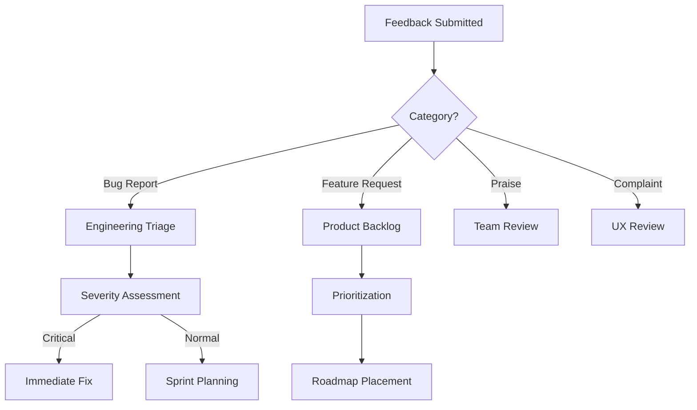

# Feature Requests & Feedback

SkillHub is built for the organization, and your feedback shapes its roadmap. Whether you have spotted a bug, have an idea for a new feature, or just want to share what is working well, there is a structured way to submit it.

## Submitting Feedback

### Via the Web Interface

1. Click **Feedback** in the SkillHub navigation bar (or go to `/feedback` directly)
2. Select a category from the dropdown: Feature Request, Bug Report, Praise, or Complaint
3. Write your feedback in the text area (minimum 20 characters)
4. Click **Submit**

Existing feedback items are shown below the form, organized by category tabs. You can upvote any item directly from the list.

### Via the API

```bash
curl -X POST -H "Authorization: Bearer $TOKEN" \
  -H "Content-Type: application/json" \
  -d '{
    "category": "feature_request",
    "body": "It would be useful to declare that Skill A depends on Skill B, so installing A automatically suggests installing B."
  }' \
  https://skillhub.yourcompany.com/api/v1/feedback
```

---

## Feedback Categories

Every feedback submission is classified into one of four categories:

| Category | Slug | When to Use |
|----------|------|-------------|
| **Feature Request** | `feature_request` | You want SkillHub to do something it does not do yet |
| **Bug Report** | `bug_report` | Something is broken, incorrect, or behaving unexpectedly |
| **Praise** | `praise` | Something is working particularly well -- this helps prioritize what to keep |
| **Complaint** | `complaint` | Something is frustrating or poorly designed, but not technically broken |

::: tip Choosing the Right Category
- **Feature requests** go into the product backlog for prioritization
- **Bug reports** are triaged by severity and assigned to the engineering team
- **Praise** helps the team understand what to protect during refactoring
- **Complaints** surface UX and design issues that are not outright bugs
:::

---

## Writing Effective Feedback

The feedback form accepts a category and a free-text body. Pack as much context as you can into the body.

### Feature Requests

Good feature requests explain the **problem**, not just the solution:

::: details Good Example
**Category:** Feature Request

**Body:** When I install the "Full Code Review" skill, I also need the "Security Checklist" and "Performance Audit" skills installed for it to work properly. Currently I have to know this and install them manually. It would be helpful if skills could declare dependencies so that installing one automatically prompts to install its dependencies.

**Why this is good:** Describes the user's problem, the current workaround, and the desired outcome.
:::

::: details Weak Example
**Category:** Feature Request

**Body:** Skills should have dependencies.

**Why this is weak:** No context on why, no description of the problem, no indication of expected behavior.
:::

### Bug Reports

Include enough information for the team to reproduce the issue:

::: details Bug Report Template
**Category:** Bug Report

**Body:**
MCP install fails for skills with spaces in the name.

Steps to reproduce:
1. Search for "Meeting Note Summarizer" via MCP
2. Ask Claude to install it
3. MCP tool returns error: "Invalid slug: meeting-note summarizer"

Expected: Skill installs successfully (slug should be auto-sanitized)
Actual: Installation fails with slug validation error
Environment: Claude Code v1.2.3, macOS 14.5, MCP server v0.8.0
:::

---

## What Happens After Submission



### For Bug Reports

1. **Triage** -- Engineering team reviews and assigns severity (critical, high, medium, low)
2. **Assignment** -- Critical and high severity bugs are assigned immediately
3. **Resolution** -- Fix is implemented, tested, and deployed
4. **Notification** -- You are notified when the fix is live (Phase 2 feature)

### For Feature Requests

1. **Review** -- Product team reviews and assesses feasibility
2. **Prioritization** -- Requests are ranked by impact, effort, and upvote count
3. **Roadmap** -- High-priority items are placed on the development roadmap
4. **Implementation** -- Feature is built, tested, and released
5. **Closure** -- Request is marked as completed

---

## Upvoting Existing Requests

Before submitting a new feature request, check if someone has already submitted the same idea. If they have, **upvote it** instead of creating a duplicate.

### How Upvoting Works

- Browse existing feedback on the Feedback page
- Click the upvote arrow on any request you support
- Each user gets one upvote per feedback item
- Higher upvote counts influence prioritization

### API Reference

```bash
# List existing feedback (most upvoted first)
curl -H "Authorization: Bearer $TOKEN" \
  "https://skillhub.yourcompany.com/api/v1/feedback?sort=upvotes"

# Upvote a feedback item
curl -X POST -H "Authorization: Bearer $TOKEN" \
  https://skillhub.yourcompany.com/api/v1/feedback/{feedback_id}/upvote

# Filter by category
curl -H "Authorization: Bearer $TOKEN" \
  "https://skillhub.yourcompany.com/api/v1/feedback?category=feature_request"
```

---

## Feedback Visibility

| Aspect | Visibility |
|--------|------------|
| Your submissions | Visible to you and the Platform Team |
| Upvote counts | Visible to all authenticated users |
| Platform Team responses | Visible to the original submitter |
| Status updates | Visible to the original submitter and upvoters |

::: info
All feedback submissions are logged in the audit trail. The Platform Team can see aggregate feedback metrics to identify trends and recurring themes.
:::

---

## Current Phase 2 Roadmap Items

These items were identified during the PoC and are planned for the next phase. Your upvotes help prioritize:

| Item | Category | Status |
|------|----------|--------|
| SSO Integration (Microsoft, Google, Okta) | Infrastructure | Ready to integrate |
| Notification System | Feature | Planned for scale |
| CI/CD Pipeline | Infrastructure | Pending deploy target |

## Next Steps

- [Browse the FAQ for common questions](/faq)
- [Learn about admin capabilities](/admin-guide)
- [Return to the marketplace](/skill-discovery)
