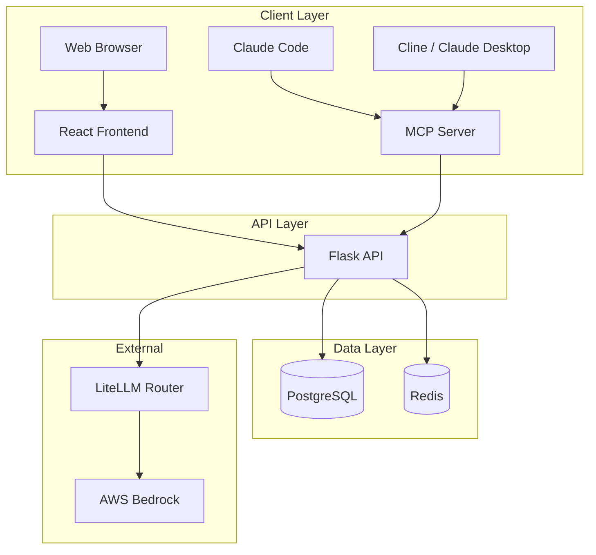

# Resources

Reference material, key terminology, related tools, and contact information for the SkillHub platform.

## Glossary

| Term | Definition |
|------|------------|
| **Skill** | A markdown file (`SKILL.md`) containing structured instructions that give Claude specialized capabilities for a specific task |
| **SKILL.md** | The file format for skills. Contains YAML front matter (metadata) and markdown content (instructions) |
| **Front Matter** | The YAML block at the top of a SKILL.md file, delimited by `---`, containing fields like name, description, triggers, and category |
| **Trigger Phrase** | A natural language phrase that activates a skill when detected in a user's message to Claude Code |
| **Slug** | A URL-safe identifier derived from a skill's name (e.g., `pr-review-assistant`). Used in URLs, API paths, and file system directories |
| **Division** | An organizational unit (e.g., Engineering Org, Data Org) that controls skill visibility and access. SkillHub has 8 divisions |
| **Category** | One of 9 functional groupings for skills: Engineering, Product, Data, Security, Finance, General, HR, Research, Operations |
| **MCP** | Model Context Protocol -- a standard for connecting AI assistants to external tools. SkillHub's MCP server provides 9 tools for Claude Code integration |
| **MCP Server** | The SkillHub service that exposes marketplace functionality as MCP tools, enabling Claude Code and Claude Desktop to search, install, and manage skills |
| **Gate** | One of three stages in the submission quality pipeline. Gate 1 is automated, Gate 2 is AI-assisted, Gate 3 is human review |
| **HITL** | Human-in-the-Loop -- refers to Gate 3 of the submission pipeline where a Platform Team member manually reviews and approves, requests changes, or rejects a submission |
| **LLM Judge** | The AI evaluation system in Gate 2 that scores skill submissions on quality, security, and usefulness (0-100 scale) |
| **Bayesian Average** | A rating calculation method that accounts for sample size, preventing skills with few ratings from dominating the leaderboard |
| **Fork** | A copy of an existing skill created by a different user, typically adapted for a specific division. Forks maintain lineage back to the original |
| **Upstream** | The original skill that a fork was created from |
| **Featured** | An editorial badge applied by the Platform Team to highlight high-quality, broadly useful skills on the homepage |
| **Verified** | A badge indicating that a skill has been explicitly endorsed by the Platform Team beyond the standard review process |
| **Trending** | A sort mode based on install velocity -- how quickly a skill is gaining new installations relative to its total |
| **Staleness** | An indicator shown on installed skills when a newer version is available on the marketplace |
| **Submission** | A skill submitted for review through the 3-gate quality pipeline. Tracked by a display ID (e.g., `SUB-00042`) |
| **Platform Team** | Administrators with permission to feature skills, review submissions (Gate 3), manage users, and configure feature flags |
| **Security Team** | Administrators with permission to remove skills for security reasons and audit platform activity |
| **Feature Flag** | A boolean configuration switch that controls platform behavior, with optional per-division overrides |
| **Audit Log** | An append-only, tamper-proof record of all significant platform actions, protected by a database trigger that prevents modification |
| **Cross-Division Access Request** | A request from a user to access a skill that is not authorized for their division |
| **Context Window** | The finite amount of text Claude can process in a single interaction. Skill content consumes context window space when activated |
| **Jaccard Coefficient** | A similarity metric (0.0 to 1.0) used in Gate 1 to detect trigger phrase collisions between skills. Submissions with similarity > 0.7 are flagged |

---

## API Quick Reference

### Base URL

| Environment | URL |
|-------------|-----|
| Local development | `http://localhost:8000/api/v1` |
| Production | `https://skillhub.yourcompany.com/api/v1` |

### Key Endpoints

| Method | Endpoint | Description |
|--------|----------|-------------|
| `GET` | `/skills` | List/search skills (supports query, category, division, sort, pagination) |
| `GET` | `/skills/{slug}` | Get skill detail |
| `POST` | `/skills/{slug}/install` | Record a skill installation |
| `DELETE` | `/skills/{slug}/install` | Record a skill uninstall |
| `GET` | `/skills/{slug}/versions` | List skill versions |
| `POST` | `/skills/{slug}/reviews` | Submit a review |
| `PUT` | `/skills/{slug}/reviews` | Update your review |
| `GET` | `/skills/{slug}/comments` | List comments |
| `POST` | `/skills/{slug}/comments` | Post a comment |
| `POST` | `/skills/{slug}/fork` | Fork a skill |
| `POST` | `/skills/{slug}/favorite` | Add to favorites |
| `DELETE` | `/skills/{slug}/favorite` | Remove from favorites |
| `POST` | `/skills/{slug}/access-requests` | Request cross-division access |
| `GET` | `/categories` | List all categories |
| `POST` | `/submissions` | Submit a new skill |
| `GET` | `/submissions/{id}` | Check submission status |
| `GET` | `/flags` | Get active feature flags |
| `POST` | `/feedback` | Submit feedback |
| `GET` | `/users/me` | Get current user profile |
| `GET` | `/users/me/favorites` | List your favorites |
| `GET` | `/users/me/following` | List authors you follow |
| `POST` | `/auth/token` | Get a JWT token (dev/stub auth) |

### Authentication

All API requests (except `/auth/token`) require a JWT bearer token:

```bash
curl -H "Authorization: Bearer $TOKEN" \
  https://skillhub.yourcompany.com/api/v1/skills
```

---

## Related Tools

| Tool | Description | Link |
|------|-------------|------|
| **Claude Code** | Anthropic's CLI for Claude with skill support | [claude.ai/claude-code](https://claude.ai/claude-code) |
| **Claude Desktop** | Desktop application with MCP server support | [claude.ai/download](https://claude.ai/download) |
| **Cline** | VS Code extension with MCP server support | [VS Code Marketplace](https://marketplace.visualstudio.com/items?itemName=saoudrizwan.claude-dev) |
| **MCP SDK** | Python SDK for building MCP servers | [GitHub](https://github.com/modelcontextprotocol/python-sdk) |
| **VitePress** | Static site generator powering this documentation | [vitepress.dev](https://vitepress.dev) |
| **NX** | Monorepo build system used by SkillHub | [nx.dev](https://nx.dev) |
| **mise** | Task runner and environment manager | [mise.jdx.dev](https://mise.jdx.dev) |

---

## Architecture Overview



---

## Project Structure

```
marketplace-ai/
  apps/
    web/              # React + Vite + TypeScript frontend
    api/              # Flask/APIFlask backend (Python 3.12)
    mcp-server/       # SkillHub MCP server
    docs/             # VitePress documentation (this site)
  libs/
    ui/               # Shared React components
    shared-types/     # TypeScript type definitions
    python-common/    # Auth, config, logging, exceptions
    db/               # SQLAlchemy models + Alembic migrations
```

---

## Development Quick Reference

| Command | Description |
|---------|-------------|
| `mise run install` | Full project setup |
| `mise run dev:api` | Start the API server |
| `mise run dev:web` | Start the web dev server |
| `mise run dev:mcp` | Start the MCP server |
| `mise run test:api` | Run API tests |
| `mise run test:web` | Run web tests |
| `mise run quality-gate` | Full CI quality gate locally |
| `mise run db:migrate` | Run database migrations |
| `mise run db:seed` | Seed the database with 61 sample skills |
| `mise run db:reset` | Reset database (drop, migrate, seed) |

---

## Contact

| Role | Contact |
|------|---------|
| **Platform Team** | Manages the marketplace, reviews submissions, configures feature flags |
| **Security Team** | Handles security-related skill removals and audit reviews |
| **Engineering** | Maintains the SkillHub platform codebase |

For platform issues, submit feedback through the [Feedback system](/feature-requests) or reach out to the Platform Team directly through your organization's communication channels.

## Next Steps

- [Get started with SkillHub](/getting-started)
- [Browse the FAQ](/faq)
- [Learn about admin capabilities](/admin-guide)
