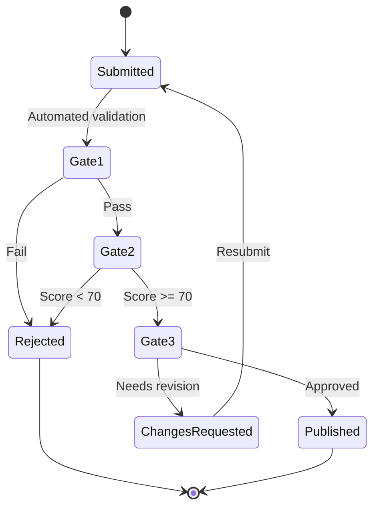

# Submitting a Skill

Contributing skills to SkillHub is how the marketplace grows. Every submitted skill passes through a 3-gate quality pipeline before it becomes available to the organization. This page walks through the full submission process.

## Before You Submit

Make sure your skill meets these baseline requirements:

::: info Submission Checklist
- [ ] Valid YAML front matter with `name`, `description`, `triggers`, and `category`
- [ ] At least 2 trigger phrases, no more than 5
- [ ] Description is one clear sentence (shown in search results)
- [ ] Content section has structured instructions (not just prose)
- [ ] Category is one of the 9 valid values (engineering, product, data, security, finance, general, hr, research, operations)
- [ ] You have declared which divisions should have access
- [ ] No secrets, API keys, or internal URLs in the content
:::

---

## How to Submit

### Option 1: MCP Server (from Claude Code)

The fastest way to submit. Write your skill, then ask Claude:

```
Submit the skill at .claude/skills/my-new-skill/SKILL.md to SkillHub
```

Claude reads the file, extracts the front matter and content, and calls the `submit_skill` MCP tool. You will receive a submission ID (e.g., `SUB-00042`) for tracking.

### Option 2: Web Interface

1. Navigate to the **Submit** page on the SkillHub web marketplace
2. Complete the 3-step wizard:
   - **Step 1: Basic Info** -- Name, description, category, tags, content
   - **Step 2: Division Declaration** -- Select which divisions should access this skill and provide a justification
   - **Step 3: Review** -- Preview your submission before sending

### Option 3: API

```bash
curl -X POST -H "Authorization: Bearer $TOKEN" \
  -H "Content-Type: application/json" \
  -d '{
    "name": "My New Skill",
    "short_description": "One-line description of what this skill does",
    "category": "engineering",
    "content": "---\nname: My New Skill\n...\n---\n\n# My New Skill\n...",
    "declared_divisions": ["engineering-org", "product-org"],
    "division_justification": "Useful for both engineering and product teams for sprint planning."
  }' \
  https://skillhub.yourcompany.com/api/v1/submissions
```

---

## The 3-Gate Pipeline {#the-3-gate-pipeline}

Every submission passes through three sequential gates. A failure at any gate stops progression until the issue is resolved.



### Gate 1: Automated Validation {#gate-1}

Gate 1 runs immediately upon submission with no human involvement. It checks:

| Check | What It Validates | Failure Reason |
|-------|-------------------|----------------|
| **Schema validation** | Required front matter fields are present and correctly typed | Missing `name`, `description`, or `triggers` |
| **Slug uniqueness** | Generated slug does not collide with an existing published skill | Slug `my-skill` already exists |
| **Trigger phrase similarity** | Jaccard coefficient against all existing trigger phrases | Similarity > 0.7 with existing skill's triggers |
| **Required fields** | Category is valid, description length, trigger count | Category `invalid` not in allowed values |
| **Content checks** | No empty content body, minimum useful length | Content body is empty or under 50 characters |

::: details Gate 1 Pass Example
```json
{
  "gate": 1,
  "result": "pass",
  "findings": [
    {"check": "schema_validation", "status": "pass"},
    {"check": "slug_uniqueness", "status": "pass"},
    {"check": "trigger_similarity", "status": "pass", "max_jaccard": 0.32},
    {"check": "required_fields", "status": "pass"},
    {"check": "content_checks", "status": "pass"}
  ]
}
```
:::

::: details Gate 1 Fail Example
```json
{
  "gate": 1,
  "result": "fail",
  "findings": [
    {"check": "trigger_similarity", "status": "fail",
     "detail": "Trigger 'review pull request' has Jaccard 0.82 with 'pr-review-assistant' trigger 'review this pull request'"}
  ]
}
```
:::

### Gate 2: AI-Assisted Evaluation (LLM Judge) {#gate-2}

Gate 2 uses an LLM to evaluate the skill's quality, security, and usefulness. The judge model (configurable via LiteLLM router, defaulting to Claude 3.5 Sonnet on AWS Bedrock) scores the submission on a 0-100 scale.

**Scoring criteria:**

| Dimension | Weight | What the Judge Evaluates |
|-----------|--------|--------------------------|
| **Quality** | 40% | Clear instructions, structured output, consistent formatting |
| **Security** | 30% | No prompt injection vectors, no credential exposure, safe patterns |
| **Usefulness** | 30% | Solves a real problem, not trivially obvious, organization-relevant |

**Pass threshold:** Score >= 70

**Auto-fail conditions:**
- Any finding rated as "critical" by the judge
- Security score below 50 regardless of overall score

::: details Gate 2 Response Format
```json
{
  "gate": 2,
  "result": "pass",
  "score": 84,
  "findings": [
    {"severity": "info", "category": "quality",
     "detail": "Well-structured with clear step-by-step process"},
    {"severity": "warning", "category": "usefulness",
     "detail": "Consider adding examples for edge cases"},
    {"severity": "info", "category": "security",
     "detail": "No security concerns identified"}
  ],
  "summary": "High-quality skill with clear instructions. Minor suggestion to add examples."
}
```
:::

::: info Feature Flag
Gate 2 is controlled by the `llm_judge_enabled` feature flag. When disabled, submissions skip Gate 2 and proceed directly to Gate 3. This allows the Platform Team to bypass AI evaluation if needed.
:::

### Gate 3: Human Review (HITL) {#gate-3}

Gate 3 is the final check. A member of the Platform Team manually reviews the submission and makes one of three decisions:

| Decision | What Happens |
|----------|--------------|
| **Approve** | Skill is published and immediately available in the marketplace |
| **Request Changes** | Submission is returned to the author with notes; author can revise and resubmit |
| **Reject** | Submission is permanently rejected with a mandatory explanation |

**Reviewers evaluate:**
- Does the skill serve a genuine organizational need?
- Are the declared divisions appropriate?
- Is the content accurate and unlikely to produce harmful output?
- Does it overlap excessively with existing published skills?

The reviewer's decision and notes are recorded in the `submission_gate_results` table with full audit trail.

---

## Change Requests and Revisions

If a reviewer requests changes at Gate 3:

1. You receive the reviewer's notes explaining what needs to change
2. You revise your SKILL.md content
3. You resubmit (the submission returns to Gate 1)
4. The full pipeline runs again on the revised content

```bash
# Check your submission status
curl -H "Authorization: Bearer $TOKEN" \
  https://skillhub.yourcompany.com/api/v1/submissions/SUB-00042

# Resubmit after changes
curl -X POST -H "Authorization: Bearer $TOKEN" \
  -H "Content-Type: application/json" \
  -d '{"content": "... revised content ..."}' \
  https://skillhub.yourcompany.com/api/v1/submissions/SUB-00042/resubmit
```

Or from Claude Code:

```
Check the status of my submission SUB-00042
```

---

## Common Rejection Reasons

| Reason | How to Fix |
|--------|------------|
| Trigger collision with existing skill | Use more specific trigger phrases or fork the existing skill instead |
| Too vague or generic | Add structured steps, specific output format, and concrete examples |
| Security concern | Remove any hardcoded URLs, API keys, or patterns that could leak data |
| Duplicate functionality | Check existing skills first; consider contributing to or forking an existing one |
| Incorrect division scope | Justify why the declared divisions need this skill |
| Low quality content | Follow the [skill writing guidelines](/introduction-to-skills#what-makes-a-good-skill) |

---

## Versioning Approved Skills

After your skill is published, you can submit new versions to update it:

1. Modify the skill content
2. Submit the updated version via the same submission process
3. The update goes through the full 3-gate pipeline
4. Once approved, the new version replaces the previous one
5. Users who have installed the skill will see a staleness indicator

Each version is recorded in the `skill_versions` table with:
- Version number
- Content hash (for change detection)
- Changelog
- Publication timestamp

```bash
# Users can check for updates
curl -H "Authorization: Bearer $TOKEN" \
  https://skillhub.yourcompany.com/api/v1/skills/my-skill/versions
```

---

## Best Practices for Approval

::: tip Maximize Your Chances
1. **Search first.** Check if a similar skill already exists. Fork it instead of creating a duplicate.
2. **Be specific.** "Python FastAPI testing" will pass more easily than "code testing."
3. **Define output format.** Skills that specify what Claude should produce are rated higher by the LLM judge.
4. **Include 3 trigger phrases.** One precise, one natural language, one shorthand.
5. **Justify your divisions.** If you declare 4+ divisions, explain why each needs access.
6. **Keep it under 1,500 words.** Concise skills score better on quality and are more useful in practice.
7. **No external dependencies.** Skills should be self-contained markdown. Do not reference external URLs that may change.
8. **Test locally first.** Install the skill in your own `.claude/skills/` and verify it works as expected before submitting.
:::

## Submission Status Pipeline

Your submission moves through these 9 states:

| State | Description |
|-------|-------------|
| `submitted` | Initial submission received |
| `gate1_pending` | Awaiting automated validation |
| `gate1_passed` | Automated validation passed |
| `gate1_failed` | Automated validation failed |
| `gate2_pending` | Awaiting LLM judge evaluation |
| `gate2_passed` | LLM judge score >= 70 |
| `gate2_failed` | LLM judge score < 70 or critical finding |
| `gate3_pending` | Awaiting human reviewer |
| `published` | Approved and live in marketplace |

Track your submission at any time:

```bash
# Via API
curl -H "Authorization: Bearer $TOKEN" \
  https://skillhub.yourcompany.com/api/v1/submissions/SUB-00042

# Via MCP
Check the status of my SkillHub submission SUB-00042
```

## Next Steps

- [Learn what makes a good skill](/introduction-to-skills)
- [Browse existing skills for inspiration](/skill-discovery)
- [Read the FAQ for submission questions](/faq)
