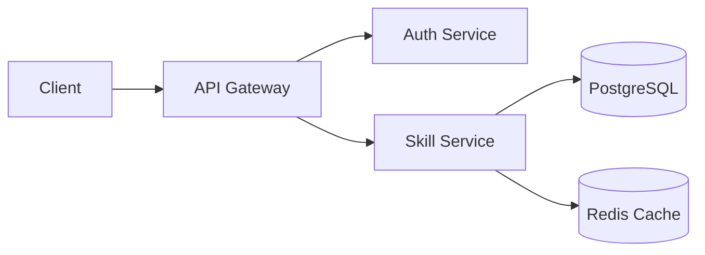
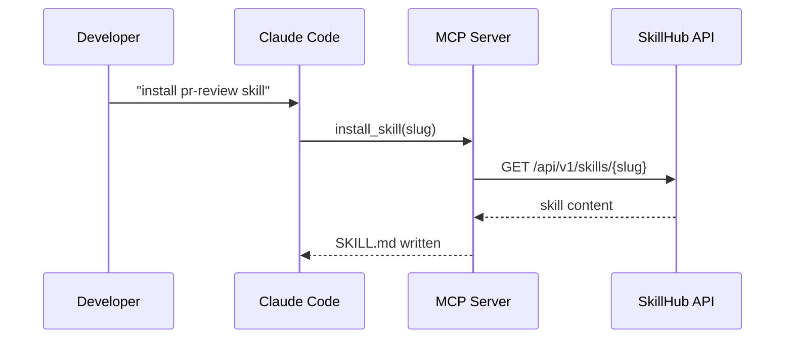
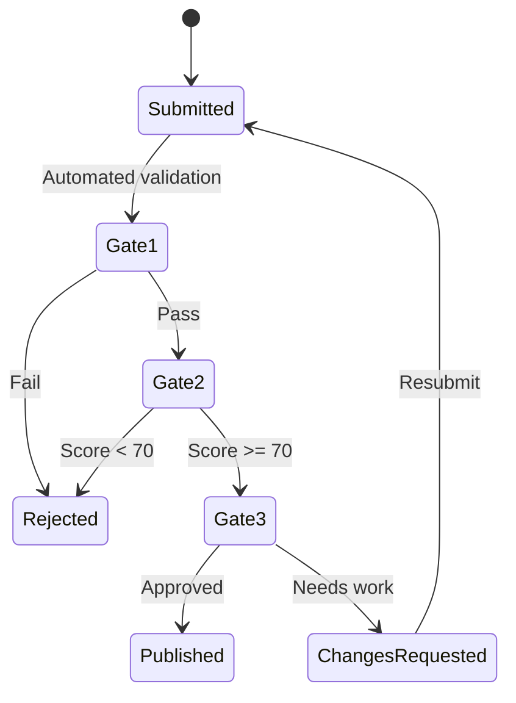

# Uses for Skills

Skills turn Claude from a general-purpose assistant into a specialized tool for your exact workflow. This page shows real examples across the most common use cases.

## Coding

### Code Review

One of the highest-value skill categories. A code review skill gives Claude a consistent checklist so nothing gets missed.

```markdown
---
name: Python Code Review
description: Security-focused Python code review with OWASP awareness
triggers:
  - review this python code
  - python code review
category: engineering
tags:
  - python
  - security
  - code-review
---

# Python Code Review

Review the provided Python code with emphasis on:

## Security (Critical)
- SQL injection (raw string formatting in queries)
- Path traversal (unsanitized file paths)
- Deserialization of untrusted data (pickle, yaml.load)
- Hardcoded secrets or credentials
- Missing input validation on API endpoints

## Correctness
- Off-by-one errors in loops and slices
- Unhandled exceptions that should be caught
- Race conditions in concurrent code
- Resource leaks (files, connections, locks)

## Performance
- N+1 query patterns in ORM code
- Unnecessary list comprehensions on large datasets
- Blocking I/O in async contexts
- Missing database indexes for filtered queries

## Output
For each finding, provide:
| Severity | File:Line | Issue | Fix |
```

### Test Generation

Skills that generate tests can enforce your team's testing standards automatically.

```markdown
---
name: Pytest Generator
description: Generate pytest test suites following AAA pattern
triggers:
  - write tests for this
  - generate pytest tests
category: engineering
---

# Pytest Test Generator

Generate comprehensive pytest tests following these rules:

1. **Arrange-Act-Assert** pattern for every test
2. Use `@pytest.fixture` for shared setup, never `setUp()` methods
3. One assertion per test (except related assertions on the same object)
4. Name tests as `test_<function>_<scenario>_<expected>`
5. Include edge cases: empty input, None, boundary values, error paths
6. Use `@pytest.mark.parametrize` for data-driven tests
7. Mock external dependencies with `unittest.mock.patch`

Always generate at least:
- 2 happy path tests
- 2 edge case tests
- 1 error handling test
```

### Refactoring

```markdown
---
name: Refactoring Guide
description: Identify and apply refactoring patterns with safety checks
triggers:
  - refactor this code
  - help me refactor
category: engineering
---

# Refactoring Guide

Before making any changes:
1. Identify existing test coverage for the code being refactored
2. If coverage is insufficient, write tests FIRST

Apply these patterns in order of impact:
- **Extract Method** — functions over 20 lines
- **Replace Magic Numbers** — named constants
- **Simplify Conditionals** — guard clauses over nested if/else
- **Remove Duplication** — DRY across the module, not the codebase

For each refactoring step, explain:
- What pattern you are applying
- Why it improves the code
- What could break (and how the tests catch it)
```

---

## Presentations and Documents

### Slide Deck Outlines

```markdown
---
name: Slide Deck Creator
description: Create structured presentation outlines with speaker notes
triggers:
  - create a presentation
  - help with slides
  - make a slide deck
category: general
tags:
  - presentation
  - slides
---

# Slide Deck Creator

Create a presentation outline with this structure:

## For Each Slide
- **Title** (max 6 words)
- **Key Message** (one sentence the audience should remember)
- **Bullet Points** (max 4, each under 10 words)
- **Speaker Notes** (2-3 sentences of what to say)
- **Visual Suggestion** (chart type, diagram, or image concept)

## Presentation Structure
1. Title slide with hook question
2. Problem/Context (2-3 slides)
3. Solution/Approach (3-5 slides)
4. Evidence/Data (2-3 slides)
5. Call to Action (1 slide)
6. Appendix (backup slides for Q&A)

Total: aim for 12-15 slides for a 20-minute presentation.
```

### Technical RFCs

```markdown
---
name: RFC Writer
description: Write technical RFCs with problem, proposal, and trade-offs
triggers:
  - write an RFC
  - draft a technical proposal
category: engineering
tags:
  - rfc
  - documentation
---

# RFC Writer

Structure every RFC with these sections:

## Template
1. **Title** — descriptive, not clever
2. **Status** — Draft | Under Review | Accepted | Rejected
3. **Author(s)** — who is proposing this
4. **Problem Statement** — what is broken or missing (max 3 paragraphs)
5. **Proposed Solution** — what to build and why this approach
6. **Alternatives Considered** — at least 2 alternatives with trade-offs
7. **Migration Plan** — how to get from here to there
8. **Risks** — what could go wrong and how to mitigate
9. **Success Metrics** — how to measure if this worked
10. **Open Questions** — unresolved decisions
```

---

## Email Drafting

```markdown
---
name: Business Email Drafter
description: Draft professional emails with appropriate tone and structure
triggers:
  - draft an email
  - write an email
  - help me with this email
category: general
tags:
  - email
  - communication
---

# Business Email Drafter

## Before Writing
Ask for (if not provided):
- Recipient and their role
- Purpose (request, update, follow-up, escalation)
- Key points to convey
- Desired tone (formal, friendly, urgent)

## Structure
1. **Subject line** — action-oriented, under 8 words
2. **Opening** — one sentence of context
3. **Body** — key points in order of importance
4. **Ask** — clear next step with deadline if applicable
5. **Close** — appropriate sign-off for the relationship

## Rules
- Max 150 words for routine emails
- Bold the key ask or deadline
- Never use "per my last email" or passive-aggressive phrasing
- If the topic is sensitive, flag it and suggest a meeting instead
```

---

## Analytics and Data Processing

### SQL Query Builder

```markdown
---
name: SQL Query Builder
description: Generate optimized SQL with CTEs, window functions, and explain plans
triggers:
  - write a SQL query
  - help with SQL
  - build a query
category: data
tags:
  - sql
  - analytics
  - postgresql
---

# SQL Query Builder

## Approach
1. Clarify the business question before writing SQL
2. Use CTEs for readability over nested subqueries
3. Apply window functions where appropriate (ROW_NUMBER, LAG, LEAD)
4. Always include WHERE clauses to limit result sets
5. Add ORDER BY explicitly -- never rely on implicit ordering

## Output Format
```sql
-- Business question: <restate the question>
-- Expected output: <describe columns and row meaning>

WITH <descriptive_cte_name> AS (
    ...
)
SELECT ...
FROM ...
```

## Performance Notes
- Flag queries that will do full table scans
- Suggest indexes if filtering on non-indexed columns
- Warn about DISTINCT as a code smell (usually means a bad JOIN)
- For large datasets, suggest LIMIT during development
```

### Dashboard Generator

```markdown
---
name: Dashboard Spec Generator
description: Create dashboard specifications with KPI definitions and layout
triggers:
  - design a dashboard
  - create dashboard specs
category: data
tags:
  - dashboard
  - analytics
  - visualization
---

# Dashboard Spec Generator

For each dashboard, define:

## KPI Cards (top row)
- Metric name, calculation, time comparison (WoW, MoM)
- Red/yellow/green thresholds

## Charts (main body)
- Chart type (line, bar, scatter, heatmap) with justification
- X-axis, Y-axis, series breakdown
- Filters available to the user

## Data Requirements
- Source tables and joins
- Refresh frequency
- Expected query performance
```

---

## Chart Generation via Mermaid

Skills can instruct Claude to generate visual diagrams using Mermaid syntax, which renders directly in many markdown viewers.

```markdown
---
name: Mermaid Diagram Generator
description: Generate architecture, flow, and sequence diagrams in Mermaid
triggers:
  - draw a diagram
  - create a mermaid diagram
  - visualize this
category: general
tags:
  - mermaid
  - diagram
  - visualization
---

# Mermaid Diagram Generator

Generate diagrams using Mermaid syntax. Choose the right type:

## Architecture Diagrams
Use `graph TD` or `graph LR` for system components:



## Sequence Diagrams
Use `sequenceDiagram` for request flows:



## State Diagrams
Use `stateDiagram-v2` for workflows:



Always include a title and brief description above each diagram.
```

---

## More Examples by Category

::: details Engineering Skills
- **Docker Compose Generator** -- Scaffold multi-service compose files
- **API Endpoint Designer** -- Design RESTful endpoints with OpenAPI annotations
- **Git Commit Message Writer** -- Conventional commits with scope and body
- **CI Pipeline Builder** -- Generate GitHub Actions or GitLab CI configs
- **Database Migration Planner** -- Plan safe, reversible Alembic migrations
:::

::: details Product Skills
- **PRD Writer** -- Product requirements with user stories and acceptance criteria
- **User Story Generator** -- INVEST-compliant stories from feature descriptions
- **Competitive Analysis** -- Structured comparison matrices
- **Release Notes Drafter** -- User-facing release notes from commit logs
:::

::: details Data Skills
- **ETL Pipeline Designer** -- Design extract-transform-load workflows
- **Data Quality Checker** -- Define validation rules for datasets
- **A/B Test Analyzer** -- Statistical significance calculations and recommendations
- **Data Dictionary Generator** -- Document table schemas and relationships
:::

::: details Operations Skills
- **SOP Generator** -- Standard operating procedures from process descriptions
- **Incident Report Writer** -- Post-incident reports with timeline and root cause
- **Runbook Creator** -- Step-by-step operational procedures with rollback plans
- **Change Management Plan** -- Risk assessment and communication plans
:::

## Next Steps

- [Browse the marketplace to find skills like these](/skill-discovery)
- [Learn how to chain skills together](/advanced-usage)
- [Submit your own skill to the marketplace](/submitting-a-skill)
