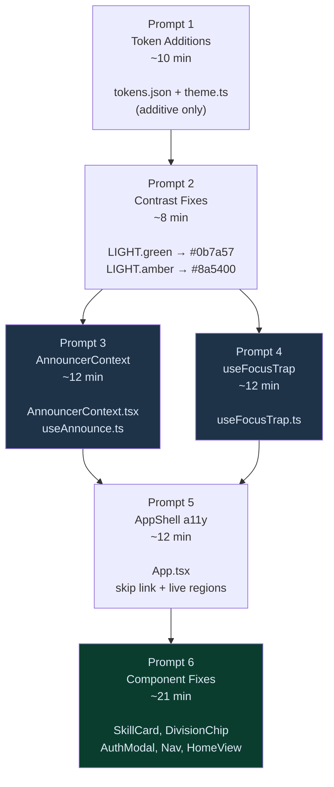
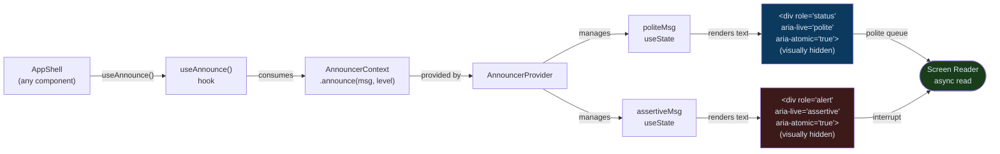
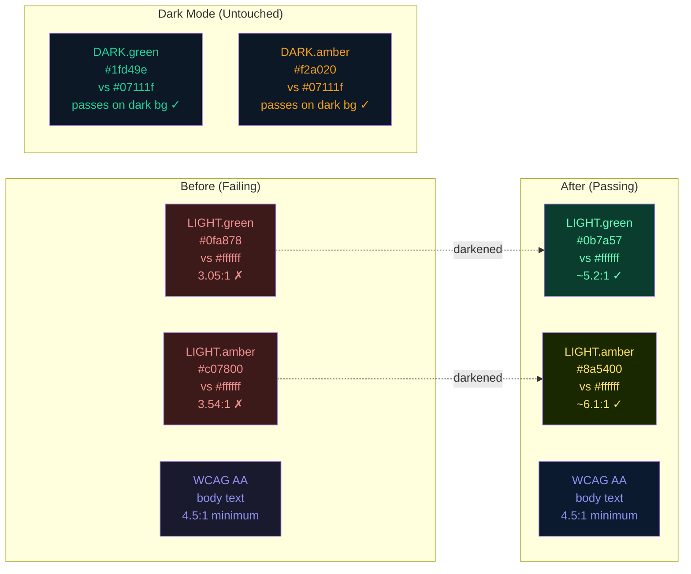
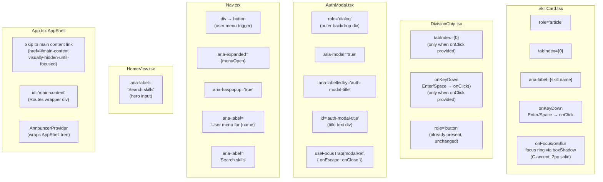
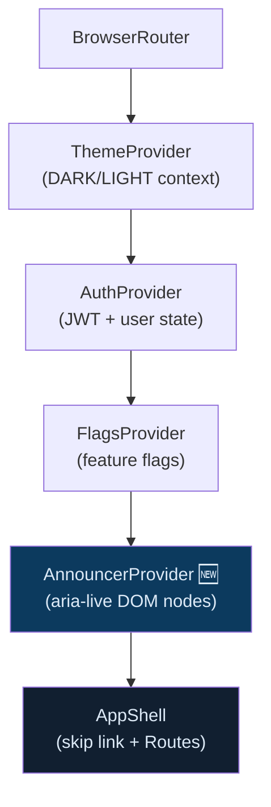
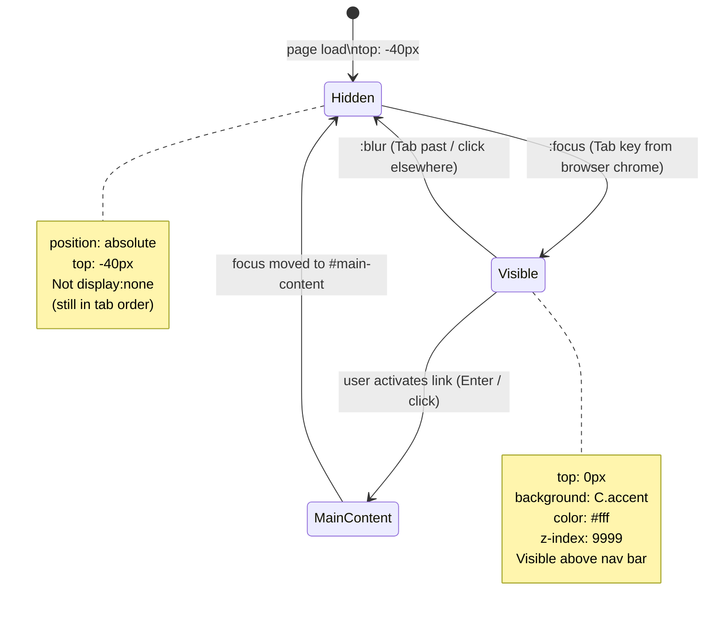
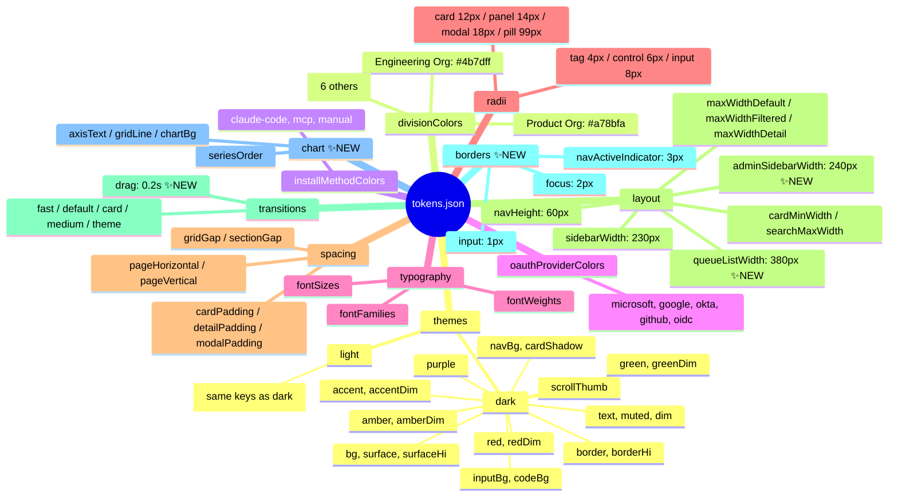
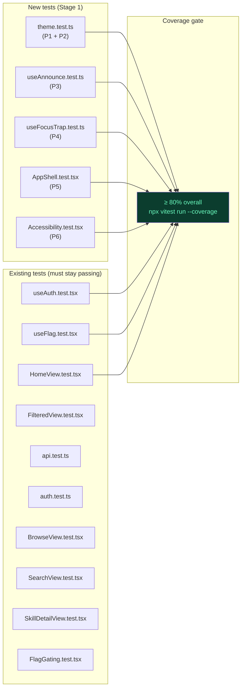

# Stage 1: Foundation — Visual Architecture Companion

Mermaid diagrams for `stage1-foundation-guide.md`. Reference these alongside the written guide when reviewing architecture decisions or planning implementation order.

---

## Diagram 1 — Prompt Execution Order & Dependencies



**Reading the graph:** P3 and P4 are independent and can be parallelized. All other edges are blocking serial dependencies. P2 must complete before P3/P4 because later tests import `LIGHT` and will fail if contrast values are wrong.

---

## Diagram 2 — New File Tree (Stage 1 output)

```mermaid
graph TD
    root["apps/web/src/"]

    lib["lib/"]
    theme["theme.ts ✏️\n+ adminBg, adminSurfaceSide\n+ purpleDim\n+ WCAG green/amber fix"]
    themeTest["theme.test.ts 🆕\ncontrast + token tests"]

    context["context/"]
    announcerCtx["AnnouncerContext.tsx 🆕\nAnnouncerProvider\naria-live DOM regions"]
    themeCtx["ThemeContext.tsx ✔️\nunchanged"]
    authCtx["AuthContext.tsx ✔️\nunchanged"]

    hooks["hooks/"]
    useAnnounce["useAnnounce.ts 🆕"]
    useAnnounceTest["useAnnounce.test.ts 🆕"]
    useFocusTrap["useFocusTrap.ts 🆕"]
    useFocusTrapTest["useFocusTrap.test.ts 🆕"]

    components["components/"]
    skillCard["SkillCard.tsx ✏️\n+ role=article\n+ tabIndex=0\n+ onKeyDown\n+ focus ring"]
    divChip["DivisionChip.tsx ✏️\n+ tabIndex conditional\n+ onKeyDown conditional"]
    authModal["AuthModal.tsx ✏️\n+ role=dialog\n+ aria-modal\n+ aria-labelledby\n+ useFocusTrap"]
    nav["Nav.tsx ✏️\n+ div→button user menu\n+ aria-expanded\n+ search aria-label"]

    views["views/"]
    homeView["HomeView.tsx ✏️\n+ search aria-label"]

    tests["__tests__/"]
    appShellTest["AppShell.test.tsx 🆕\nskip link + live regions"]
    a11yTest["Accessibility.test.tsx 🆕\ncomponent a11y tests"]

    app["App.tsx ✏️\n+ AnnouncerProvider\n+ skip link\n+ id=main-content"]

    designDir["design/"]
    tokens["tokens.json ✏️\n+ layout.adminSidebarWidth\n+ layout.queueListWidth\n+ borders section\n+ transitions.drag\n+ chart section"]

    root --> lib
    root --> context
    root --> hooks
    root --> components
    root --> views
    root --> tests
    root --> app

    lib --> theme
    lib --> themeTest

    context --> announcerCtx
    context --> themeCtx
    context --> authCtx

    hooks --> useAnnounce
    hooks --> useAnnounceTest
    hooks --> useFocusTrap
    hooks --> useFocusTrapTest

    components --> skillCard
    components --> divChip
    components --> authModal
    components --> nav

    views --> homeView

    tests --> appShellTest
    tests --> a11yTest

    designDir --> tokens
```



---

## Diagram 3 — AnnouncerContext Architecture



**Key design decision:** Two separate DOM nodes with two separate React state variables. Never clear and replace a single node — JAWS and NVDA detect text changes on a node; replacing the entire node can miss the mutation event.

**7-second clear:** Prevents stale text from being re-read if the user navigates back to the region with a screen reader virtual cursor.

---

## Diagram 4 — useFocusTrap Lifecycle

```mermaid
sequenceDiagram
    participant Mount as Component Mount
    participant Hook as useFocusTrap
    participant DOM as Container DOM
    participant Prev as previouslyFocused

    Mount->>Hook: enabled=true, containerRef attached
    Hook->>Prev: capture document.activeElement
    Hook->>DOM: querySelectorAll(FOCUSABLE)
    DOM-->>Hook: [btn-A, btn-B, btn-C]
    Hook->>DOM: focusables[0].focus() → btn-A

    Note over DOM: User presses Tab from btn-C
    DOM->>Hook: keydown { key:'Tab', shiftKey:false }
    Hook->>DOM: re-query FOCUSABLE (dynamic DOM)
    Hook->>DOM: activeElement === last? Yes
    Hook->>DOM: preventDefault(); focusables[0].focus() → btn-A

    Note over DOM: User presses Shift+Tab from btn-A
    DOM->>Hook: keydown { key:'Tab', shiftKey:true }
    Hook->>DOM: activeElement === first? Yes
    Hook->>DOM: preventDefault(); last.focus() → btn-C

    Note over DOM: User presses Escape
    DOM->>Hook: keydown { key:'Escape' }
    Hook->>Mount: onEscape?.()

    Note over Mount: Component unmounts
    Mount->>Hook: cleanup runs
    Hook->>Prev: previouslyFocused?.focus()
```

---

## Diagram 5 — WCAG Contrast: Before vs After



**Why `dim` variants are not fixed:** `greenDim` and `amberDim` are `rgba` values with 9% opacity — they are always decorative (backgrounds, borders). WCAG does not require decorative-only elements to meet contrast thresholds (criterion 1.4.3 exempts "decorative" content). The dim RGB base values are updated to match the new base colors to maintain visual consistency, but this is purely aesthetic.

---

## Diagram 6 — Component ARIA Responsibility Map



---

## Diagram 7 — Provider Nesting Order (App.tsx after Stage 1)



**Nesting rationale:** `AnnouncerProvider` wraps `AppShell` because any component in the tree (including future admin panel routes) may call `useAnnounce()`. It is placed inside `FlagsProvider` so admin-gated features can use announcements without provider ordering issues.

---

## Diagram 8 — Skip Link Behavior (Focus State Machine)



**Why not `display:none`:** A `display:none` element is removed from the tab order entirely. The skip link must be in the tab order as the first focusable element — it is just off-screen by default.

---

## Diagram 9 — Token Taxonomy (tokens.json after Stage 1)



---

## Diagram 10 — Test File Map



---

## Summary Reference Card

| Prompt | Time | Files Changed | Files Created | Key Test Assertion |
|---|---|---|---|---|
| 1 | 10m | `tokens.json`, `theme.ts` | `theme.test.ts` | `DARK.adminBg === '#060e1a'` |
| 2 | 8m | `theme.ts` | _(appended to theme.test.ts)_ | `contrastRatio(LIGHT.green, '#fff') >= 4.5` |
| 3 | 12m | — | `AnnouncerContext.tsx`, `useAnnounce.ts`, `useAnnounce.test.ts` | `[role="status"]` present; message clears after 7s |
| 4 | 12m | — | `useFocusTrap.ts`, `useFocusTrap.test.ts` | Tab wraps last→first; Escape calls `onEscape` |
| 5 | 12m | `App.tsx` | `AppShell.test.tsx` | skip link href=`#main-content`; live regions present |
| 6 | 21m | `SkillCard.tsx`, `DivisionChip.tsx`, `AuthModal.tsx`, `Nav.tsx`, `HomeView.tsx` | `Accessibility.test.tsx` | `role=article`; `role=dialog`; keyboard Enter/Space |
| **Total** | **~75m** | **7 modified** | **8 created** | |
