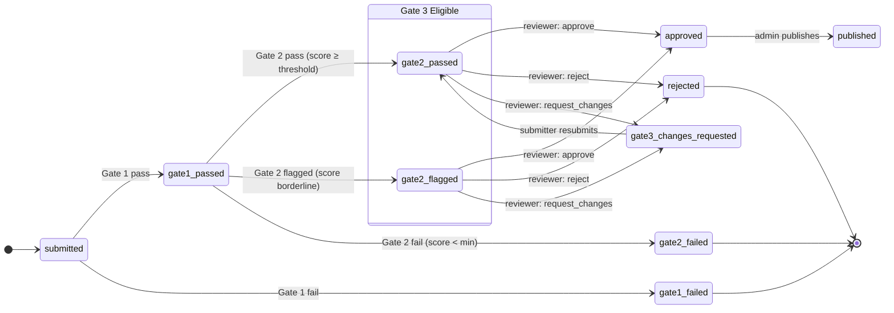
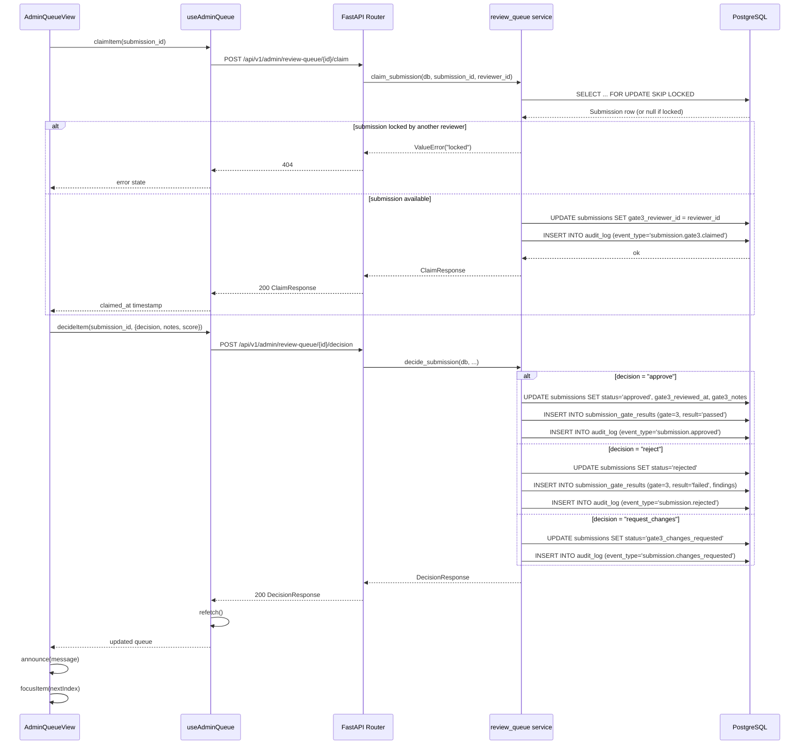
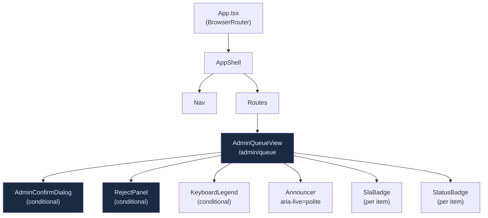

# Stage 4: HITL Review Queue — Visual Architecture Companion

Mermaid diagrams for the HITL submission approval workflow.

---

## Diagram 1: Submission State Machine (Gate 3 Focus)



---

## Diagram 2: Claim + Decision Sequence



---

## Diagram 3: Frontend Component Tree



---

## Diagram 4: Master-Detail Layout

```
┌─────────────────────────────────────────────────────────────────────┐
│  Nav (60px, fixed)                                                   │
└─────────────────────────────────────────────────────────────────────┘
┌────────────────────────┬────────────────────────────────────────────┐
│  Queue List (380px)    │  Detail Panel (flex-1)                     │
│  ─────────────────     │  ─────────────────────────────────────     │
│  role="grid"           │                                            │
│  aria-rowcount=N       │  [Skill Name]        [Approve] [Reject]    │
│                        │  SKL-001  v1.0.0     [Request Changes]     │
│  ┌──────────────────┐  │                                            │
│  │ SKL-001  [SLA⚠]  │  │  Submitted by Alice · 30h ago             │
│  │ My Test Skill    │  │                                            │
│  │ Alice · 30h ago  │  │  ┌──────────────┬───────────────────────┐ │
│  └──────────────────┘  │  │ GATE 1       │ GATE 2                │ │
│  ┌──────────────────┐  │  │ Content      │ LLM Score             │ │
│  │ SKL-002          │  │  │ Passed       │ 82/100                │ │
│  │ Other Skill      │  │  │              │ "Solid implementation"│ │
│  │ Bob · 2h ago     │  │  └──────────────┴───────────────────────┘ │
│  └──────────────────┘  │                                            │
│                        │  Content Preview                           │
│  [?] keyboard legend   │  ┌────────────────────────────────────┐   │
│                        │  │ This is the skill content preview… │   │
│                        │  └────────────────────────────────────┘   │
└────────────────────────┴────────────────────────────────────────────┘
  ← 380px →              ← flex-1 →
```

---

## Diagram 5: Keyboard Navigation Map

```
Global keydown handler (fires when activeElement is NOT input/textarea)
│
├── J ──────────────── focusItem(selectedIndex + 1)
│                      selectItem(items[next].submission_id)
│                      → URL: /admin/queue?id=<next-uuid>
│
├── K ──────────────── focusItem(selectedIndex - 1)
│                      selectItem(items[prev].submission_id)
│
├── A ──────────────── if isSelfSubmission → announce("You cannot approve...")
│                      else → setShowConfirm(true)
│                             [AdminConfirmDialog opens]
│
├── Shift+A ─────────── if batchSelected.size > 0 → handleBatchApprove()
│                       (processes up to 20 items sequentially)
│
├── R ──────────────── setShowRejectPanel(true)
│                      [RejectPanel opens with textarea]
│
├── X ──────────────── toggle selectedId in batchSelected Set
│                      (NOT Space — avoids page scroll conflict)
│
├── ? ──────────────── setShowLegend(true/false)
│
└── Escape ──────────── close all modals
                        setShowConfirm(false)
                        setShowRejectPanel(false)
                        setShowLegend(false)
                        confirmTriggerRef.current?.focus()
```

---

## Diagram 6: Self-Approval Guard — Frontend Decision Tree

```
User clicks "Approve" button
          │
          ▼
  isSelfSubmission?
   (submitter_id === user.user_id)
          │
    ┌─────┴─────┐
   YES          NO
    │            │
    ▼            ▼
announce(     setShowConfirm(true)
 "You cannot      │
  approve your    ▼
  own           AdminConfirmDialog
  submission.") opens (destructive=false)
                  │
           User confirms?
            ┌────┴────┐
           YES        NO
            │          │
            ▼          ▼
         claimItem  dialog closes
            +       focus restored
         decideItem    to trigger
         {approve}
            │
            ▼
         announce(
          "Submission approved.
           N items remaining.")
            │
            ▼
         focusItem(nextIndex)
```

---

## Diagram 7: Self-Approval Guard — Backend Decision Tree

```
POST /api/v1/admin/review-queue/{id}/decision
 body: { decision: "approve" }
          │
          ▼
  require_platform_team
  dependency validates JWT
          │
          ▼
  decide_submission(
    reviewer_id = UUID(current_user["user_id"])
  )
          │
          ▼
  Load submission from DB
          │
          ▼
  sub.submitted_by == reviewer_id?
    ┌─────┴─────┐
   YES          NO
    │            │
    ▼            ▼
  raise        proceed with
  PermissionError  decision logic
  "Cannot approve
   own submission"
          │
  HTTP 403 returned
```

---

## Diagram 8: Concurrent Claim Safety (SELECT FOR UPDATE SKIP LOCKED)

```
Time ──────────────────────────────────────────────────────────────►

Reviewer A                     DB Transaction A
──────────                     ─────────────────
claimItem(sub-001)  ─────────► BEGIN
                               SELECT * FROM submissions
                               WHERE id = sub-001
                               FOR UPDATE SKIP LOCKED
                               → Row acquired ✓
                               UPDATE gate3_reviewer_id = reviewer_a
                               COMMIT

Reviewer B (concurrent)        DB Transaction B
───────────────────            ─────────────────
claimItem(sub-001)  ─────────► BEGIN
                               SELECT * FROM submissions
                               WHERE id = sub-001
                               FOR UPDATE SKIP LOCKED
                               → Row is locked → SKIPPED
                               → scalar_one_or_none() returns None
                               ← ValueError("not found or locked")
                  ◄──────────  HTTP 404

Result: sub-001 claimed by Reviewer A only.
        Reviewer B sees 404 and must pick another item.
```

---

## Diagram 9: SLA Badge Logic

```
wait_time_hours = (now - submitted_at).total_seconds() / 3600

       0h ──────── 24h ─────── 48h ───────────────►

       [  no badge  ][ SLA at risk ][ SLA breached ]
                       amber badge    red badge
                    amberDim bg      redDim bg
                    C.amber text     C.red text
```

---

## Diagram 10: Database Schema — New Columns in Context

```
submissions
┌─────────────────────────────┬──────────────────────────┬──────────┐
│ Column                      │ Type                     │ Nullable │
├─────────────────────────────┼──────────────────────────┼──────────┤
│ id (PK)                     │ UUID                     │ NO       │
│ display_id                  │ VARCHAR(10) UNIQUE       │ NO       │
│ skill_id (FK skills.id)     │ UUID                     │ YES      │
│ submitted_by (FK users.id)  │ UUID                     │ NO       │
│ name                        │ VARCHAR(255)             │ NO       │
│ short_desc                  │ VARCHAR(255)             │ NO       │
│ category                    │ VARCHAR(100)             │ NO       │
│ content                     │ TEXT                     │ NO       │
│ declared_divisions          │ JSON                     │ NO       │
│ division_justification      │ TEXT                     │ NO       │
│ status                      │ VARCHAR(30)              │ NO       │
│ ══════════════ NEW ════════ │ ════════════════════════ │          │
│ gate3_reviewer_id           │ UUID (FK users.id)       │ YES  ←── │
│ gate3_reviewed_at           │ TIMESTAMPTZ              │ YES  ←── │
│ gate3_notes                 │ TEXT                     │ YES  ←── │
│ ════════════════════════════│ ════════════════════════ │          │
│ created_at                  │ TIMESTAMPTZ              │ NO       │
│ updated_at                  │ TIMESTAMPTZ              │ NO       │
└─────────────────────────────┴──────────────────────────┴──────────┘

Index: ix_submissions_gate3_reviewer_id on (gate3_reviewer_id)

submission_gate_results (existing — gate=3 rows created by this stage)
┌─────────────────────────────┬──────────────────────────┬──────────┐
│ Column                      │ Type                     │ Nullable │
├─────────────────────────────┼──────────────────────────┼──────────┤
│ id (PK)                     │ UUID                     │ NO       │
│ submission_id (FK)          │ UUID                     │ NO       │
│ gate                        │ INTEGER (= 3)            │ NO       │
│ result                      │ VARCHAR(10)              │ NO       │
│ findings                    │ JSON                     │ YES      │
│ score                       │ INTEGER                  │ YES      │
│ reviewer_id (FK users.id)   │ UUID                     │ YES      │
│ created_at                  │ TIMESTAMPTZ              │ NO       │
└─────────────────────────────┴──────────────────────────┴──────────┘
```

---

## Diagram 11: API Endpoint Map (Stage 4 additions)

```
/api/v1/admin/review-queue
│
├── GET  /
│        Auth:    require_platform_team
│        Params:  page, per_page
│        Returns: ReviewQueueResponse (paginated fat objects)
│        Service: get_review_queue()
│
├── POST /{submission_id}/claim
│        Auth:    require_platform_team
│        Body:    (none)
│        Returns: ClaimResponse
│        Service: claim_submission() — SELECT FOR UPDATE SKIP LOCKED
│        Errors:  403 (self-claim), 404 (not found/locked)
│
└── POST /{submission_id}/decision
         Auth:    require_platform_team
         Body:    DecisionRequest {decision, notes, score}
         Returns: DecisionResponse
         Service: decide_submission()
         Errors:  403 (self-approve), 422 (short reject notes / bad decision)
```

---

## Diagram 12: Review Queue Data Flow — Full Picture

```
PostgreSQL
  submissions
  (status IN
   gate2_passed,
   gate2_flagged)
        │
        │ get_review_queue()
        │ ORDER BY created_at ASC
        │ + join user names
        │ + join gate_results
        │
        ▼
FastAPI /api/v1/admin/review-queue GET
        │
        │ ReviewQueueResponse JSON
        │
        ▼
useAdminQueue hook (React)
  data.items: ReviewQueueItem[]
        │
        ▼
AdminQueueView
  ┌─────────────────────────┐
  │  Queue List (role=grid) │
  │  - Item rows            │
  │  - SLA badges           │
  │  - Claimed indicator    │
  └────────────┬────────────┘
               │ user selects item
               │ setSearchParams({id}, replace: true)
               ▼
  ┌─────────────────────────┐
  │  Detail Panel           │
  │  - Gate 1 / 2 results  │
  │  - Content preview      │
  │  - Action buttons       │
  └────────────┬────────────┘
               │
     ┌─────────┼──────────────┐
     ▼         ▼              ▼
  Approve   Reject     Request Changes
     │         │              │
     ▼         ▼              ▼
AdminConfirm RejectPanel  immediate POST
Dialog      (textarea,    /decision
(focuses     min 10 chars)  {request_changes}
 Cancel if
 destructive)
     │         │
     ▼         ▼
POST /claim   POST /claim
POST /decision POST /decision
{approve}     {reject, notes}
     │         │
     └────┬────┘
          ▼
       refetch()
       announce()
       focusItem(next)
```
