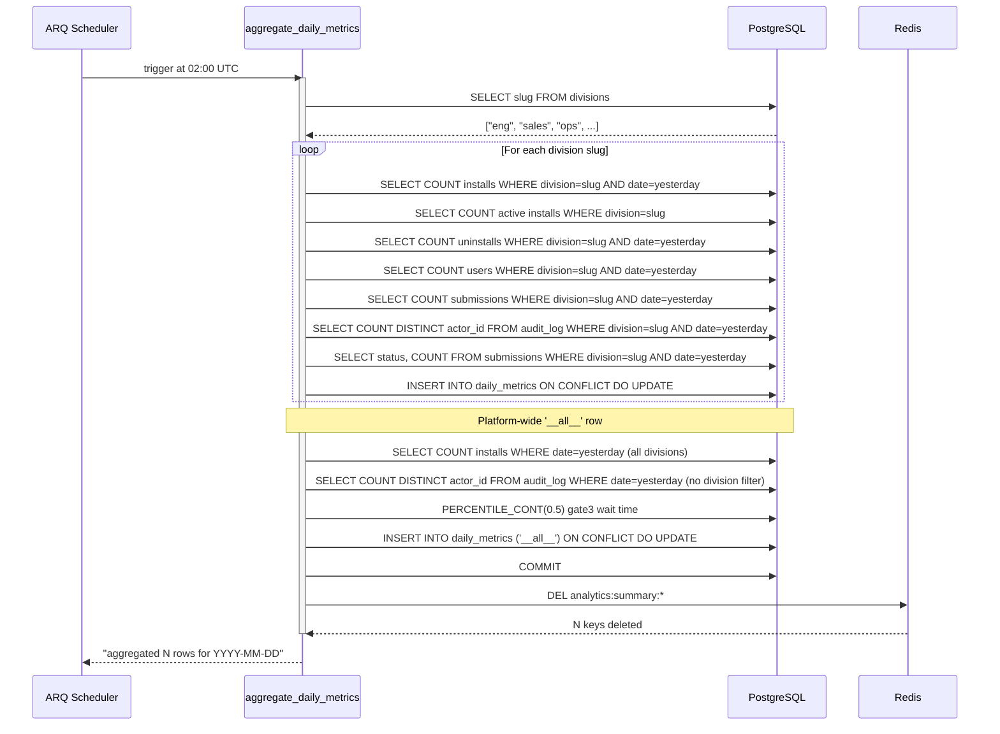
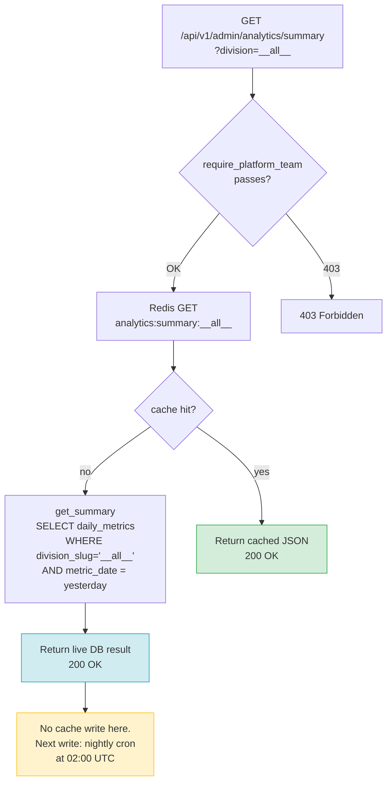
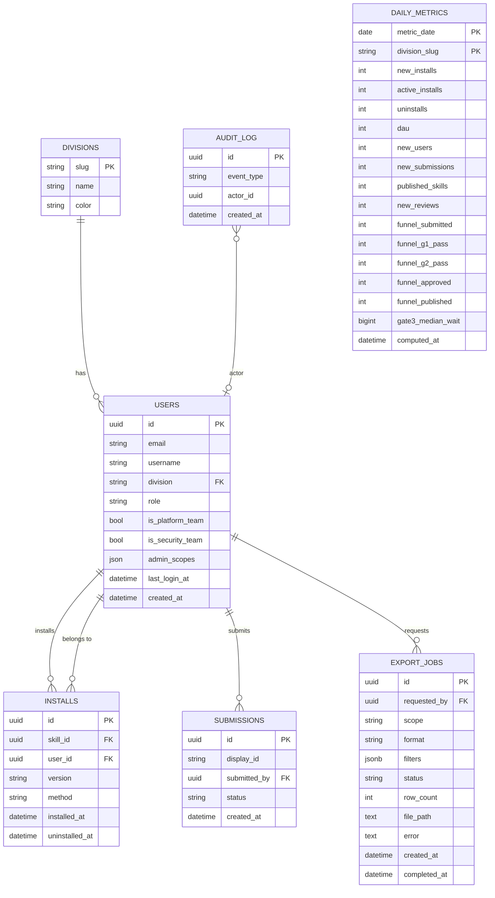
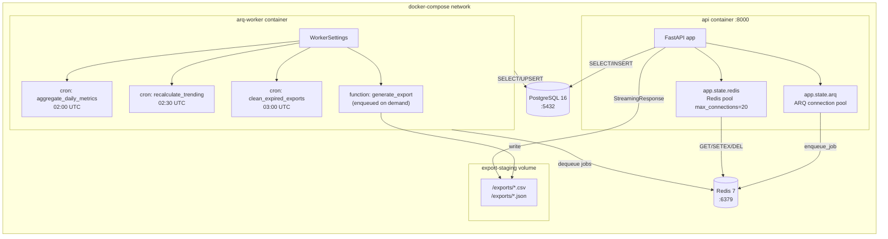
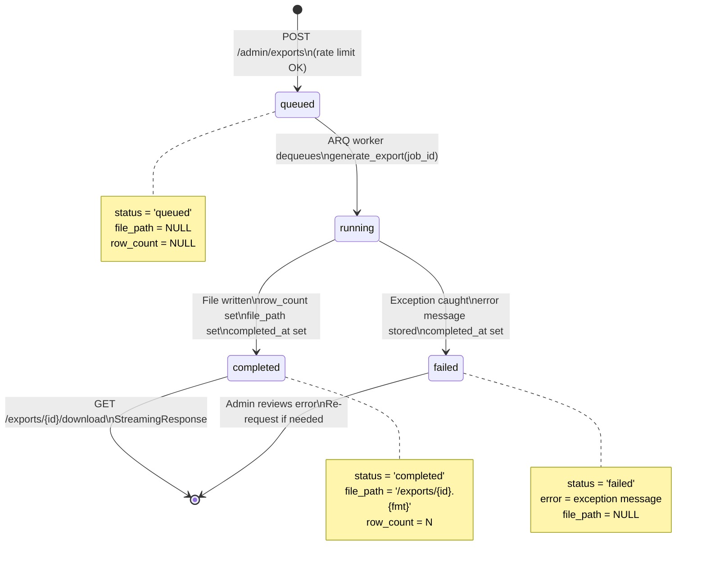
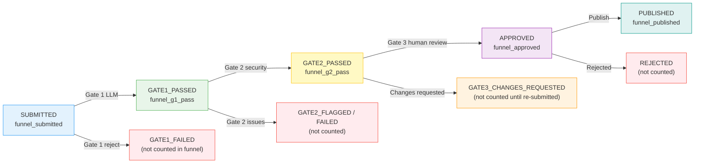
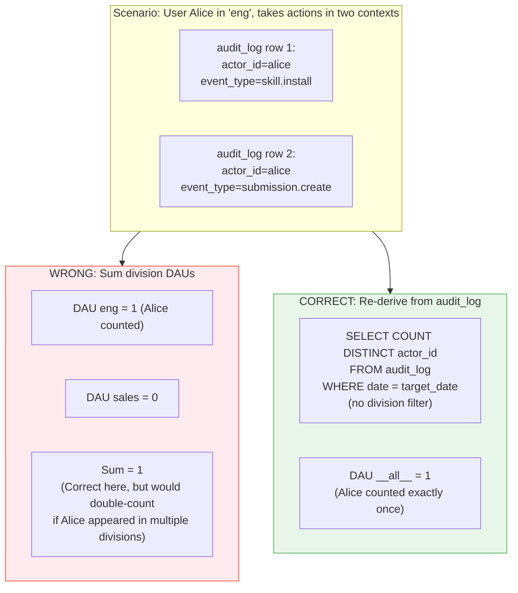
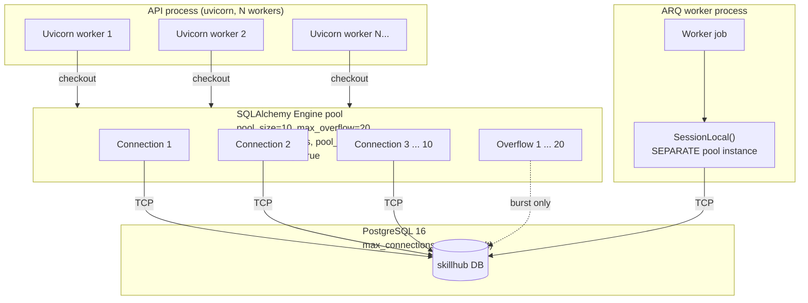
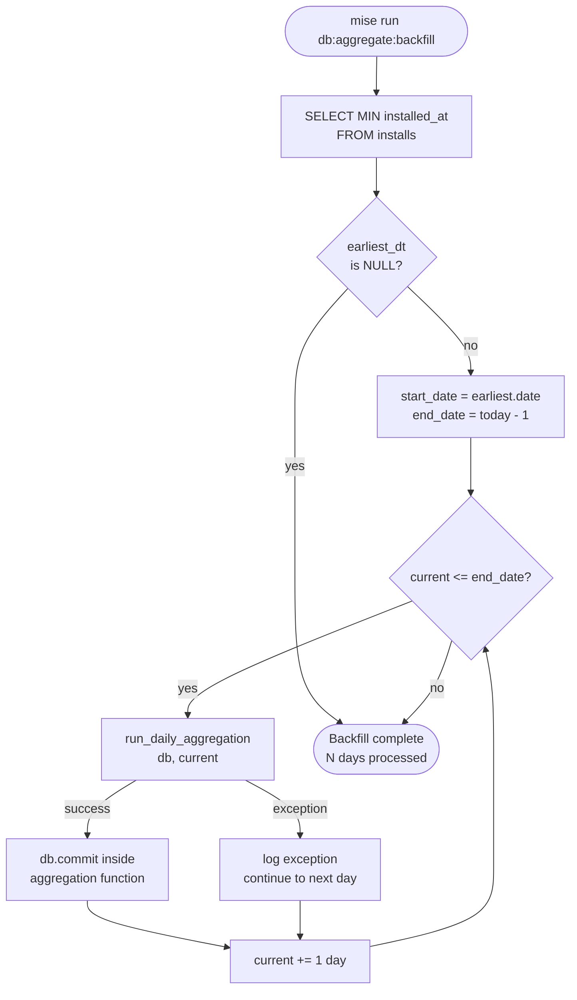
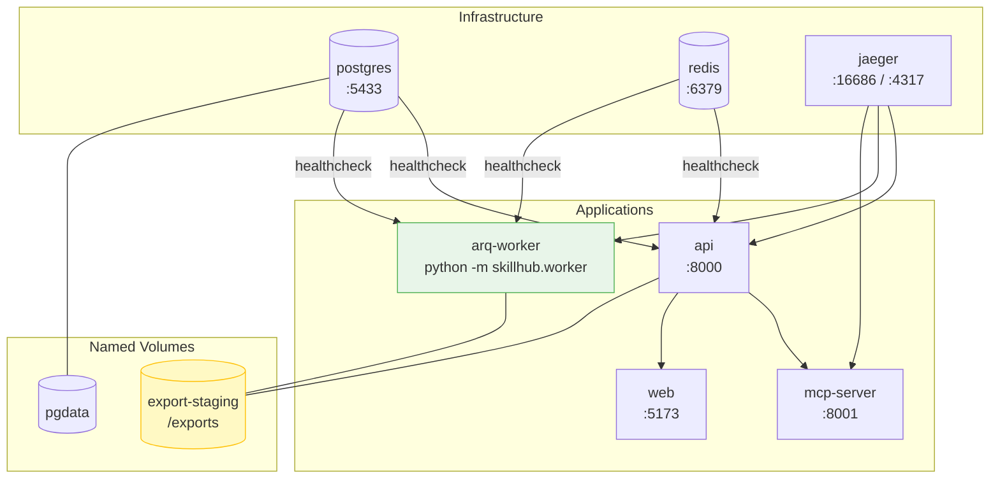

# Stage 5: Backend Infrastructure — Visual Architecture Companion

This file is the diagram companion to `stage5-backend-infra-guide.md`.
All diagrams use Mermaid syntax and are renderable in GitHub, GitLab, and most Markdown viewers.

---

## Diagram 1 — Full Data Pipeline Overview

End-to-end view from user action to admin dashboard read, showing every component introduced in Stage 5.

```mermaid
flowchart TD
    subgraph users["User Actions (any hour)"]
        UA[Install / Fork / Submit / Review]
    end

    subgraph api["FastAPI API  :8000"]
        EP[Existing endpoints\nskills / installs / submissions]
        ALog[(audit_log\nappend-only)]
        EP -->|writes| ALog
    end

    subgraph pg["PostgreSQL 16  :5432"]
        T_installs[(installs)]
        T_submissions[(submissions)]
        T_users[(users)]
        T_audit[(audit_log)]
        T_metrics[(daily_metrics\nPK: date + division_slug)]
        T_exports[(export_jobs)]
    end

    subgraph redis["Redis 7  :6379"]
        R_summary["analytics:summary:{div}  TTL 5 min"]
        R_ts["analytics:timeseries:{div}:{days}  TTL 1 hr"]
        R_funnel["analytics:funnel:{div}:{days}  TTL 2 hr"]
        R_top["analytics:top_skills:{n}  TTL 30 min"]
        ARQ_queue[("ARQ job queue")]
    end

    subgraph worker["ARQ Worker  (arq-worker container)"]
        CRON1["02:00 UTC\naggregate_daily_metrics"]
        CRON2["02:30 UTC\nrecalculate_trending"]
        CRON3["03:00 UTC\nclean_expired_exports"]
        JOB1["generate_export\n(enqueued on demand)"]
    end

    subgraph analytics_api["Analytics Router  /api/v1/admin/analytics"]
        A_sum[GET /summary]
        A_ts[GET /time-series]
        A_fun[GET /submission-funnel]
        A_top[GET /top-skills]
    end

    subgraph export_api["Exports Router  /api/v1/admin/exports"]
        E_post[POST /exports]
        E_get[GET /exports/{id}]
        E_dl[GET /exports/{id}/download]
    end

    subgraph exports_fs["export-staging volume  /exports"]
        CSV["{job_id}.csv"]
        JSON["{job_id}.json"]
    end

    UA -->|HTTP| EP
    EP -->|INSERT| T_installs
    EP -->|INSERT| T_submissions
    EP -->|INSERT| T_users
    EP -->|INSERT| T_audit

    CRON1 -->|SELECT| T_installs
    CRON1 -->|SELECT| T_submissions
    CRON1 -->|SELECT| T_users
    CRON1 -->|SELECT| T_audit
    CRON1 -->|UPSERT| T_metrics
    CRON1 -->|DEL analytics:summary:*| redis

    CRON2 -->|UPDATE skills.trending_score| pg
    CRON2 -->|DEL analytics:top_skills:*| redis

    CRON3 -->|rm old files| exports_fs

    JOB1 -->|SELECT| pg
    JOB1 -->|write file| exports_fs
    JOB1 -->|UPDATE status| T_exports

    A_sum -->|GET| R_summary
    A_sum -.->|cache miss: SELECT| T_metrics
    A_ts -->|GET| R_ts
    A_ts -.->|cache miss: SELECT| T_metrics
    A_fun -->|GET| R_funnel
    A_fun -.->|cache miss: SELECT| T_metrics
    A_top -->|SELECT| pg

    E_post -->|INSERT| T_exports
    E_post -->|ENQUEUE| ARQ_queue
    ARQ_queue -->|dequeue| JOB1
    E_get -->|SELECT| T_exports
    E_dl -->|read| exports_fs
```

---

## Diagram 2 — Nightly Aggregation Sequence

Detailed sequence for the 02:00 UTC `aggregate_daily_metrics` job.



---

## Diagram 3 — Analytics API Cache Flow

Shows the exact decision path for a GET /summary request, illustrating the "read-only cache path" principle.



---

## Diagram 4 — daily_metrics Table Schema

Entity-relationship style view of the new tables and their relationships to existing tables.



Note: `DAILY_METRICS.division_slug` has no FK constraint on `DIVISIONS.slug` — this is intentional to allow the `'__all__'` sentinel without violating referential integrity.

---

## Diagram 5 — ARQ Worker Architecture

Shows the relationship between the API process, the ARQ worker process, and shared infrastructure.



---

## Diagram 6 — Export Job Lifecycle

State machine showing all status transitions for an `ExportJob`.



---

## Diagram 7 — Redis Key Taxonomy

```mermaid
mindmap
  root((Redis))
    analytics
      summary
        "analytics:summary:__all__"
          TTL 300s
        "analytics:summary:{division_slug}"
          TTL 300s
      timeseries
        "analytics:timeseries:__all__:{days}"
          TTL 3600s
        "analytics:timeseries:{division}:{days}"
          TTL 3600s
      funnel
        "analytics:funnel:__all__:{days}"
          TTL 7200s
        "analytics:funnel:{division}:{days}"
          TTL 7200s
      top_skills
        "analytics:top_skills:{limit}"
          TTL 1800s
    arq
      "arq:job:{job_id}"
        ARQ managed
      "arq:result:{job_id}"
        ARQ managed
```

**Cache write ownership:**
- `analytics:summary:*` — written by `aggregate_daily_metrics` cron, busted on each run
- `analytics:timeseries:*` — written by `aggregate_daily_metrics` cron
- `analytics:funnel:*` — written by `aggregate_daily_metrics` cron
- `analytics:top_skills:*` — written by `recalculate_trending` cron, busted on each run
- `arq:*` — managed entirely by the ARQ library; do not touch

---

## Diagram 8 — Submission Funnel Visualization

How the five funnel columns in `daily_metrics` map to the submission pipeline states.



Conversion rates returned by `/admin/analytics/submission-funnel`:
- `submitted_to_g1` = funnel_g1_pass / funnel_submitted
- `g1_to_g2` = funnel_g2_pass / funnel_g1_pass
- `g2_to_approved` = funnel_approved / funnel_g2_pass
- `approved_to_published` = funnel_published / funnel_approved
- `end_to_end` = funnel_published / funnel_submitted

---

## Diagram 9 — DAU Calculation Strategy

Why the `'__all__'` row re-derives DAU instead of summing division DAUs.



The division filter joins `audit_log` to `users` on `actor_id`. A user belongs to exactly one division at any moment in time. However, if division membership changes between events (unlikely but possible), summing division DAUs could overcount. Re-deriving from audit_log is always correct.

---

## Diagram 10 — Connection Pool Layout

Database connection pool topology under steady-state load.



The ARQ worker process creates its own `create_engine()` instance with the same pool parameters. The two processes share the PostgreSQL server but maintain independent connection pools. PostgreSQL max_connections of 100 easily accommodates api (30 max) + worker (30 max) + headroom.

---

## Diagram 11 — Backfill Script Flow



Each day commits independently. A failure on one day is logged and skipped — the script continues to the next day. Re-running the script is safe because `run_daily_aggregation` is idempotent (INSERT ON CONFLICT DO UPDATE).

---

## Diagram 12 — Docker Compose Service Graph (Post Stage 5)



The `arq-worker` service shares the same Docker image as `api` (built from `apps/api/Dockerfile`) but runs a different command. The `export-staging` volume is the only shared filesystem state between the two containers — the API reads export files for download; the worker writes them.
