# Stage 6B: Frontend Diagrams Companion

**Stage 6B: Feedback, Roadmap & Export — Frontend Views**
Date: 2026-03-23

---

## 1. Component Tree

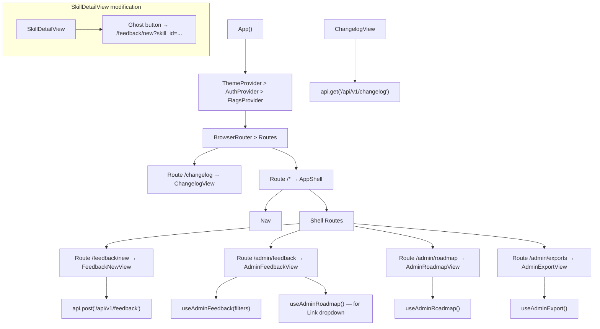

---

## 2. AdminFeedbackView Layout

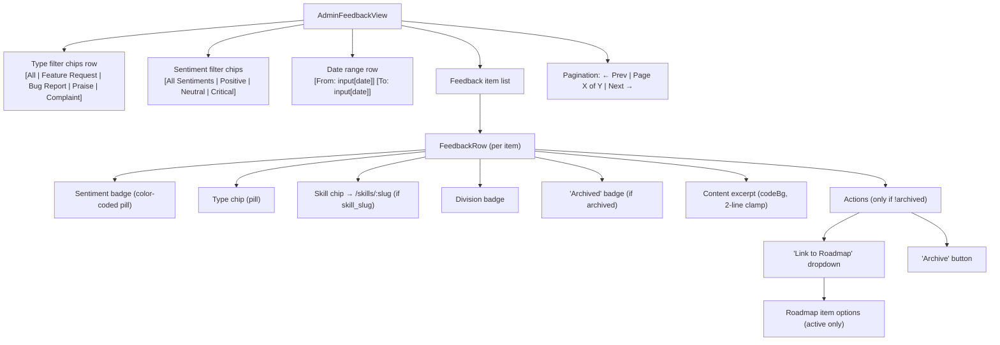

---

## 3. Sentiment Color Mapping

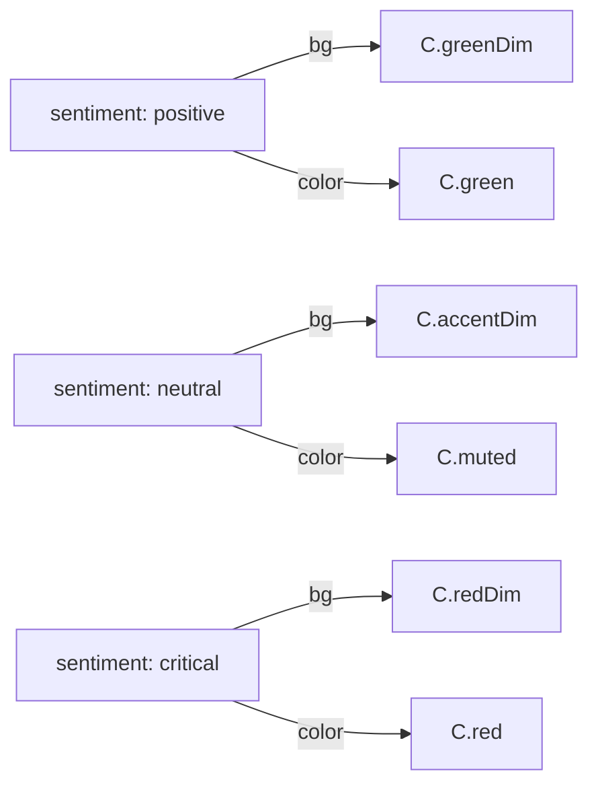

---

## 4. AdminRoadmapView — Kanban Layout

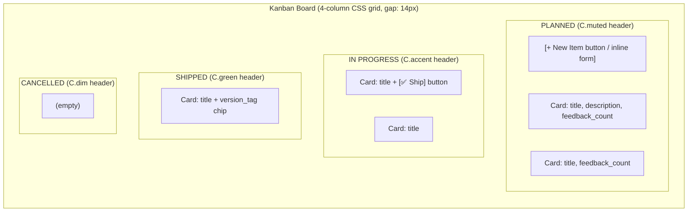

---

## 5. Kanban Card Anatomy

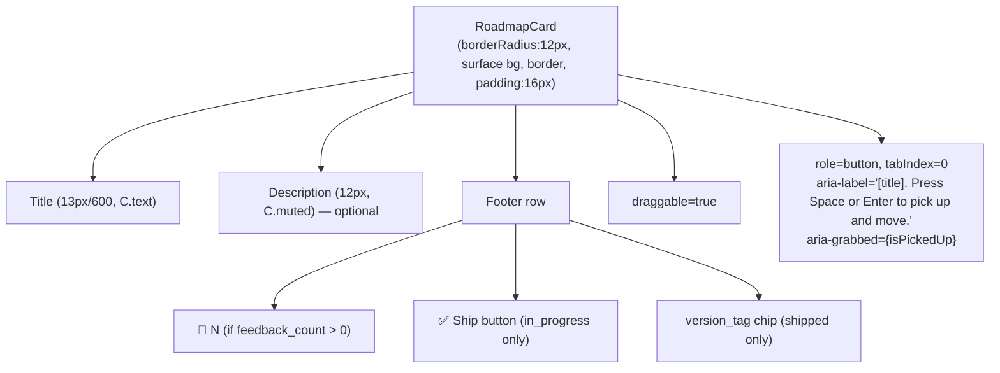

---

## 6. Drag-and-Drop State Machine

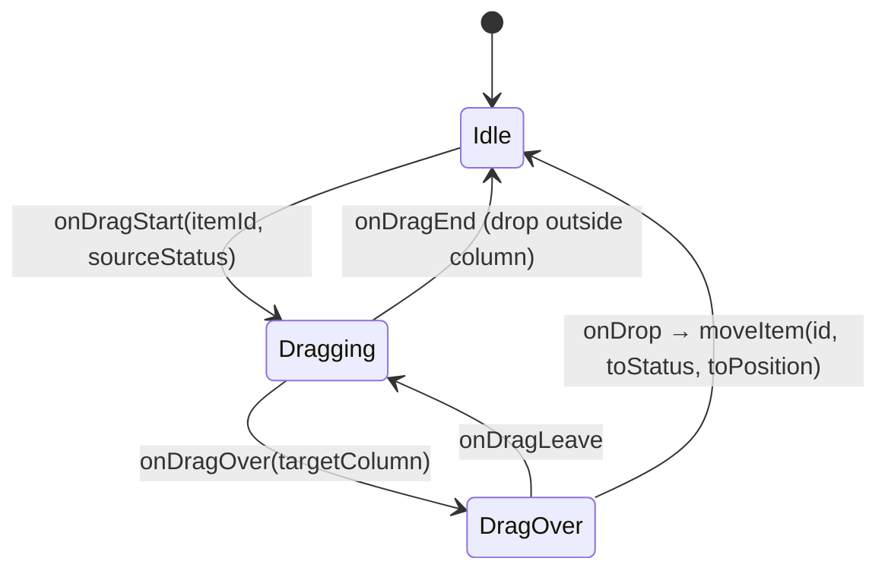

---

## 7. Keyboard Drag-and-Drop State Machine

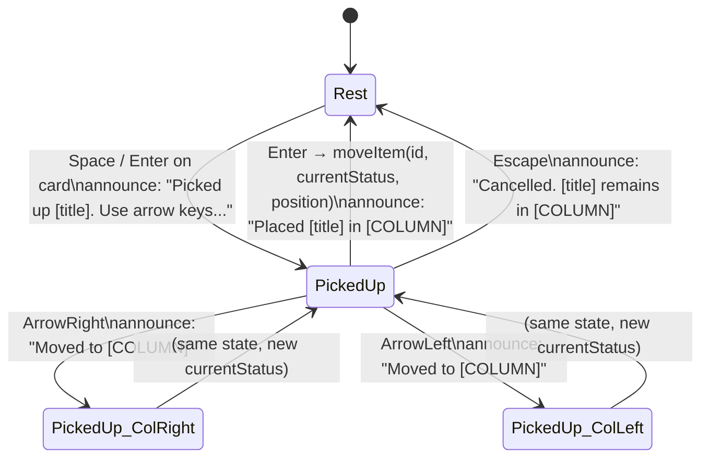

---

## 8. "Mark as Shipped" Side Panel Flow

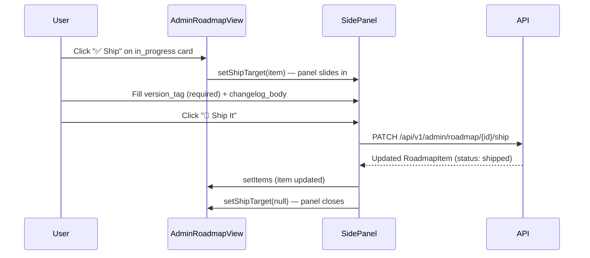

---

## 9. AdminExportView — State Machine

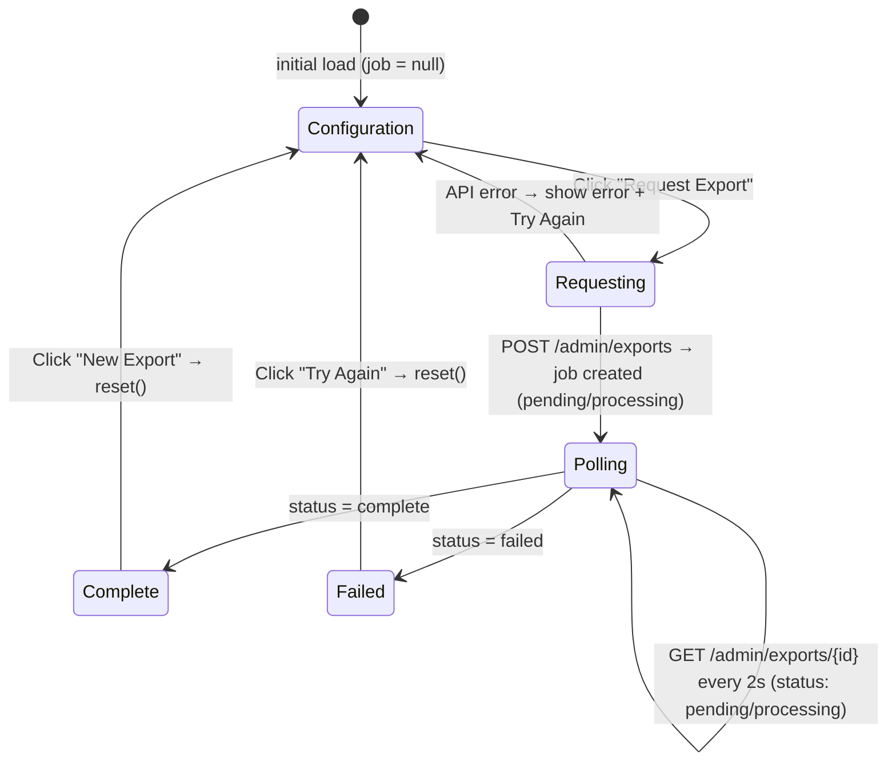

---

## 10. AdminExportView — Component Layout

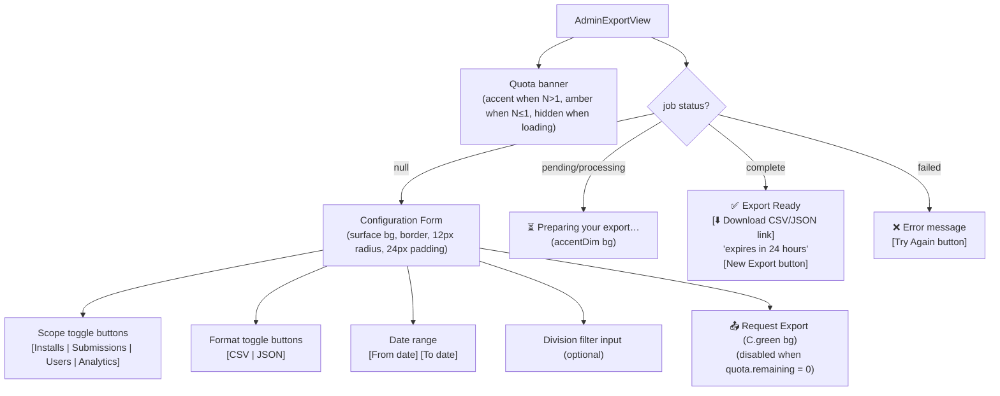

---

## 11. Feedback Form Flow (User-facing)

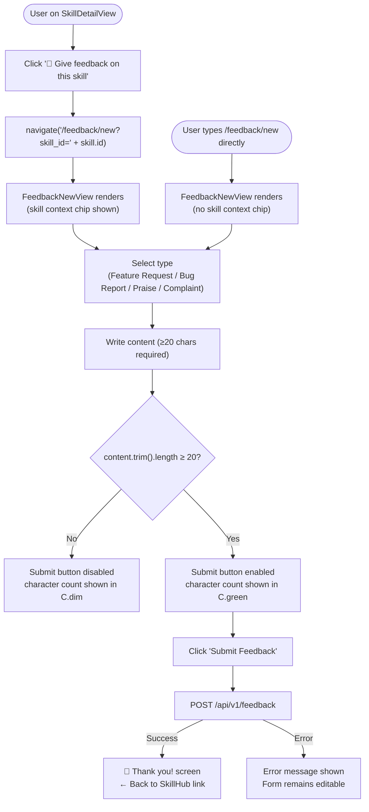

---

## 12. Public Changelog Route Isolation

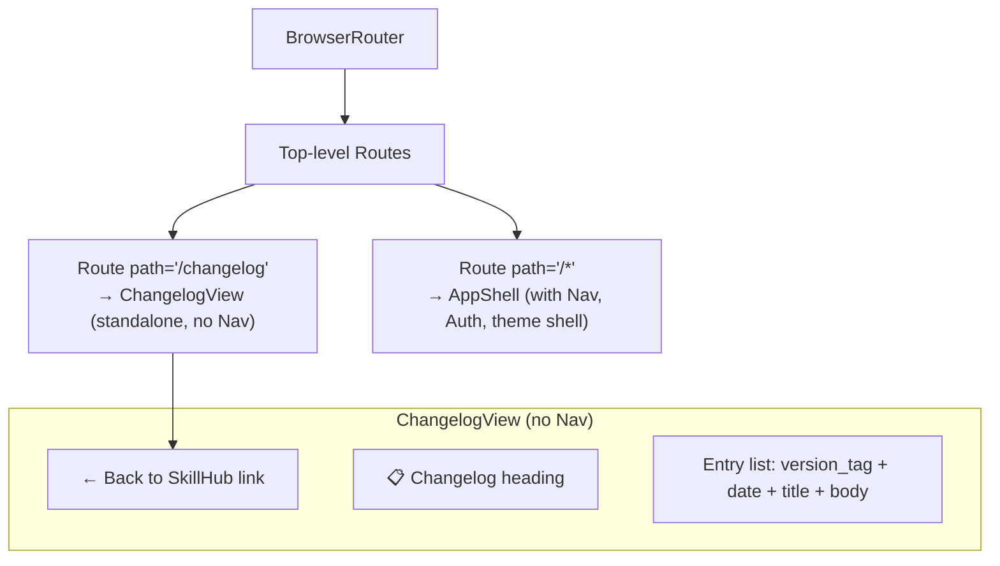

---

## 13. Hook Data Flow

```mermaid
graph LR
    subgraph "useAdminFeedback"
        AF_params["FeedbackFilters (type, sentiment, dates, page)"]
        AF_params -->|GET /api/v1/admin/feedback| AF_state["{ data, loading, error }"]
        AF_archive["archive(id)"] -->|PATCH .../archive| AF_state
        AF_link["linkToRoadmap(fbId, rmId)"] -->|PATCH .../roadmap| AF_state
    end

    subgraph "useAdminRoadmap"
        AR_fetch["fetch()"] -->|GET /api/v1/admin/roadmap| AR_items["items: RoadmapItem[]"]
        AR_move["moveItem(id, status, pos)"] -->|optimistic update + PATCH| AR_items
        AR_create["createItem(title)"] -->|POST /api/v1/admin/roadmap| AR_items
        AR_ship["shipItem(id, ver, log)"] -->|PATCH .../ship| AR_items
    end

    subgraph "useAdminExport"
        AE_req["requestExport(scope, format, ...)"] -->|POST /api/v1/admin/exports| AE_job["job: ExportJob | null"]
        AE_poll["setInterval 2000ms"] -->|GET /api/v1/admin/exports/{id}| AE_job
        AE_quota["fetchQuota()"] -->|GET .../quota| AE_quota_state["quota: ExportQuota"]
        AE_job -->|status complete/failed| AE_stopPoll["stopPoll()"]
    end
```

---

## 14. Token Reference by View

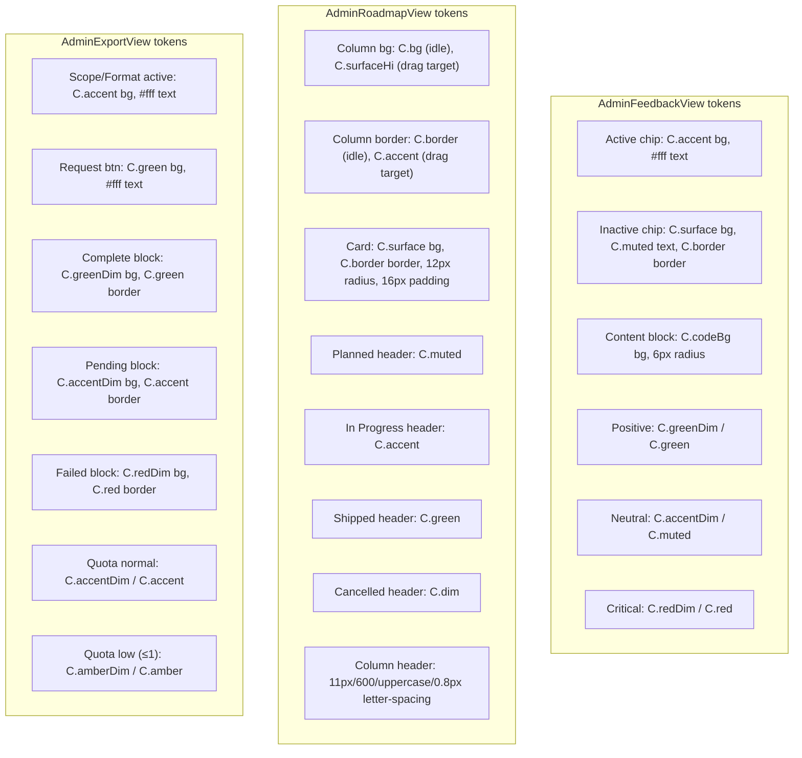
