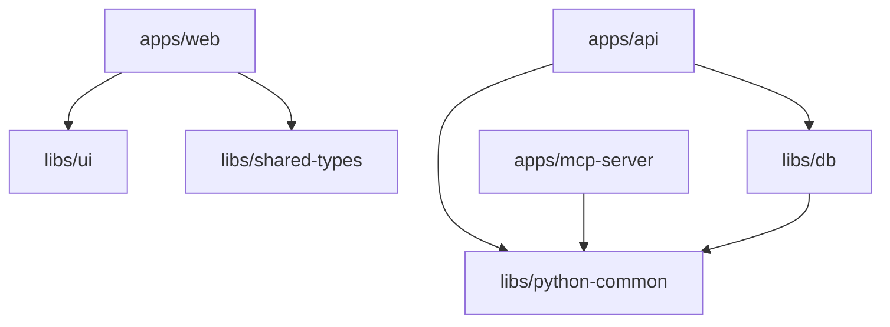

# Monorepo Structure

## Workspace Layout

```
marketplace-ai/
  apps/
    api/              # Flask/APIFlask backend (Python)
    web/              # React + Vite frontend (TypeScript)
    mcp-server/       # MCP server for Claude Code (Python)
  libs/
    db/               # SQLAlchemy models, Alembic migrations, seed
    python-common/    # Shared Python utilities
    ui/               # Shared React components (TypeScript)
    shared-types/     # Generated TypeScript types from OpenAPI
  docs/               # Documentation
  specs/              # OpenAPI spec, SQL schema dumps
  design/             # Design assets
```

## Dependency Rules



**Enforced constraints:**
- No circular dependencies
- `apps/*` never imports from other `apps/*`
- `libs/*` never imports from `apps/*`

## Mise Task Namespaces

| Namespace | Examples |
|---|---|
| `dev:*` | `dev:api`, `dev:web`, `dev:mcp` |
| `test:*` | `test:api`, `test:web`, `test:mcp`, `test:db` |
| `lint:*` | `lint:api`, `lint:web`, `lint:mcp`, `lint:fix` |
| `format:*` | `format:api`, `format:web`, `format:check` |
| `typecheck:*` | `typecheck:api`, `typecheck:web` |
| `build:*` | `build:web`, `build:docker`, `build:docker:api` |
| `db:*` | `db:up`, `db:migrate`, `db:seed`, `db:reset`, `db:shell` |
| `docker:*` | `docker:up`, `docker:down`, `docker:logs`, `docker:reset` |
| `gen:*` | `gen:openapi`, `gen:types` |
| `quality-gate` | Full CI gate: lint + format + typecheck + tests |

Config: `mise.toml` at repo root.

## Docker Services

| Service | Image | Port | Depends On |
|---|---|---|---|
| `postgres` | `postgres:16-alpine` | 5432 | - |
| `redis` | `redis:7-alpine` | 6379 | - |
| `api` | Custom Dockerfile | 8000 | postgres, redis |
| `mcp-server` | Custom Dockerfile | 8001 | api |
| `web` | Custom Dockerfile | 5173 | api |

Config: `docker-compose.yml` at repo root. Production variant: `docker-compose.prod.yml`.

## CI Stages

`mise run quality-gate` runs the full pipeline:
1. `ruff check` — Python linting
2. `ruff format --check` — Python format check
3. `mypy --strict` — Python type check
4. `pytest --cov --cov-fail-under=80` — API tests with coverage gate
5. `pytest` — DB lib tests
6. `tsc --noEmit` — TypeScript type check

## Key Files

- `mise.toml` — all task definitions
- `nx.json` — NX workspace config
- `docker-compose.yml` — local dev services
- `package.json` — Node workspace root
- `tsconfig.base.json` — shared TypeScript config
