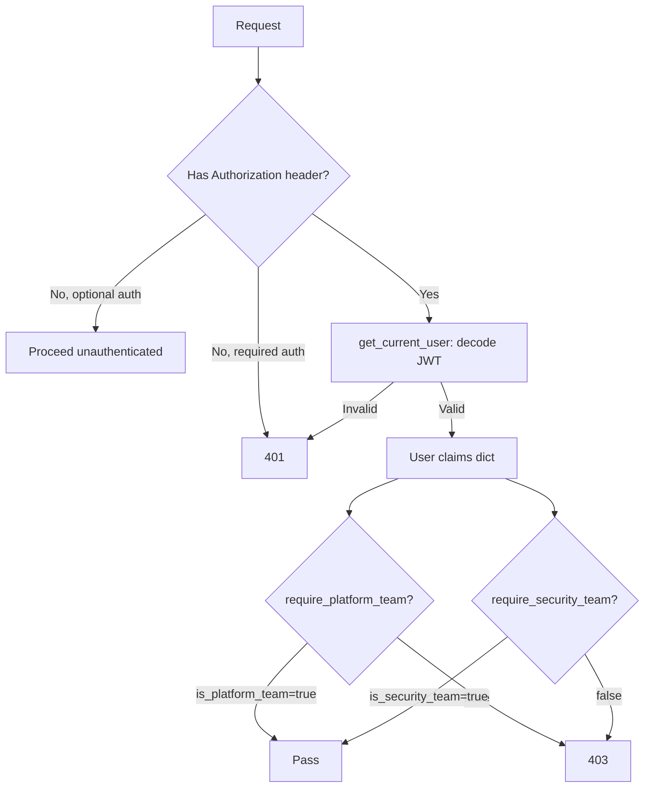

# API Design

FastAPI backend at `apps/api/`. Runs on port 8000.

## REST Conventions

- All resource endpoints under `/api/v1/`
- Auth endpoints under `/auth/`
- Health at `/health`
- Plural nouns for collections: `/skills`, `/submissions`
- Nested resources: `/skills/{slug}/reviews`, `/skills/{slug}/comments/{id}/replies`
- Idempotent upserts for favorite and follow (POST returns 200, not 201)
- Soft deletes where appropriate (install, comment)

## Pagination

All list endpoints accept:
```
?page=1&per_page=20
```
- `page`: >= 1 (default 1)
- `per_page`: 1-100 (default 20)

Response:
```json
{
  "items": [...],
  "total": 42,
  "page": 1,
  "per_page": 20,
  "has_more": true
}
```

## Error Responses

| Status | Usage |
|---|---|
| 400 | Invalid input (bad UUID, missing fields) |
| 401 | Missing or invalid JWT |
| 403 | Division restricted, not owner, wrong team |
| 404 | Resource not found |
| 409 | Duplicate review |
| 501 | OAuth callback (not implemented) |

Error body: `{ "detail": "message" }` or `{ "detail": { "error": "code" } }`.

## Auth Middleware Chain



Three auth levels via FastAPI `Depends()`:
1. `get_current_user` — any authenticated user
2. `require_platform_team` — chains `get_current_user`, checks `is_platform_team`
3. `require_security_team` — chains `get_current_user`, checks `is_security_team`

Optional auth: `_optional_auth()` helper in skills and flags routers.

## Service Layer Pattern

```
Router (endpoint) -> Service (business logic) -> SQLAlchemy (DB)
```

- Routers handle HTTP concerns: request parsing, response models, status codes
- Services handle business logic: validation, authorization, counter updates
- Services raise `ValueError` (-> 404), `PermissionError` (-> 403)
- Routers catch and map to HTTP exceptions

## Key Files

- `apps/api/skillhub/main.py` — app factory
- `apps/api/skillhub/config.py` — settings via pydantic-settings
- `apps/api/skillhub/dependencies.py` — auth + DB dependencies
- `apps/api/skillhub/routers/` — one file per domain
- `apps/api/skillhub/services/` — one file per domain
- `apps/api/skillhub/schemas/` — Pydantic request/response models
