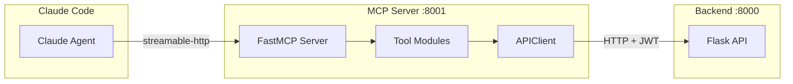

# MCP Server Design

Python MCP server using `FastMCP`. Located at `apps/mcp-server/`.

## Architecture



## Tool Registry

9 tools registered on the `FastMCP` instance in `server.py`. Each tool:
1. Accepts typed parameters + optional `token` string
2. Creates `APIClient(base_url, token)`
3. Delegates to a function in `skillhub_mcp/tools/{name}.py`
4. Returns dict/list to Claude

No business logic in the MCP server. All validation, authorization, and persistence happen in the API.

## Delegation Pattern

```python
# server.py — registration
@mcp.tool(name="search_skills", description="...")
async def search_skills_tool(query=None, category=None, ...):
    client = _get_api_client(token)
    return await _search_skills(query=query, ..., api_client=client)

# tools/search.py — delegation
async def search_skills(query, category, ..., api_client):
    params = {k: v for k, v in {...}.items() if v is not None}
    response = await api_client.get("/api/v1/skills", params=params)
    return response.json()
```

## Division Enforcement

The MCP server does not enforce divisions directly. For install/update, it:
1. Decodes the JWT without verification (`options={"verify_signature": False}`)
2. Passes claims to the tool module
3. The tool calls the API, which verifies the JWT and checks divisions

This ensures division logic has a single source of truth (the API).

## Local Filesystem

Skills install to a configurable directory (default `~/.local/share/claude/skills/`).

Operations:
- **install**: Fetch content from API, write `{skills_dir}/{slug}/SKILL.md`
- **update**: Compare local version against API, overwrite if newer
- **list_installed**: Scan directory, parse frontmatter for version, compare against API

## Configuration

`MCPSettings` via `pydantic-settings`. All vars prefixed `SKILLHUB_MCP_`.
Reads from env vars and `.env` file.

## Key Files

- `apps/mcp-server/skillhub_mcp/server.py` — tool registration
- `apps/mcp-server/skillhub_mcp/api_client.py` — `APIClient` (httpx async)
- `apps/mcp-server/skillhub_mcp/config.py` — `MCPSettings`
- `apps/mcp-server/skillhub_mcp/tools/` — one module per tool
- `apps/mcp-server/tests/` — one test file per tool
