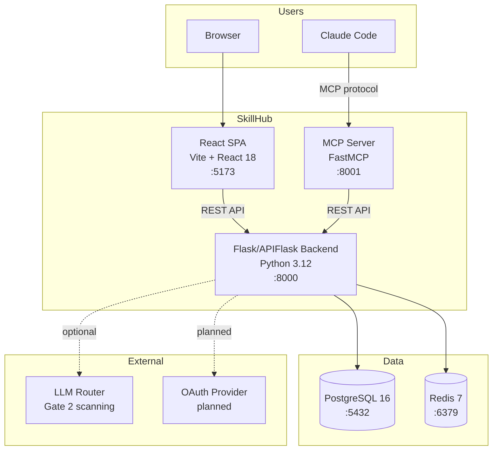

# Architecture Overview

## System Context

SkillHub is an internal AI skills marketplace. Users browse, install, review, and share Claude skills across organizational divisions.

## Container Diagram

## Data Flow

1. **Browse**: Browser -> React SPA -> `GET /api/v1/skills` -> Flask API -> PostgreSQL
2. **Install via MCP**: Claude Code -> MCP Server -> `POST /api/v1/skills/{slug}/install` -> Flask API (division check) -> PostgreSQL
3. **Submit**: User -> `POST /api/v1/submissions` -> Gate 1 (sync) -> Admin triggers Gate 2 (LLM) -> Gate 3 (human) -> Published
4. **Flags**: Any client -> `GET /api/v1/flags` -> division override resolution -> merged flag map

## Deployment

**Local dev**: `mise run dev:api`, `mise run dev:web`, `mise run dev:mcp` as separate processes. Docker for postgres + redis.

**Docker**: `docker compose up -d` runs all 5 services. API hot-reloads via volume mounts.

**Production**: `docker-compose.prod.yml` (separate config, no volume mounts).

## Key Architectural Decisions

- **Division enforcement is server-side only.** Never trust client division claims.
- **MCP server has no database access.** All operations delegate to the API.
- **Denormalized counters** on skills table avoid COUNT queries at read time.
- **Audit log is append-only.** DB trigger blocks UPDATE/DELETE.
- **Stub auth for dev.** OAuth providers planned but not yet implemented.

## Tracing

OpenTelemetry SDK in API and MCP server. Exports via OTLP to Jaeger all-in-one (local). Disabled by default (`OTEL_TRACES_ENABLED=false`). No tracing in production unless explicitly configured. Graceful degradation — app runs fine without Jaeger.

## Related Docs

- [DATABASE.md](DATABASE.md) — schema details
- [API-DESIGN.md](API-DESIGN.md) — REST conventions
- [FRONTEND.md](FRONTEND.md) — React architecture
- [MCP-DESIGN.md](MCP-DESIGN.md) — MCP server design
