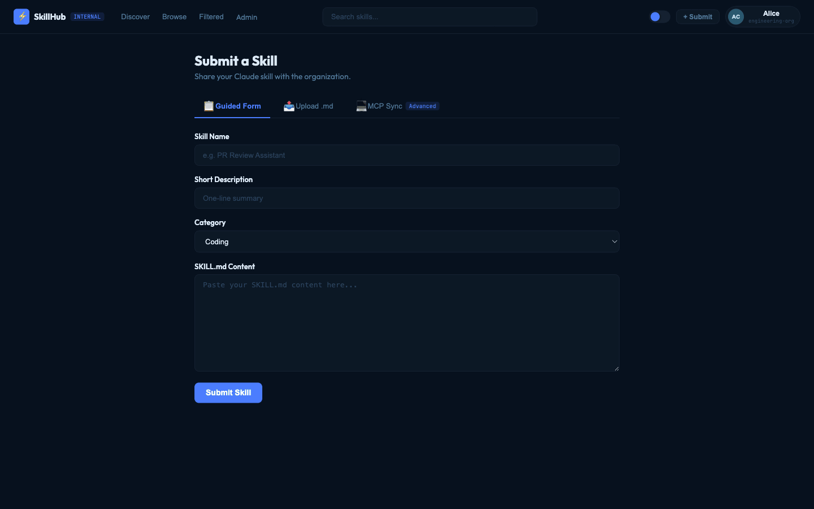
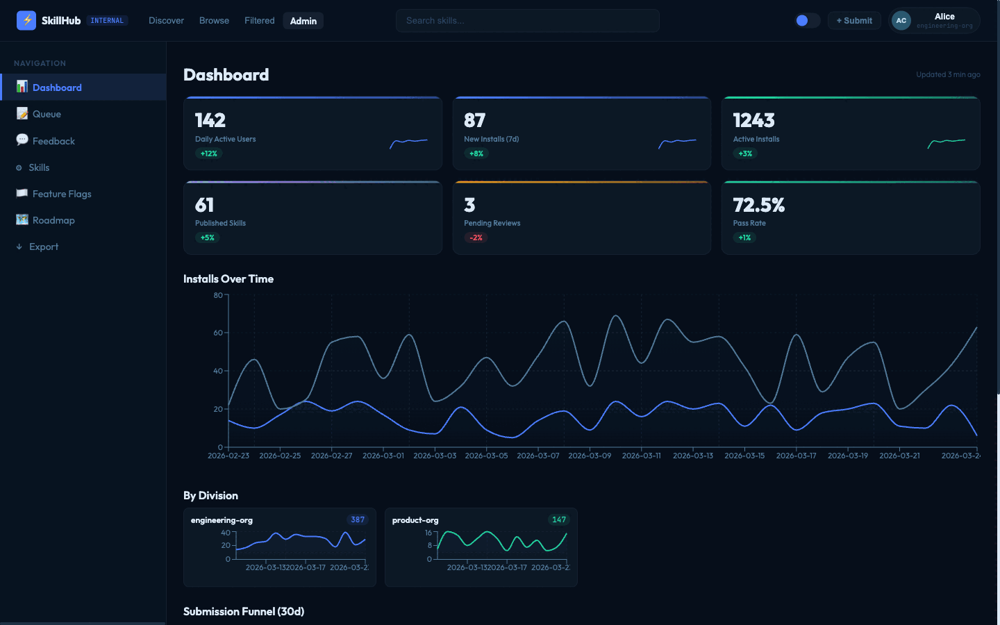
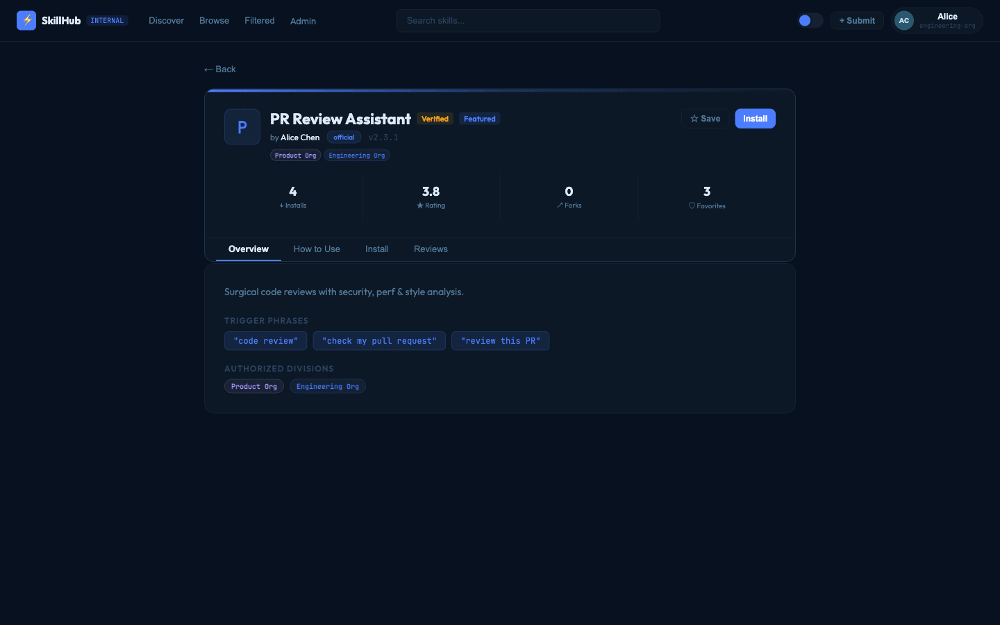
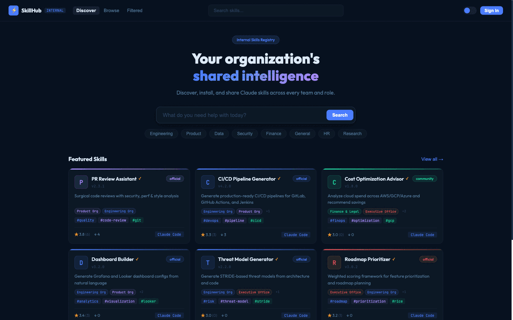

# SkillHub Features

> Visual feature documentation for the SkillHub AI Skills Marketplace.
> GIF demos are recorded using the `feature-demo-recorder` skill.

## Table of Contents
- [1. Skill Discovery & Search](#1-skill-discovery--search)
- [2. Quality Assurance Pipeline](#2-quality-assurance-pipeline)
- [3. Governance & Access Control](#3-governance--access-control)
- [4. Collaboration & Community](#4-collaboration--community)
- [5. Developer Integration (Claude Code MCP)](#5-developer-integration-claude-code-mcp)
- [6. Operational Readiness](#6-operational-readiness)
- [7. Authentication](#7-authentication)
- [8. Admin HITL Queue Enhancements (Phase 6)](#8-admin-hitl-queue-enhancements-phase-6--coming-soon)
- [9. User Documentation Portal (Phase 6)](#9-user-documentation-portal-phase-6--coming-soon)
- [10. User Skill Submission UI (Phase 6)](#10-user-skill-submission-ui-phase-6--coming-soon)

---

## 1. Skill Discovery & Search

Browse skills across 9 categories with instant search, division filtering, and smart sorting. The card-based UI supports dark/light theme with a fully tokenized design system. Users can find a relevant AI skill in under 30 seconds by searching or browsing by their team's category.

**Key capabilities:**
- Marketplace browse with card-based UI across 9 categories (Engineering, Product, Data, Security, Finance, General, HR, Research, Operations)
- Full-text search by name, description, or tags with instant results
- Multi-select division filtering (8 divisions)
- Sort by Trending, Most Installed, Highest Rated, Newest, Recently Updated
- Featured/verified skill badges with curated homepage section
- Load-more pagination across all browse/search views
- Dark/light theme with system-matched toggle and fully tokenized design system

---

## 2. Quality Assurance Pipeline

Every skill passes through a 3-gate quality pipeline before reaching the marketplace: automated validation, AI-assisted evaluation, and human review. The pipeline tracks submissions through 9 states with a full audit trail at every transition, ensuring that only vetted skills are published.

**Key capabilities:**
- Gate 1 — Automated Validation: schema validation, required fields, slug uniqueness, trigger phrase similarity check (Jaccard > 0.7 blocks duplicates)
- Gate 2 — AI-Assisted Evaluation: LLM judge scores quality, security, and usefulness (0-100); feature-flag controlled with pluggable scoring model
- Gate 3 — Human Review: platform team approves, requests changes, or rejects with mandatory notes
- Auto-publication of approved submissions as live published skills
- 9-state status tracking with full audit trail at every transition

---

## 3. Governance & Access Control

Division-based permissions ensure skills are scoped to specific organizational divisions with server-enforced boundaries. Role-based admin access, append-only audit logging, and feature flags provide the governance controls needed for enterprise deployment. All 15 admin API endpoints are complete and tested.

**Key capabilities:**
- Division-based permissions with server-enforced skill scoping (never client-side)
- Role-based admin access: Platform Team and Security Team roles with distinct permissions (feature vs. remove)
- Append-only, tamper-proof audit log with DB trigger that blocks modification
- Feature flags with boolean flags and per-division overrides for progressive rollout
- Skill moderation: feature, deprecate, or remove skills with full audit trail
- User management: list, filter, and update user roles/divisions/team flags
- Cross-division access requests: users request access to skills outside their division; admins approve/deny

---

## 4. Collaboration & Community

Community engagement features let users rate, review, discuss, and fork skills to create organic quality curation. Star ratings use Bayesian average calculation for fair ranking, and forking preserves skill lineage so division-specific variants maintain a connection to their origin.

**Key capabilities:**
- Star ratings: 1-5 star rating per user per skill with Bayesian average calculation
- Written reviews with edit capability and helpful/unhelpful voting
- Threaded comments and replies with upvoting and soft-delete
- Favorites: save skills to a personal collection
- Following: follow skill authors for updates
- Forking: fork a skill to create division-specific variants while preserving lineage

---

## 5. Developer Integration (Claude Code MCP)

Nine MCP tools provide native Claude Code CLI integration so developers never leave their AI assistant to find, install, update, fork, or submit skills. This is the key differentiator — no commercial tool offers native Claude Code CLI integration via MCP, keeping the entire developer workflow inside the AI assistant.

**Key capabilities:**
- Search Skills: search the marketplace from inside Claude Code
- Install Skill: one-command install with division access check
- Uninstall Skill: clean removal with API tracking
- Update Skill: detect and update stale installed skills
- List Installed: view all installed skills with staleness indicator
- Fork Skill: fork a skill directly from the CLI
- Submit Skill: submit a SKILL.md for review without leaving the editor
- Check Status: check submission pipeline status from CLI

---

## 6. Operational Readiness

The full platform runs from a single Docker Compose command covering all 5 services plus observability. The codebase includes 634+ automated tests, Alembic-managed database migrations, 61 realistic seed skills, and OpenTelemetry distributed tracing with a Jaeger UI for debugging.

**Key capabilities:**
- Docker Compose stack: single-command startup for all 5 services plus observability
- Database migrations: Alembic-managed schema with rollback capability
- Seed data: 61 realistic skills across all categories, divisions, and install methods
- Distributed tracing: OpenTelemetry instrumentation across API and MCP server with Jaeger UI
- Test suite: 634+ automated tests (550 API, 84 MCP) with TDD enforcement
- Design system: canonical design tokens (tokens.json), style guide, component inventory

---

## 7. Authentication

The PoC uses 6 deterministic dev personas across divisions to validate the full user journey across different roles and divisions. The auth architecture is designed for SSO integration — the database model, JWT claim structure, and OAuth session table are already in place. Provider-specific callback handlers are the remaining work for pilot readiness.

**Key capabilities:**
- Dev authentication: 6 persona users across divisions (Engineering, Product, Data, Security) with JWT tokens
- JWT verification: cryptographic token verification on all protected endpoints
- OAuth / SSO: Microsoft, Google, Okta, GitHub, and Generic OIDC integration planned (database model and JWT claim structure ready)

---

## 8. Admin HITL Queue Enhancements (Phase 6 — coming soon)

Enhanced human-in-the-loop review queue for platform administrators with real-time updates, batch operations, and improved review workflows. This builds on the existing Gate 3 human review pipeline with a dedicated browser-based interface for managing the submission backlog efficiently.

**Key capabilities:**
- Dedicated admin review queue with filtering by submission state, category, and division
- Batch approve/reject operations for high-volume review periods
- Real-time queue updates via WebSocket notifications
- Inline diff view for skill content changes between submission revisions
- Reviewer assignment and workload balancing

---

## 9. User Documentation Portal (Phase 6 — coming soon)

A self-service documentation portal that helps users understand how to discover, install, author, and submit skills. The portal integrates directly with the marketplace UI so contextual help is always one click away, reducing support burden on the platform team.

**Key capabilities:**
- Getting started guides for skill discovery, installation, and authoring
- Interactive tutorials for SKILL.md authoring with live validation
- FAQ and troubleshooting section covering common issues
- Contextual help links embedded throughout the marketplace UI
- Searchable documentation with category-based navigation

---

## 10. User Skill Submission UI (Phase 6 — coming soon)

A browser-based skill submission form that complements the existing MCP-based CLI submission workflow. This lowers the barrier to entry for non-developer contributors who prefer a visual interface, while feeding into the same 3-gate quality assurance pipeline.

**Key capabilities:**
- Step-by-step submission wizard with SKILL.md template scaffolding
- Live preview of skill card as it will appear in the marketplace
- Client-side validation matching Gate 1 automated checks (schema, required fields, slug uniqueness)
- Submission status dashboard showing pipeline progress through all 3 gates
- Draft save and resume for in-progress submissions
