# Phase 1: Flask Skeleton — Visual Architecture Companion

**Companion to:** `phase1-flask-skeleton-guide.md`
**Notation:** All diagrams use Mermaid syntax

---

## 1. System Overview — Before and After Phase 1

### Before Phase 1 (Current State)

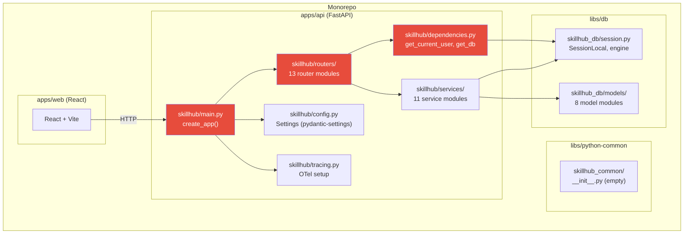

### After Phase 1

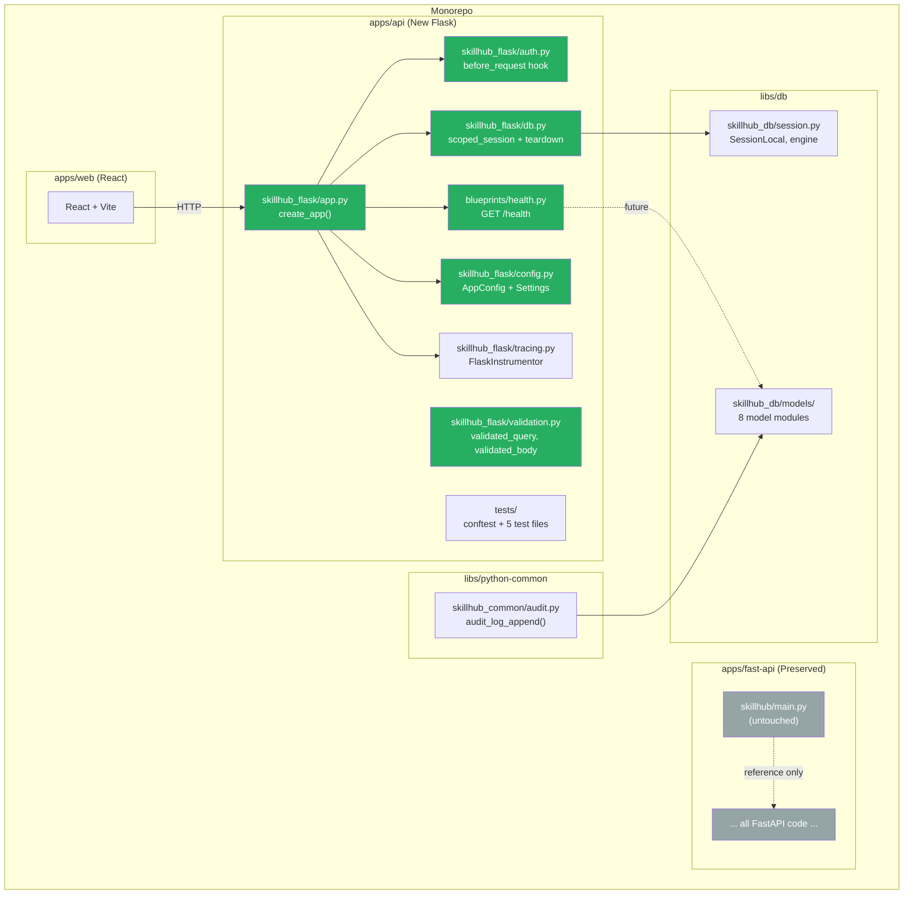

---

## 2. App Factory Sequence Diagram

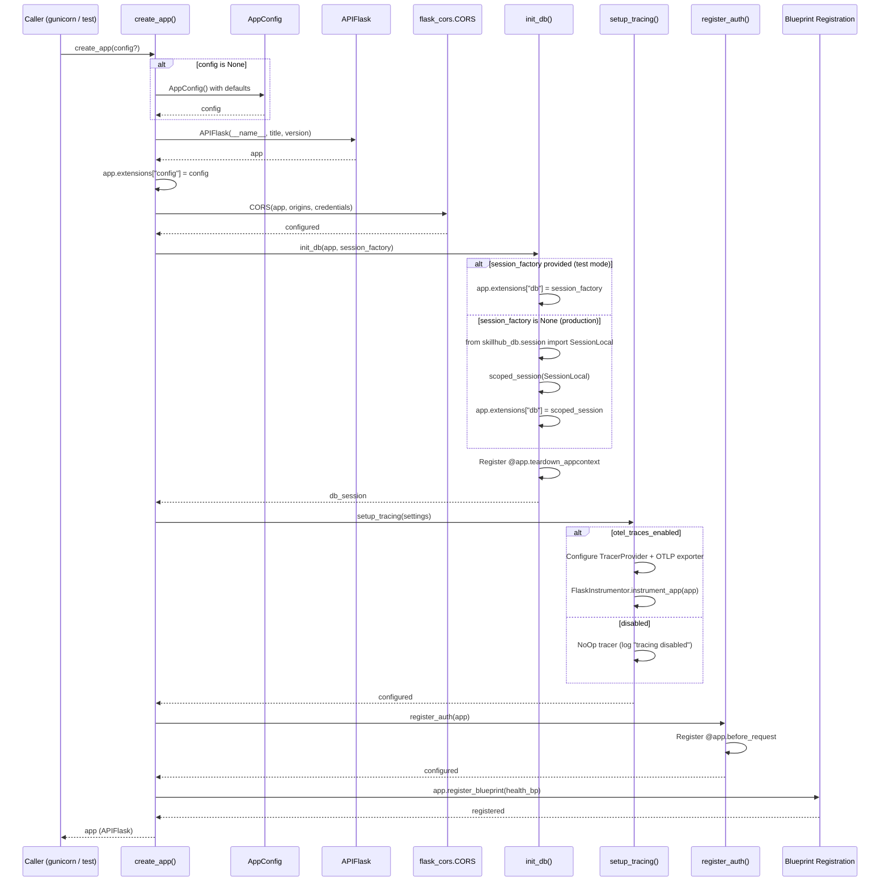

---

## 3. Authentication Flow — `before_request` Hook

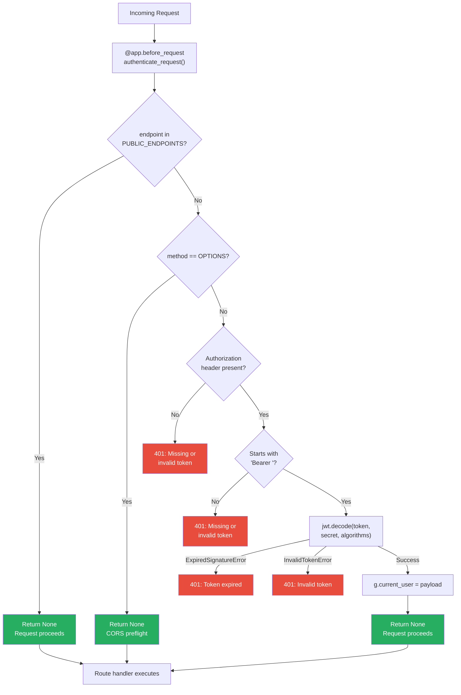

### PUBLIC_ENDPOINTS Registry

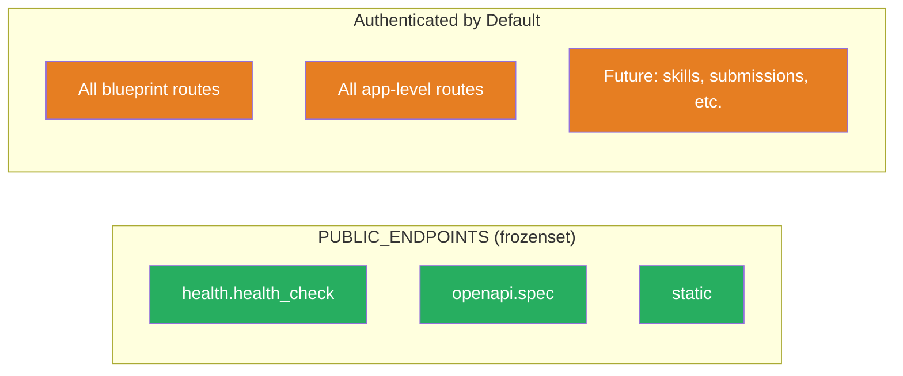

---

## 4. Database Session Lifecycle

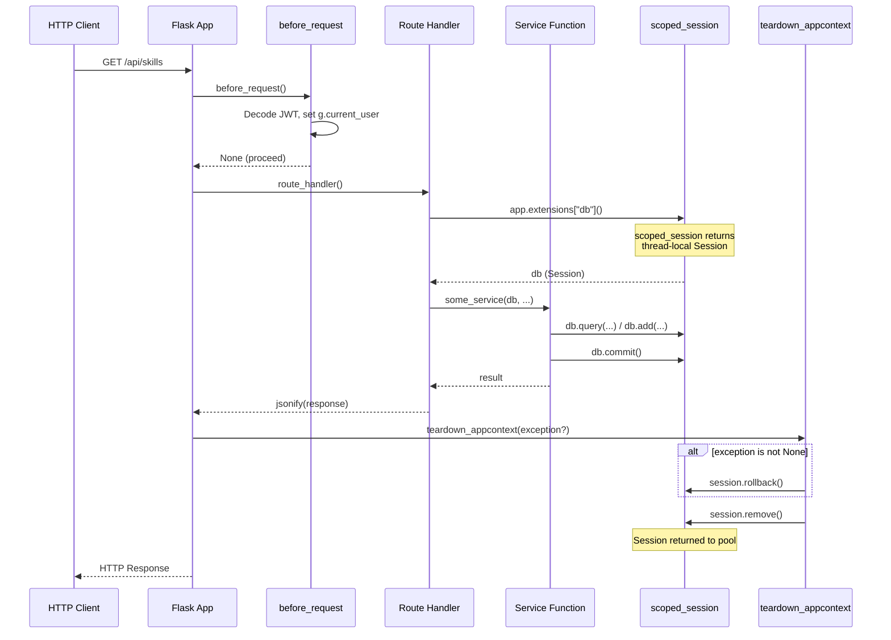

### Test Mode vs Production Mode

```mermaid
graph TB
    subgraph "Production"
        P_FACTORY["create_app()"] -->|"session_factory=None"| P_INIT["init_db()"]
        P_INIT -->|"import"| P_SL["skillhub_db.session.SessionLocal"]
        P_SL --> P_SCOPED["scoped_session(SessionLocal)"]
        P_SCOPED --> P_EXT["app.extensions['db']"]
    end

    subgraph "Test"
        T_FACTORY["create_app(config)"] -->|"session_factory=mock"| T_INIT["init_db()"]
        T_INIT --> T_MOCK["MagicMock()"]
        T_MOCK --> T_EXT["app.extensions['db']"]
    end

    style P_SL fill:#3498db,color:#fff
    style T_MOCK fill:#e67e22,color:#fff
```

---

## 5. Request Validation Flow

### `validated_query()` Decorator

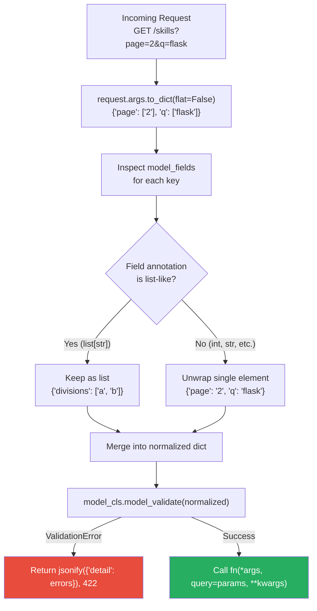

### `validated_body()` Decorator

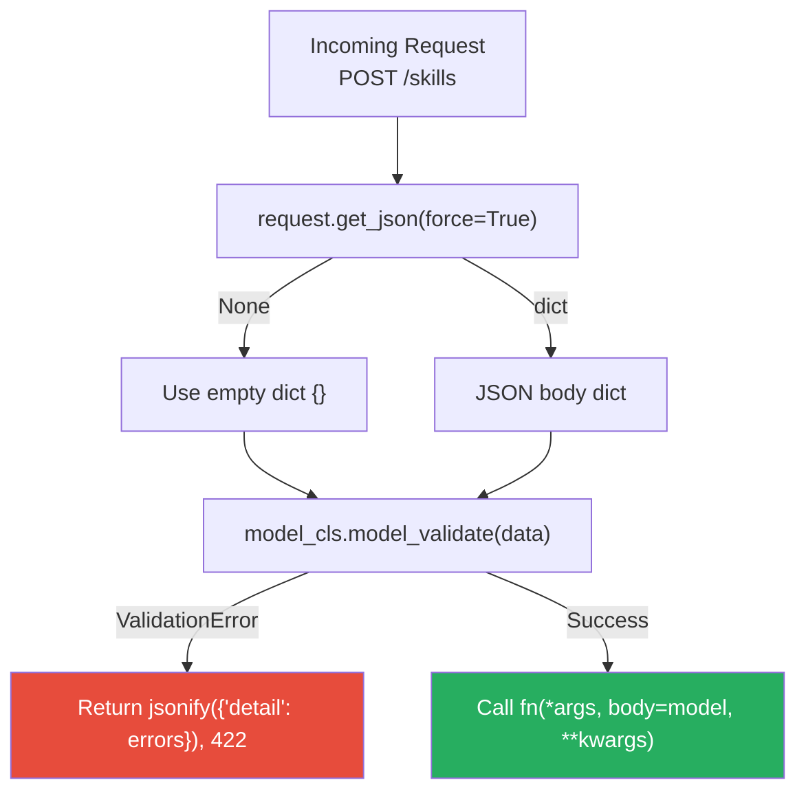

### Error Response Format (FastAPI Parity)

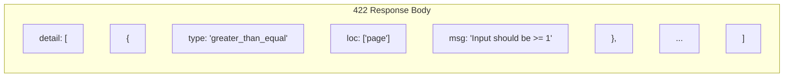

---

## 6. File Dependency Graph — Phase 1 Modules

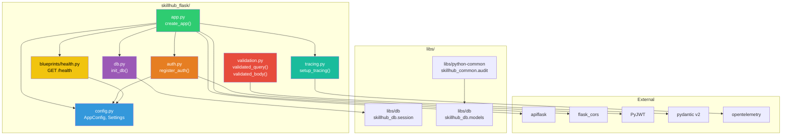

---

## 7. Prompt Execution Dependency Graph

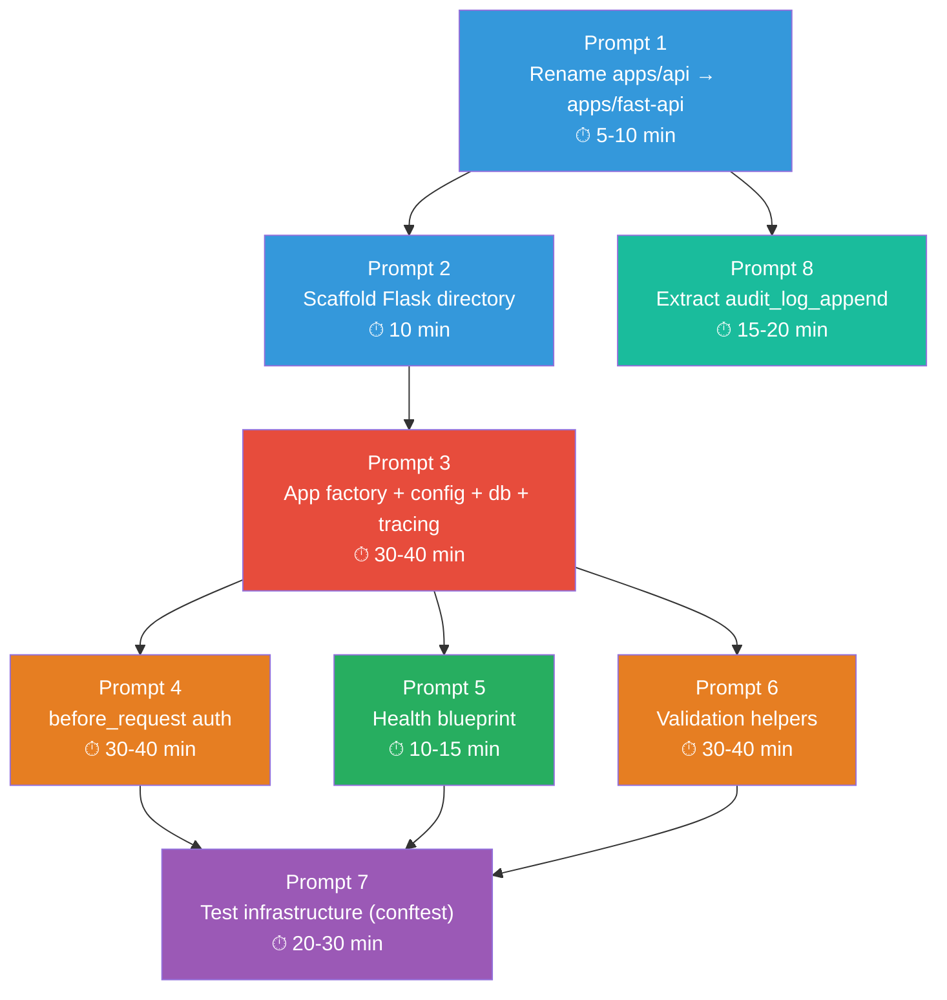

**Legend:**
- Blue: Setup / scaffolding
- Red: Core infrastructure (longest prompt)
- Orange: Medium complexity
- Green: Simple implementation
- Purple: Integration / verification
- Teal: Independent extraction

---

## 8. FastAPI-to-Flask Concept Mapping

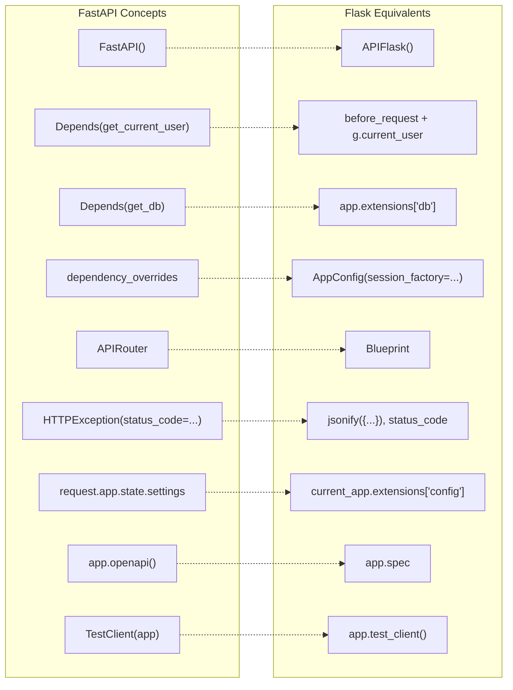

---

## 9. Security Model — Fail-Closed vs Fail-Open

### FastAPI (Fail-Open — Current)

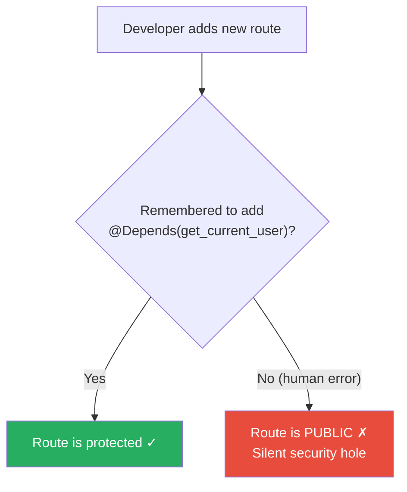

### Flask (Fail-Closed — Phase 1)

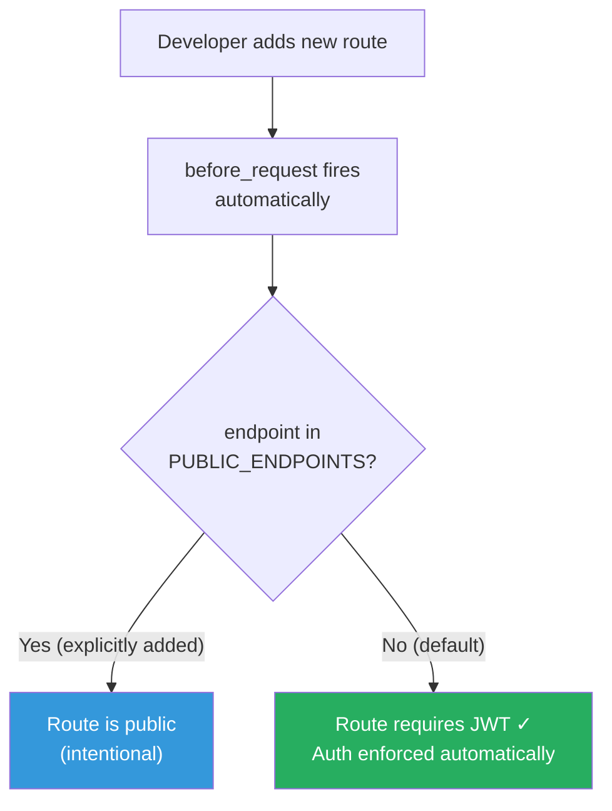

---

## 10. Migration Timeline — Phase 1 in Context

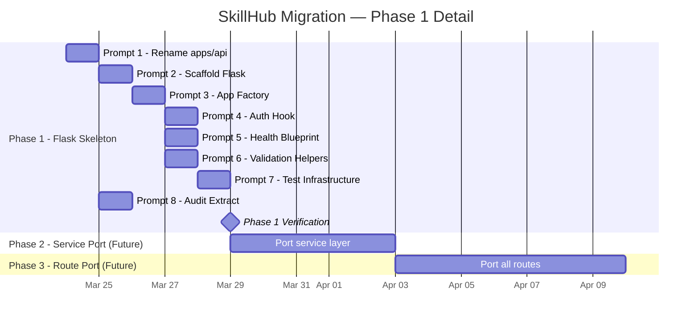
