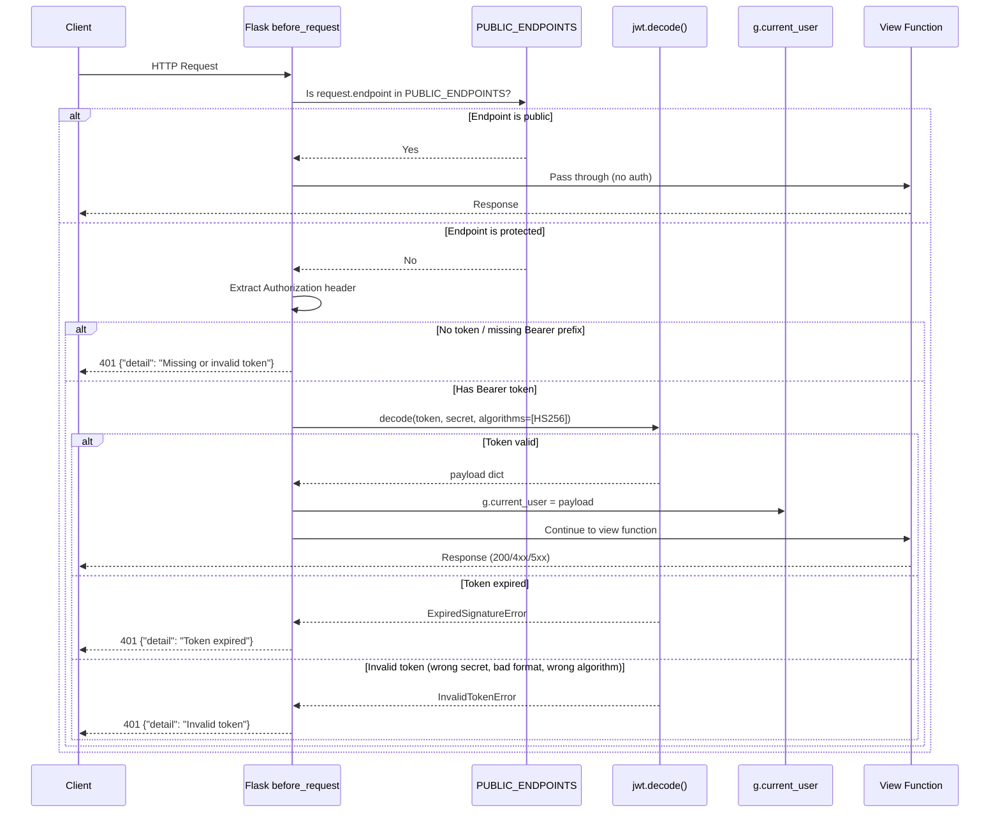
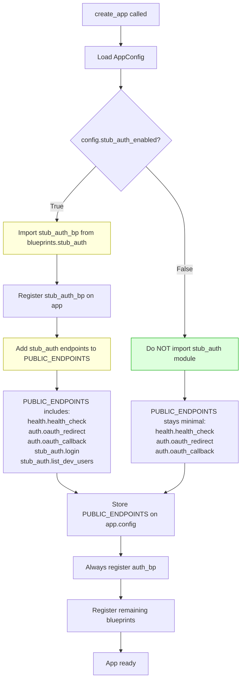
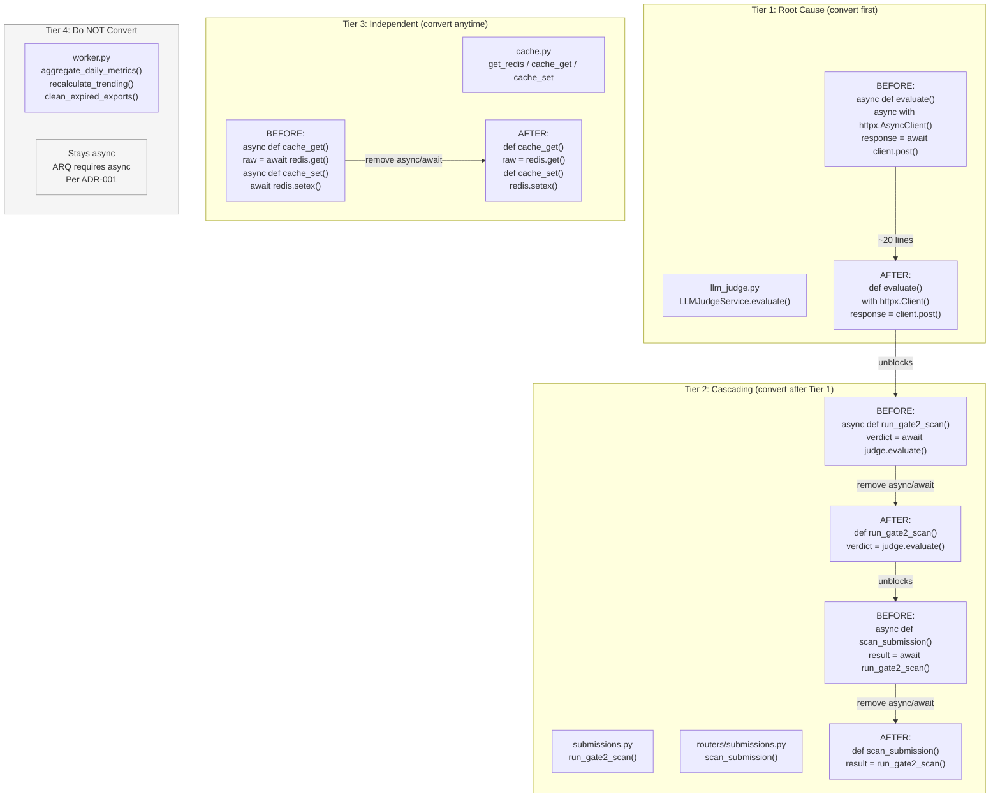
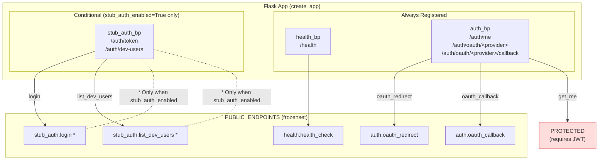
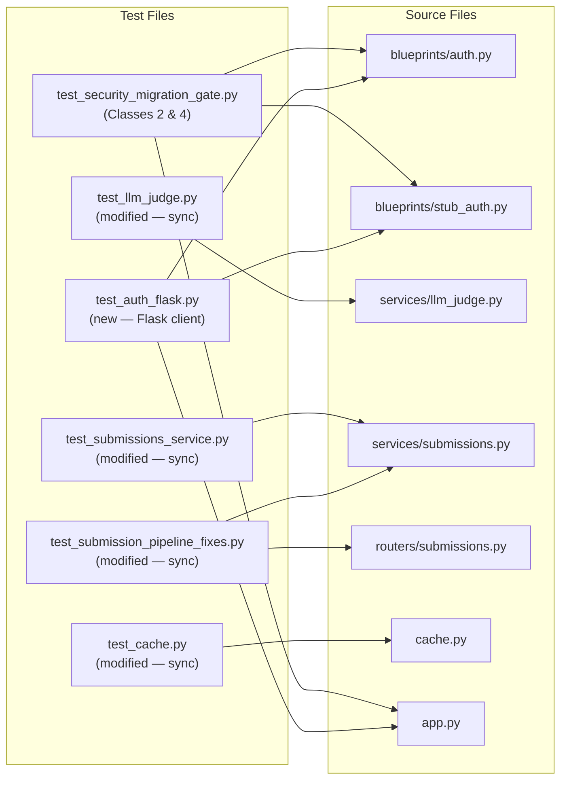

# Phase 2: Auth Endpoints + Async Sync Conversion — Diagrams

Companion diagrams for `phase2-auth-async-guide.md`.

---

## 1. Auth Flow Sequence — Flask `before_request` Hook

Shows how every request flows through the authentication middleware and how
public endpoints, protected endpoints, and stub auth interact.



---

## 2. Stub Auth Conditional Registration Flow

Shows how the Flask app factory decides whether to register the stub auth
blueprint and how `PUBLIC_ENDPOINTS` grows accordingly.



### Security Invariants

```mermaid
flowchart LR
    subgraph Production [stub_auth_enabled = False]
        P1[stub_auth.py never imported]
        P2[/auth/token returns 404]
        P3[/auth/dev-users returns 404]
        P1 --> P2
        P1 --> P3
    end

    subgraph Development [stub_auth_enabled = True]
        D1[stub_auth.py imported + registered]
        D2[/auth/token returns 200]
        D3[/auth/dev-users returns 200]
        D1 --> D2
        D1 --> D3
    end

    style Production fill:#dfd,stroke:#0a0
    style Development fill:#ffd,stroke:#aa0
```

---

## 3. Async-to-Sync Conversion Chain

Shows the dependency chain that dictates conversion order and the exact
changes at each level.



### Conversion Order with Test File Mapping

```mermaid
flowchart LR
    subgraph Step1 ["Step 1: llm_judge.py"]
        S1[Convert evaluate to sync]
        T1["Update tests:<br/>test_llm_judge.py (5 tests)<br/>- Remove @pytest.mark.asyncio<br/>- AsyncMock -> MagicMock<br/>- AsyncClient -> Client"]
    end

    subgraph Step2 ["Step 2: submissions.py"]
        S2[Convert run_gate2_scan to sync]
        T2["Update tests:<br/>test_submission_pipeline_fixes.py (8)<br/>test_submissions_service.py (2)<br/>- Remove @pytest.mark.asyncio<br/>- Remove await"]
    end

    subgraph Step3 ["Step 3: routers/submissions.py"]
        S3[Convert scan_submission to sync]
        T3["No dedicated test changes<br/>(covered by Step 2 tests)"]
    end

    subgraph Step4 ["Step 4: cache.py"]
        S4[Convert cache functions to sync]
        T4["Update tests:<br/>test_cache.py (5 tests)<br/>- Remove @pytest.mark.asyncio<br/>- AsyncMock -> MagicMock"]
    end

    Step1 --> Step2 --> Step3
    Step4 -.->|"independent"| Step1

    style Step1 fill:#fee,stroke:#c00
    style Step2 fill:#ffe,stroke:#aa0
    style Step3 fill:#efe,stroke:#0a0
    style Step4 fill:#eef,stroke:#00a
```



---

## 4. Blueprint Registration and PUBLIC_ENDPOINTS Overview

Shows all blueprints and their endpoint-to-visibility mapping after Phase 2.



---

## 5. Test Coverage Map

Shows which test files cover which source files after Phase 2.


