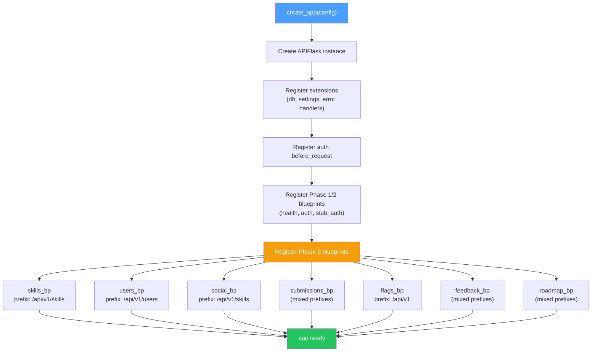
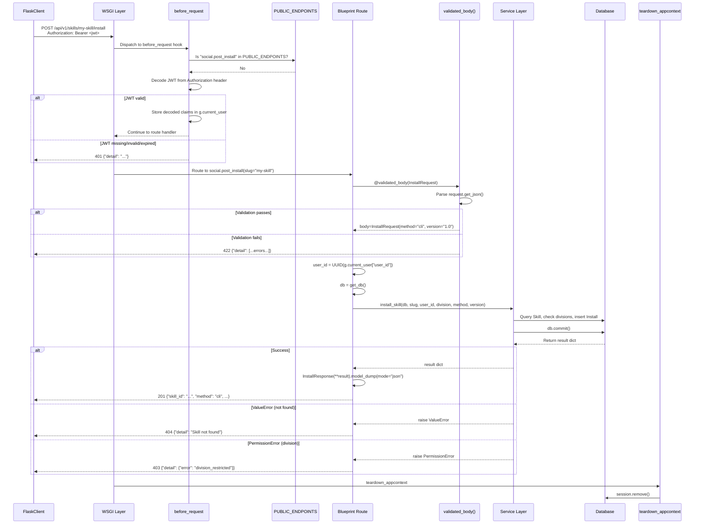
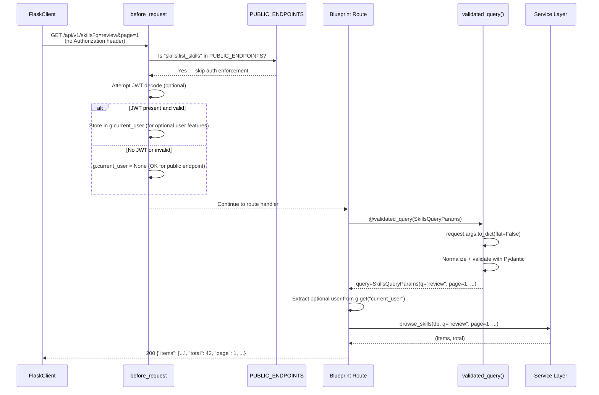
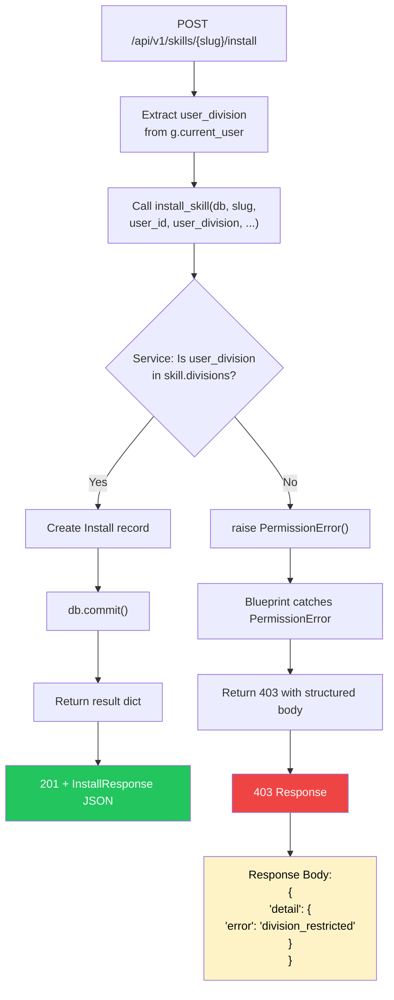
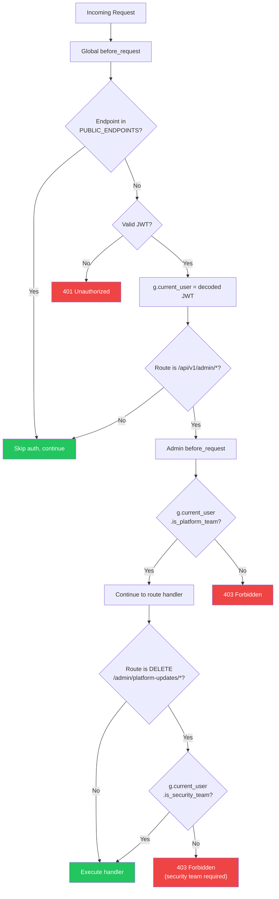
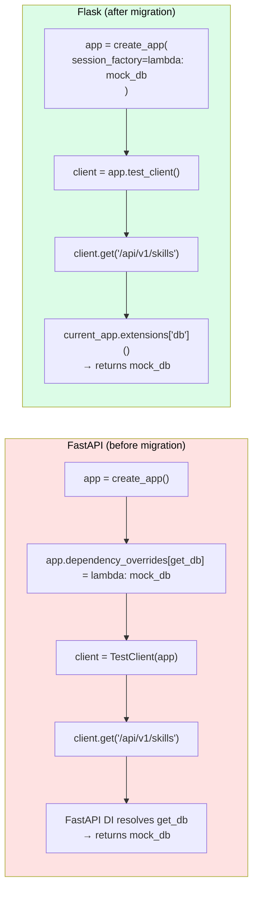
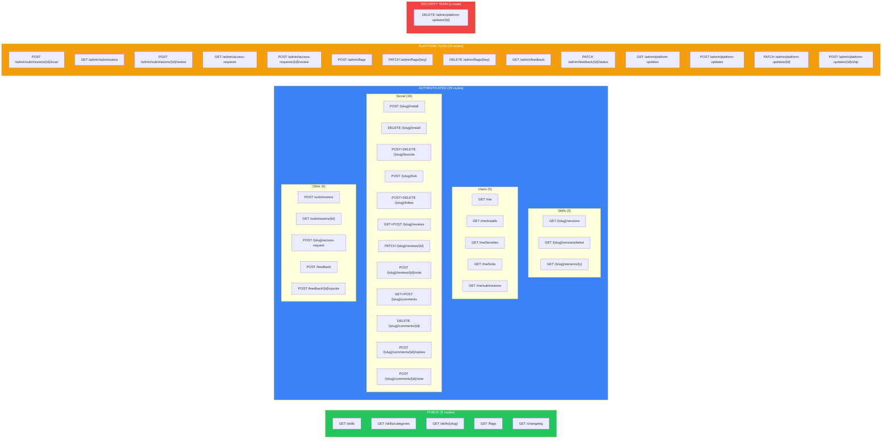
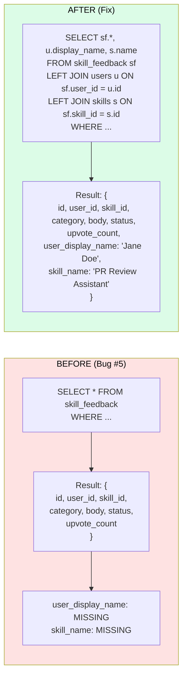
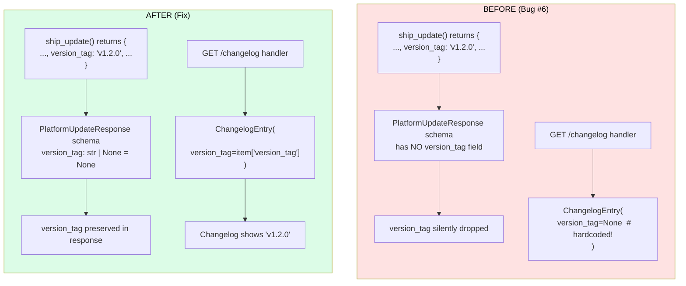

# Phase 3: Core Domain Blueprints — Architecture Diagrams

**Companion to:** `phase3-core-blueprints-guide.md`
**Purpose:** Visual reference for agents implementing Phase 3 blueprints

---

## Diagram 1: Blueprint Registration Flow

How the app factory discovers and registers all 7 Phase 3 blueprints at startup.



---

## Diagram 2: Request Lifecycle — Authenticated Endpoint

Complete request flow from HTTP request to JSON response for an authenticated endpoint (e.g., POST /api/v1/skills/{slug}/install).



---

## Diagram 3: Request Lifecycle — Public Endpoint

Flow for a public endpoint (e.g., GET /api/v1/skills). Note that `before_request` still runs but skips auth enforcement.



---

## Diagram 4: DivisionRestrictedError Handling Flow

How division enforcement works for the install endpoint, from service layer exception to structured 403 response.



### Key Detail: Dict-typed detail

The 403 response for division restriction uses a **dict** as the detail value, not a string. This is intentional and matches the FastAPI behavior where `HTTPException(detail={"error": "division_restricted"})` serializes the dict directly. The Flask equivalent:

```python
except PermissionError:
    return jsonify({"detail": {"error": "division_restricted"}}), 403
```

Frontend code checks `response.json().detail.error === "division_restricted"` to show the division access request dialog.

---

## Diagram 5: Background Task Session Pattern

How background tasks (view count increment, Gate 2 scan) create their own database sessions to avoid using the request-scoped session after the request completes.

```mermaid
sequenceDiagram
    participant R as Request Thread
    participant BP as Blueprint Route
    participant DB1 as Scoped Session<br/>(request-bound)
    participant T as Background Thread
    participant DB2 as Fresh SessionLocal()<br/>(thread-owned)
    participant TD as teardown_appcontext

    R->>BP: GET /api/v1/skills/{slug}
    BP->>DB1: get_skill_detail(db, slug)
    DB1-->>BP: result dict (includes skill_id)

    BP->>T: Thread(target=_bg_increment, args=(skill_id,)).start()
    Note over T: Thread starts independently

    BP-->>R: Return 200 response immediately

    R->>TD: teardown_appcontext fires
    TD->>DB1: session.remove()
    Note over DB1: Request session is now closed

    Note over T: Thread may still be running...
    T->>DB2: bg_db = SessionLocal()
    T->>DB2: increment_view_count(bg_db, skill_id)
    T->>DB2: bg_db.commit()
    T->>DB2: bg_db.close()
    Note over T: Thread exits cleanly

    style DB1 fill:#ef4444,color:#fff
    style DB2 fill:#22c55e,color:#fff
```

### Rules for Background Sessions

1. **NEVER** use `get_db()` (the scoped session proxy) in a background thread
2. **ALWAYS** create a fresh `SessionLocal()` at the start of the thread function
3. **ALWAYS** close the session in a `finally` block
4. **ALWAYS** set `daemon=True` on the thread so it does not block shutdown
5. **ALWAYS** wrap the thread body in try/except to log errors (otherwise they vanish silently)

```python
def _bg_increment_view(skill_id: UUID) -> None:
    """Background: increment view count with its own session."""
    from skillhub_db.session import SessionLocal
    bg_db = SessionLocal()
    try:
        increment_view_count(bg_db, skill_id)
    except Exception:
        logger.exception("Failed to increment view count for %s", skill_id)
    finally:
        bg_db.close()

# In route handler:
threading.Thread(target=_bg_increment_view, args=(skill_id,), daemon=True).start()
```

---

## Diagram 6: Admin Route Auth Enforcement

How platform-team and security-team checks work with the two-tier `before_request` pattern.



### Auth Level Summary

| Level | Check | Applied To |
|-------|-------|-----------|
| Public | In `PUBLIC_ENDPOINTS` frozenset | 5 endpoints (skills browse/categories/detail, flags list, changelog) |
| Authenticated | Valid JWT in `g.current_user` | 29 endpoints (users, social, feedback submit/upvote, submissions create/view, access-request) |
| Platform Team | `g.current_user["is_platform_team"]` | 14 endpoints (admin submissions, admin flags, admin feedback, admin roadmap) |
| Security Team | `g.current_user["is_security_team"]` | 1 endpoint (DELETE platform-updates) |

---

## Diagram 7: Test Injection Pattern — FastAPI vs Flask

Side-by-side comparison of how test database injection works in FastAPI vs Flask.



### Test Setup Comparison

```python
# BEFORE (FastAPI)
def test_list_skills(client, mock_db):
    app.dependency_overrides[get_db] = lambda: mock_db
    with patch("skillhub.services.skills.browse_skills") as mock:
        mock.return_value = ([skill_dict], 1)
        resp = client.get("/api/v1/skills")
    assert resp.status_code == 200

# AFTER (Flask)
def test_list_skills(client, auth_headers, mock_db):
    with patch("skillhub.services.skills.browse_skills") as mock:
        mock.return_value = ([skill_dict], 1)
        resp = client.get("/api/v1/skills")
    assert resp.status_code == 200
```

Key differences:
1. Session factory is injected via `create_app()` constructor, not monkey-patched
2. Auth token must be passed in headers (no `dependency_overrides` for auth either)
3. `client.get()` / `client.post()` API is identical between TestClient and FlaskClient
4. Response `.json` is a method in Flask (`resp.get_json()`) vs property in FastAPI (`resp.json()`) — but many test helpers normalize this

---

## Diagram 8: Complete Phase 3 Blueprint Map

All 49 routes across 7 blueprints, organized by auth level.



---

## Diagram 9: Bug #5 Fix — Feedback JOIN

Before and after the `list_feedback()` query fix.



---

## Diagram 10: Bug #6 Fix — Roadmap version_tag

Before and after the `PlatformUpdateResponse` and changelog fix.


