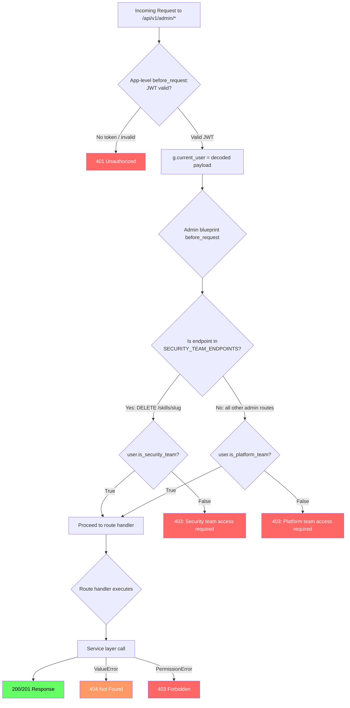
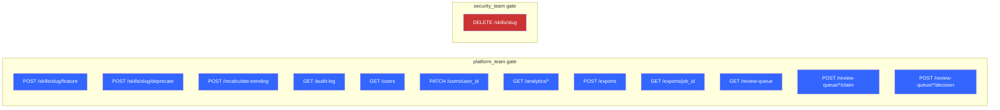
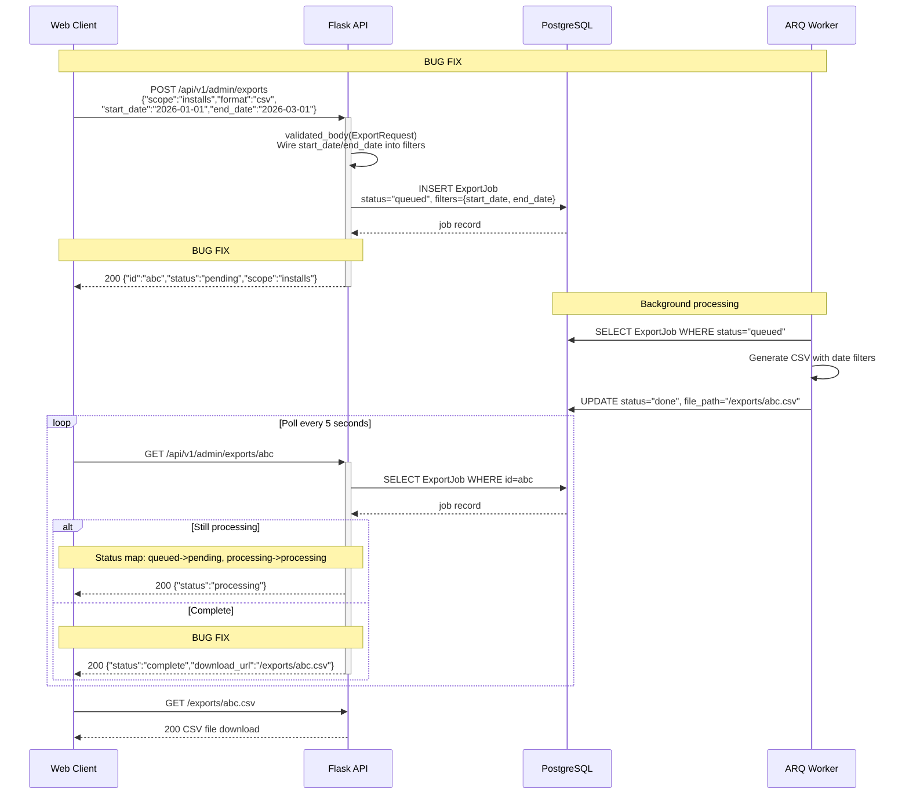
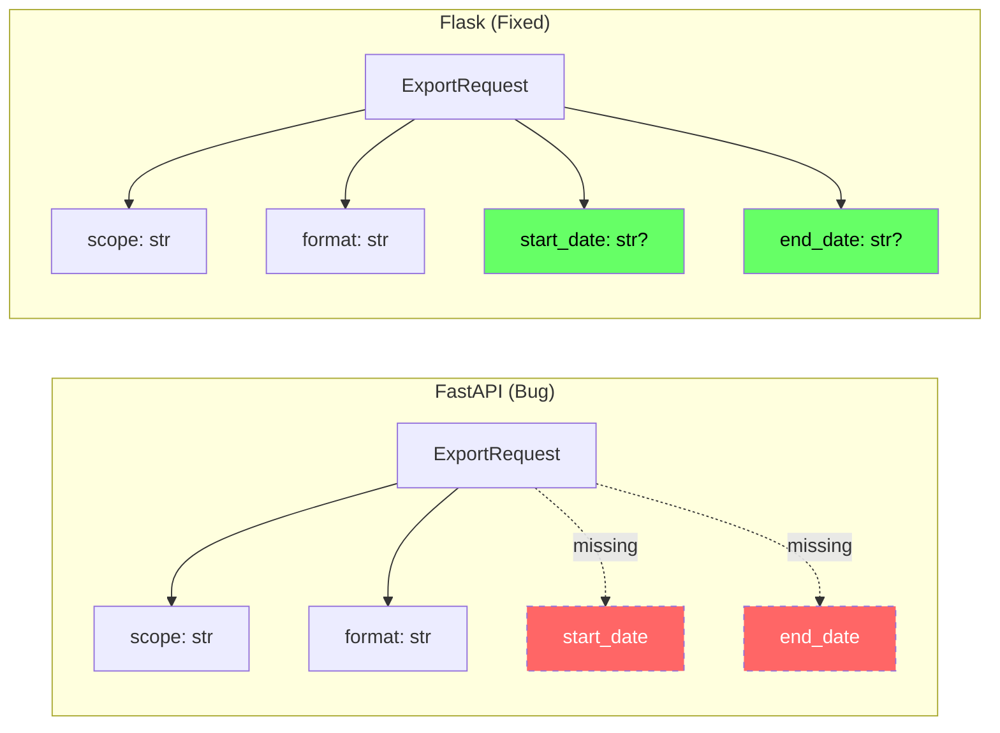
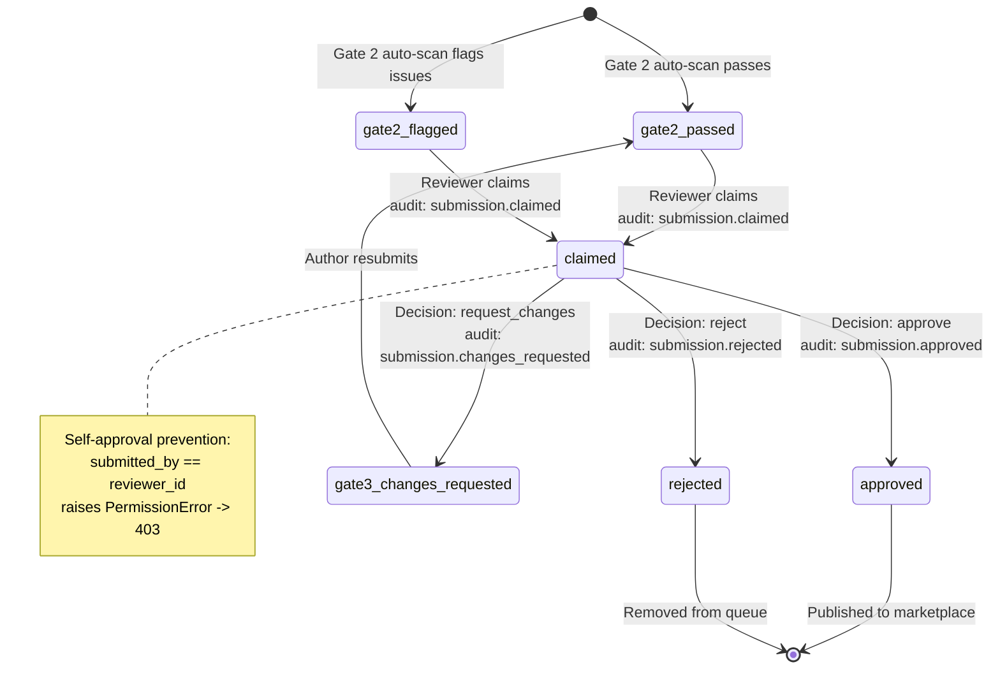
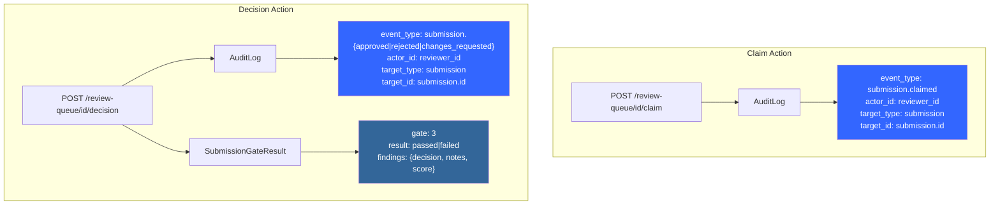
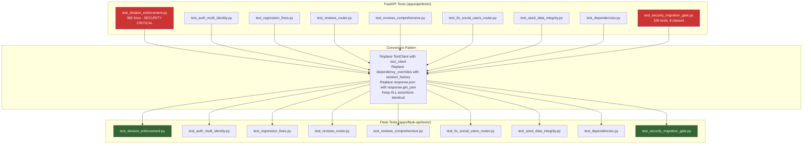
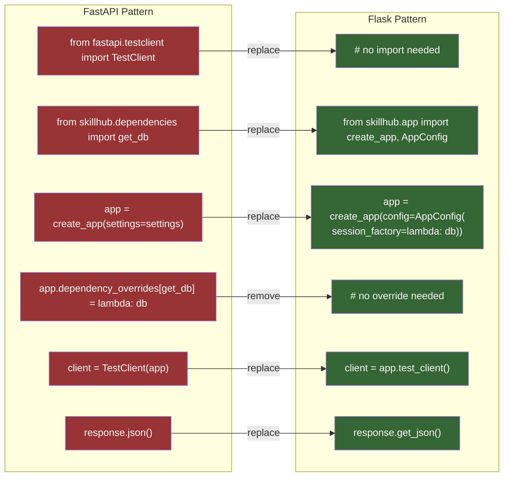
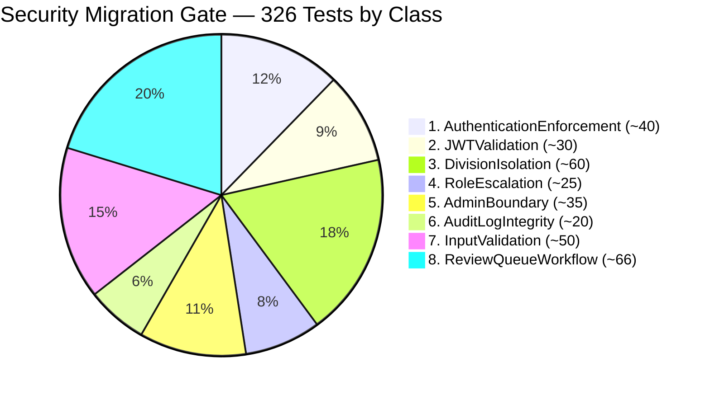

# Phase 4: Admin, Analytics, Exports — Visual Architecture Companion

Visual companion to `phase4-admin-canary-guide.md`. All diagrams use Mermaid syntax.

---

## 1. Admin Blueprint Auth Flow

Shows how the admin blueprint's `before_request` hook enforces access control before any route logic executes. The key distinction: most endpoints require `platform_team`, but `DELETE /skills/{slug}` requires `security_team`.



### Endpoint-to-Gate Mapping



---

## 2. Export Polling Sequence

Shows the client-server interaction for the export workflow, including the 3 bug fixes applied in the Flask port.



### Export Request Schema Comparison



---

## 3. Review Queue State Machine

Shows the submission lifecycle through the HITL review process, including the event_type strings written to the audit log at each transition.



### Event Type Bug Fix Detail

```mermaid
flowchart TD
    A[decision = "reject"] --> B{Which implementation?}

    B -->|"FastAPI (Bug)"| C["f'submission.{decision}d'"<br/>= "submission.rejectd"]
    B -->|"Flask (Fixed)"| D["_event_map[decision]"<br/>= "submission.rejected"]

    C --> E[AuditLog.event_type = "submission.rejectd"]
    D --> F[AuditLog.event_type = "submission.rejected"]

    style C fill:#f66,color:#fff
    style E fill:#f66,color:#fff
    style D fill:#6f6,color:#000
    style F fill:#6f6,color:#000
```

### Audit Log Entries per Review Action



---

## 4. Test Migration Flow

Shows how existing FastAPI test files are converted to Flask test files, highlighting the mechanical transformation pattern and the distinction between portable (framework-agnostic) and framework-dependent tests.



### Portable vs Framework-Dependent Tests

```mermaid
graph TB
    subgraph "Portable (No Changes Needed)"
        P1[test_skills_service.py]
        P2[test_social_service.py]
        P3[test_reviews_service.py]
        P4[test_users_service.py]
        P5[test_skill_schemas.py]
    end

    subgraph "Framework-Dependent (Must Convert)"
        F1[test_division_enforcement.py]
        F2[test_auth_multi_identity.py]
        F3[test_regression_fixes.py]
        F4[test_security_migration_gate.py]
        F5[test_admin.py]
        F6[test_exports.py]
        F7[test_review_queue.py]
        F8[test_analytics.py]
    end

    P1 --- Note1[Pure service layer tests.<br/>Call service functions with mock db.<br/>No HTTP client involved.]
    F1 --- Note2[Use HTTP test client.<br/>Test routes, auth, status codes.<br/>Must convert client + DI pattern.]

    style P1 fill:#363,color:#fff
    style P2 fill:#363,color:#fff
    style P3 fill:#363,color:#fff
    style P4 fill:#363,color:#fff
    style P5 fill:#363,color:#fff
    style F1 fill:#936,color:#fff
    style F2 fill:#936,color:#fff
    style F3 fill:#936,color:#fff
    style F4 fill:#936,color:#fff
    style F5 fill:#936,color:#fff
    style F6 fill:#936,color:#fff
    style F7 fill:#936,color:#fff
    style F8 fill:#936,color:#fff
```



### Test Conversion Diff



### Security Gate Test Classes (326 Total)


