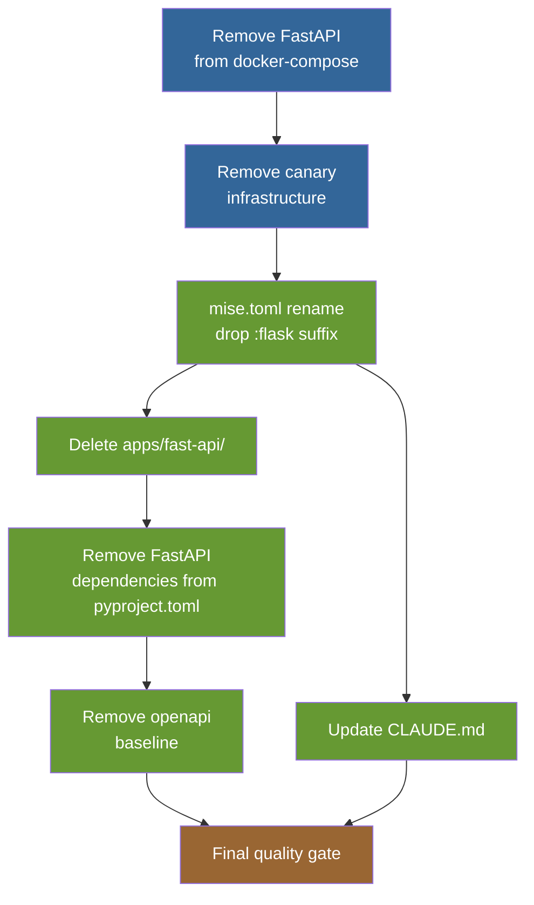
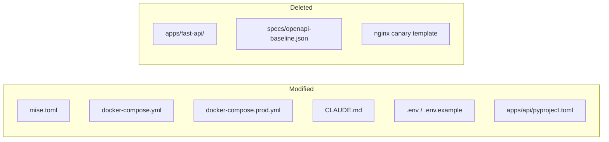

# Phase 5: Cutover Diagrams

Companion diagrams for `phase5-cutover-guide.md`. Render with any Mermaid-compatible viewer.

---

## 1. Cleanup Dependency Graph

Shows which cleanup tasks depend on each other. Execute sequentially top-to-bottom.

---

## 2. File Changes Summary

Overview of which files are modified or deleted during cleanup.

