# SkillHub Phase 6 — Post-Migration Enhancements: Architecture Diagrams

## Companion to phase6-post-migration-guide.md

Reference these diagrams by section number when executing prompts from the guide.

---

## Table of Contents

1. [Revision State Machine](#section-1)
2. [Submission Pipeline with Revision Loops](#section-2)
3. [VitePress Architecture](#section-3)
4. [Component Hierarchy — Submission Page & Admin Queue](#section-4)
5. [Audit Log Data Flow](#section-5)
6. [Version Selector UX Flow](#section-6)
7. [Database Schema Changes ERD](#section-7)

---

## Section 1 — Revision State Machine

> Referenced by: Prompts A.2.1, A.2.2

This diagram shows the complete lifecycle of a submission including revision loops.
REJECTED is terminal. CHANGES_REQUESTED leads to revision. The revision_number
increments on each resubmit cycle.

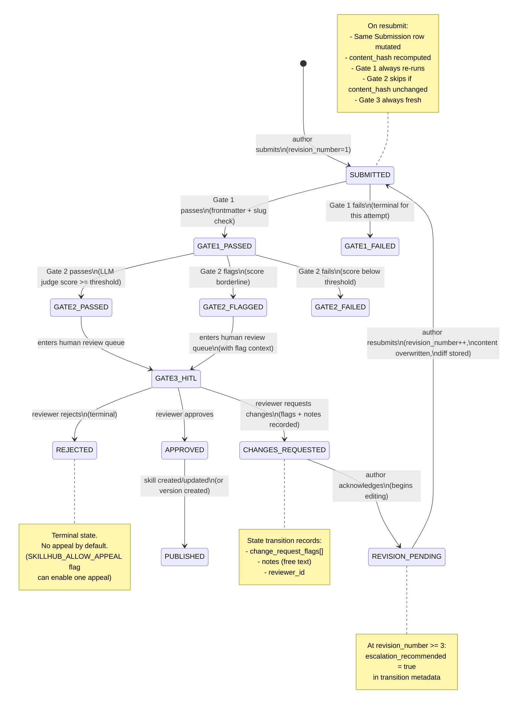

---

## Section 2 — Submission Pipeline with Revision Loops

> Referenced by: Prompts A.2.1, A.6.1, C.3.1

This sequence diagram shows the full flow including the revision loop and the
optimization where Gate 2 can be skipped if the content hash has not changed.

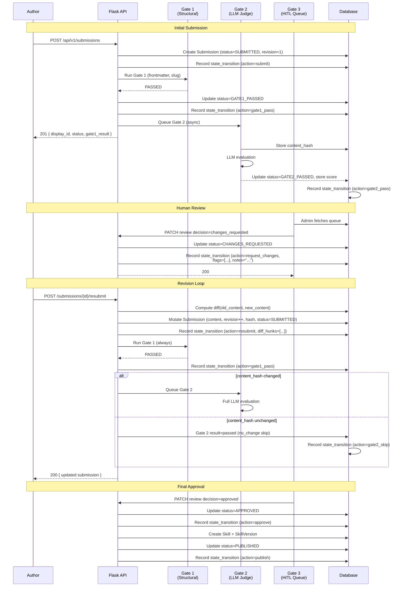

---

## Section 3 — VitePress Architecture

> Referenced by: Prompts B.1.1, B.1.2

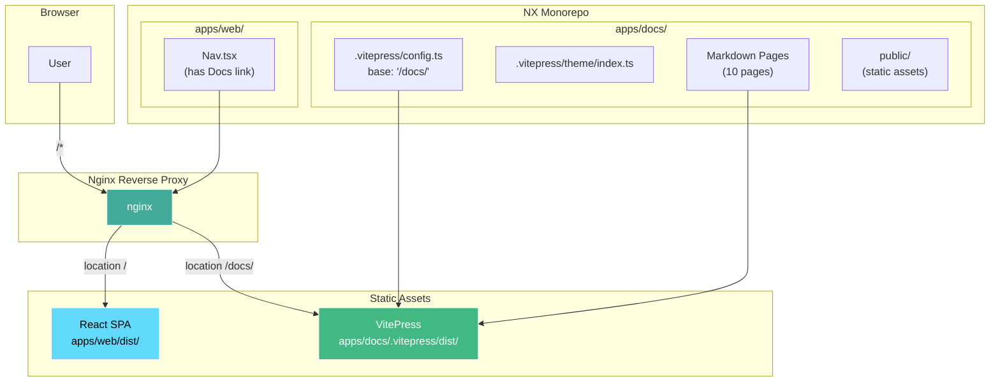

### Nginx Configuration Layout

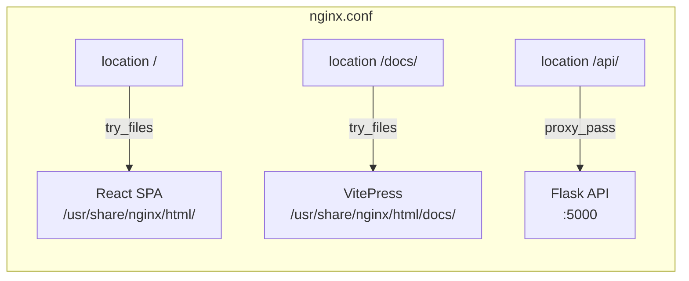

### Docker Multi-Stage Build

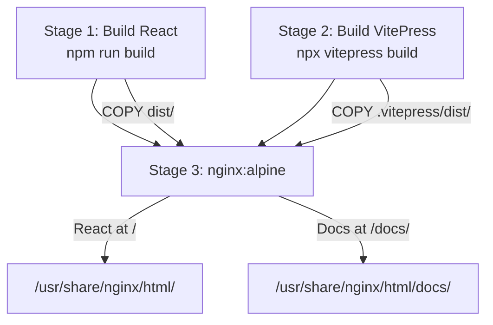

### Documentation Site Map

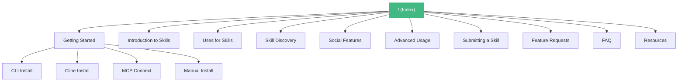

---

## Section 4 — Component Hierarchy: Submission Page & Admin Queue

> Referenced by: Prompts A.3.1-A.3.3, A.4.1-A.4.2, A.5.1, C.1.1-C.3.3

### Skill Submission Page Hierarchy

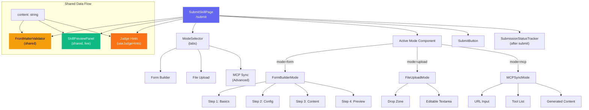

### Admin Queue Component Hierarchy

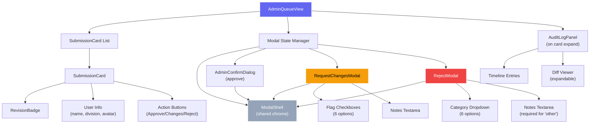

### ModalShell Extraction Pattern

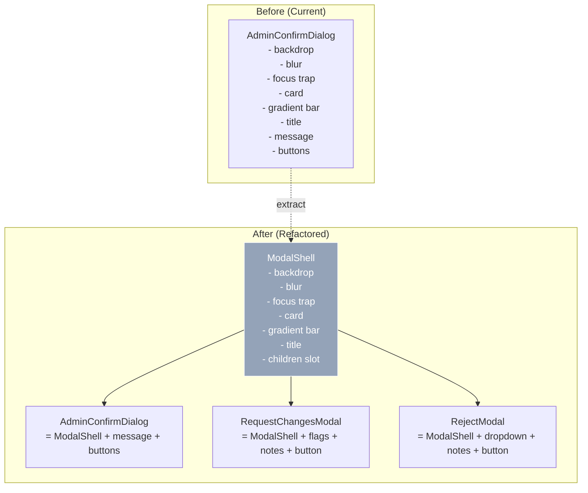

---

## Section 5 — Audit Log Data Flow

> Referenced by: Prompts A.2.2, A.5.1

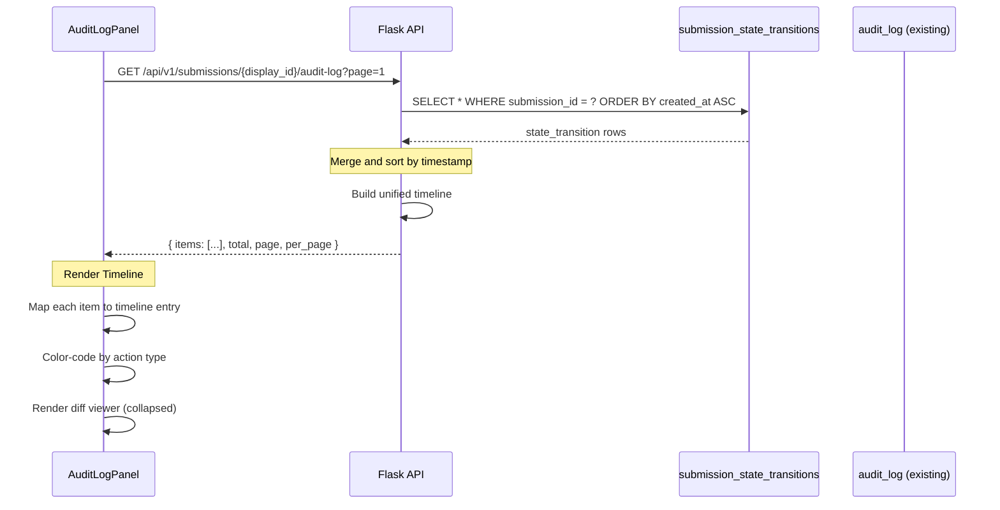

### Audit Log Entry Types and Colors

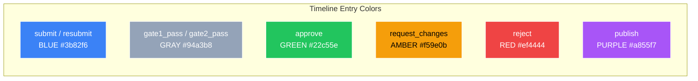

### State Transition Record Structure

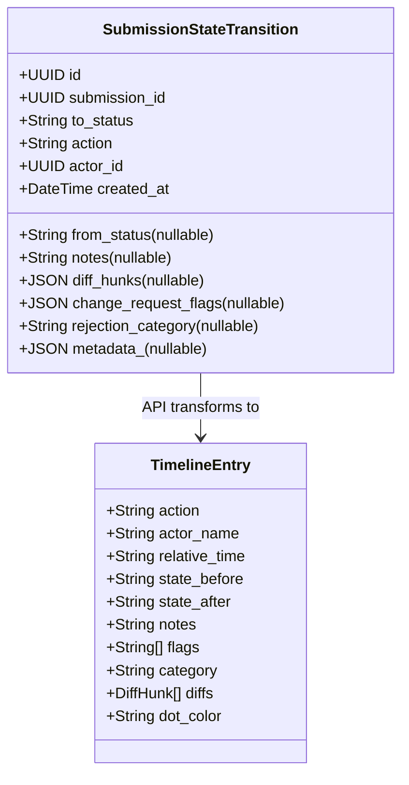

---

## Section 6 — Version Selector UX Flow

> Referenced by: Prompts A.6.1, A.6.2

### Browse Grid to Version Detail Flow

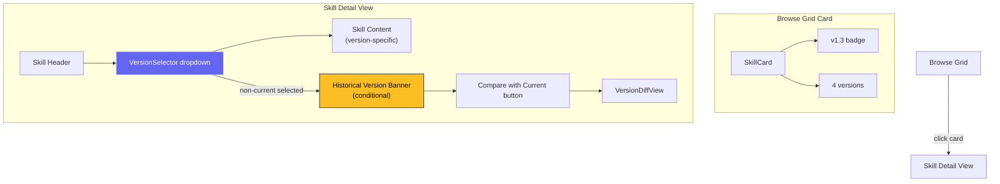

### Version Selector State Machine

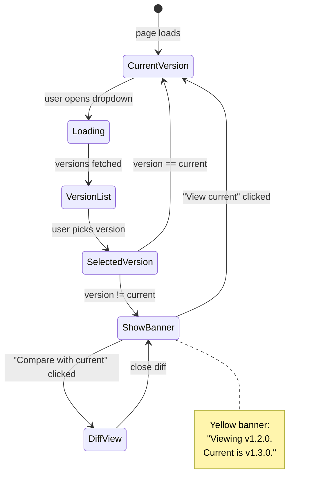

### Version Comparison Diff View

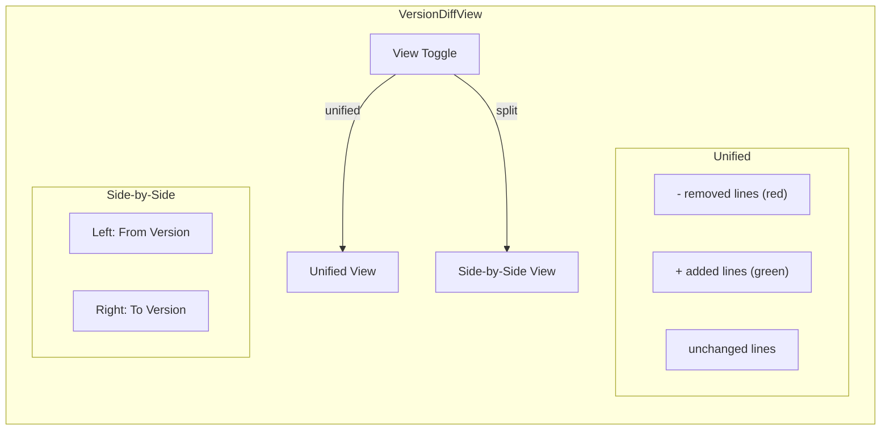

---

## Section 7 — Database Schema Changes ERD

> Referenced by: Prompts A.1.1, A.1.2, A.6.1

### New and Modified Tables

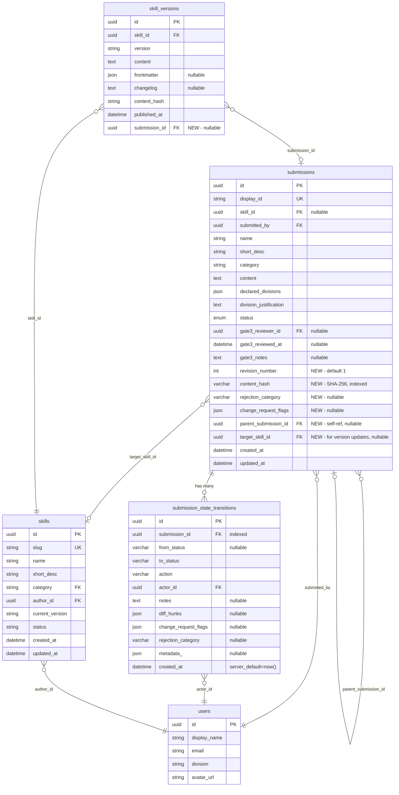

### New Indexes

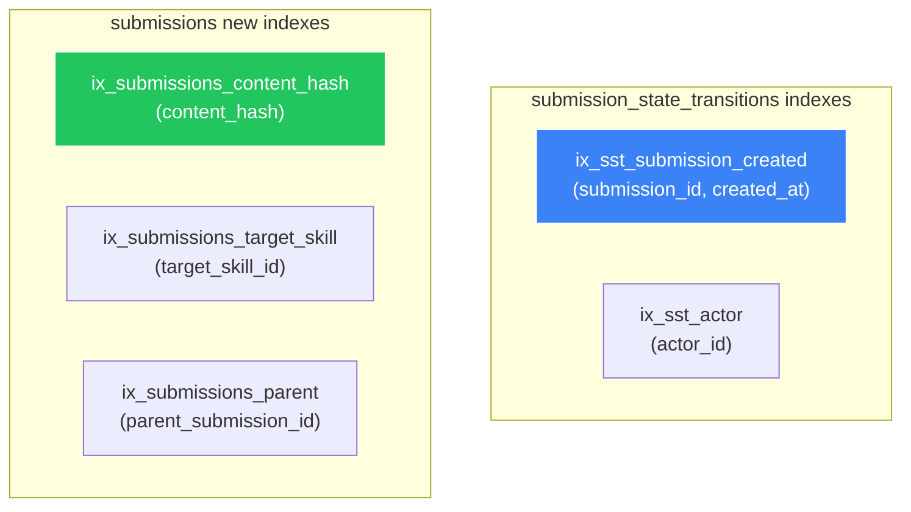

### Enum Changes

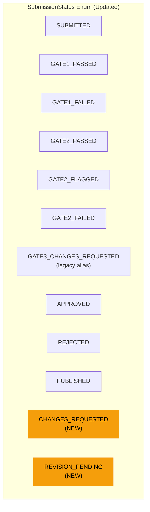

---

## Cross-Cutting: Full System Topology with Phase 6 Additions

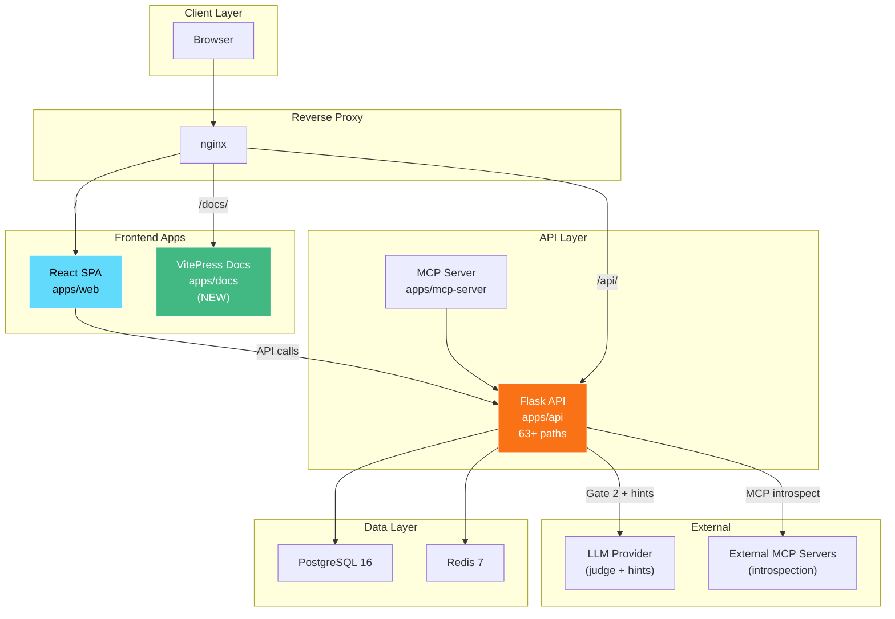
