# SkillHub — Visual Architecture Companion

Reference diagrams for the technical implementation guide.
Each section number corresponds to guide references (e.g. "See Section 2").

---

## 1. System & Project Structure

### 1.1 System Context (C4)

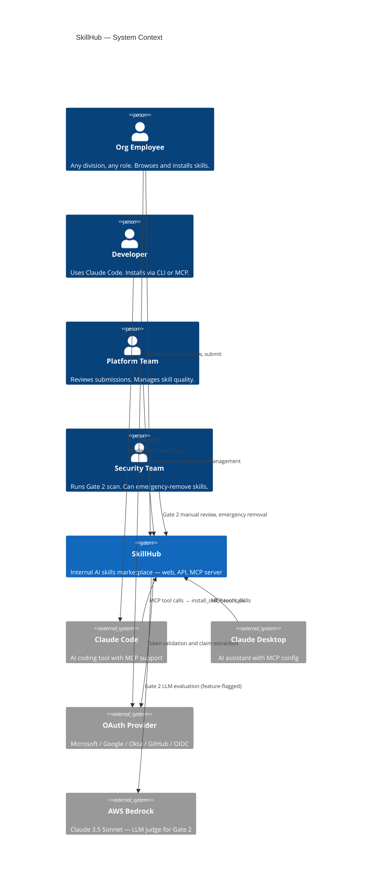

### 1.2 Container Diagram (C4)

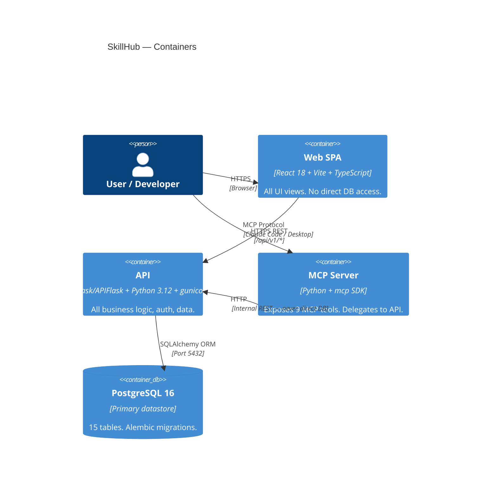

### 1.3 NX Project Dependency Graph

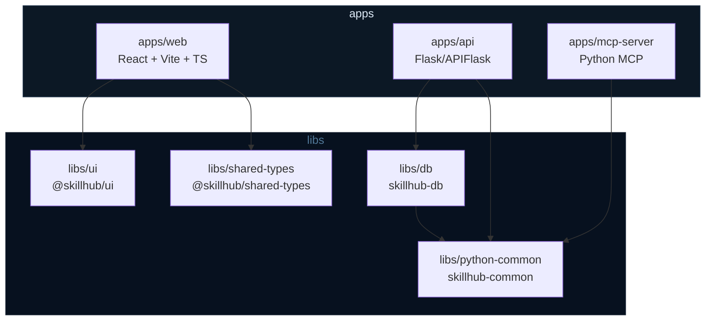

---

## 2. Data Models

### 2.1 Identity Domain ERD

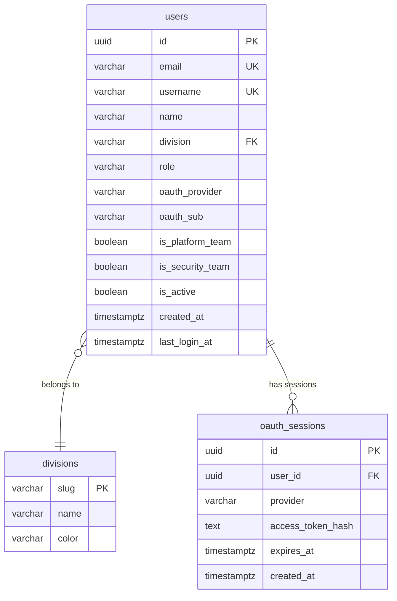

### 2.2 Skill Core ERD

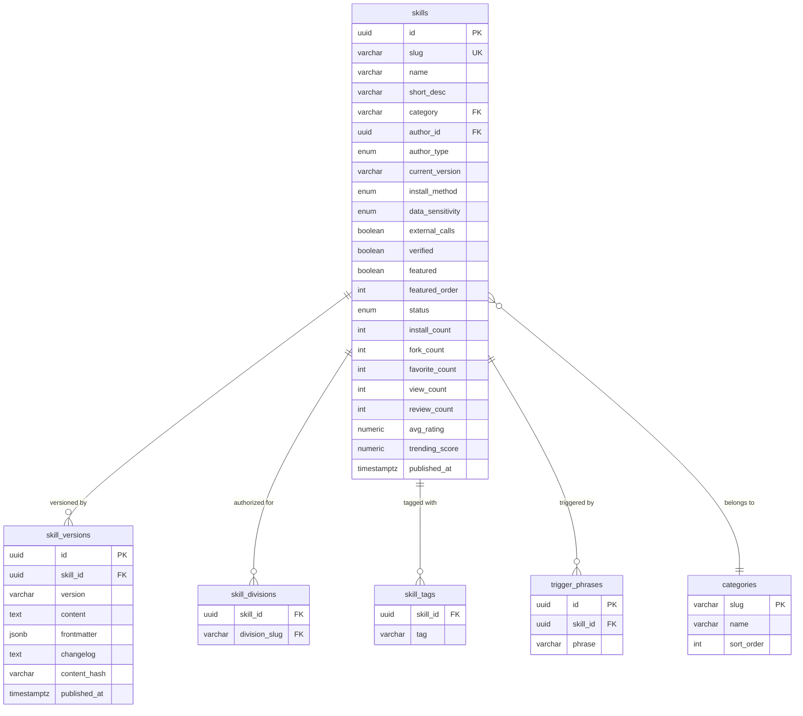

### 2.3 Social Domain ERD

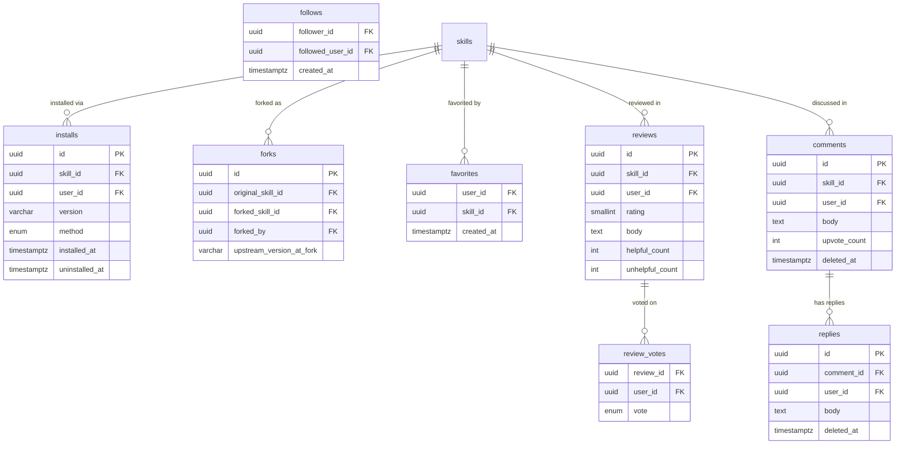

### 2.4 Submission Domain ERD

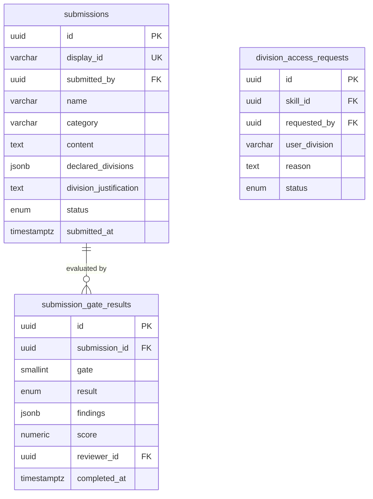

### 2.5 Platform Domain ERD

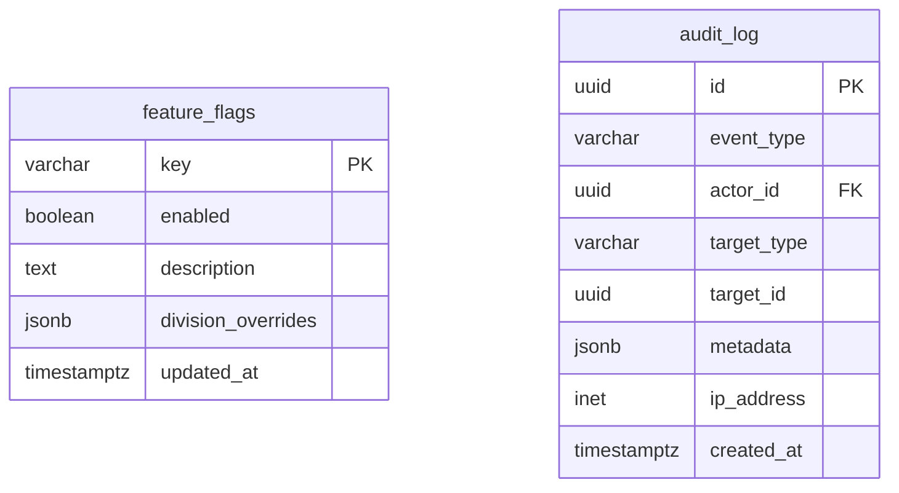

---

## 3. Sequence Diagrams

### 3.1 Stub Auth Flow (Development)

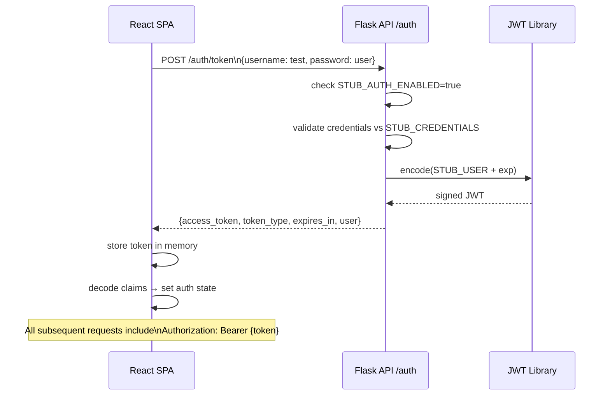

### 3.2 Production OAuth Flow

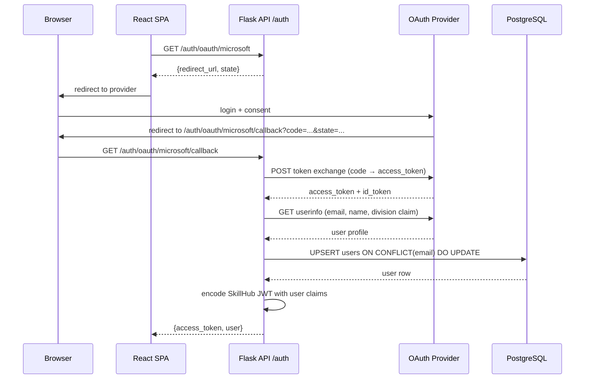

### 3.3 MCP Skill Install

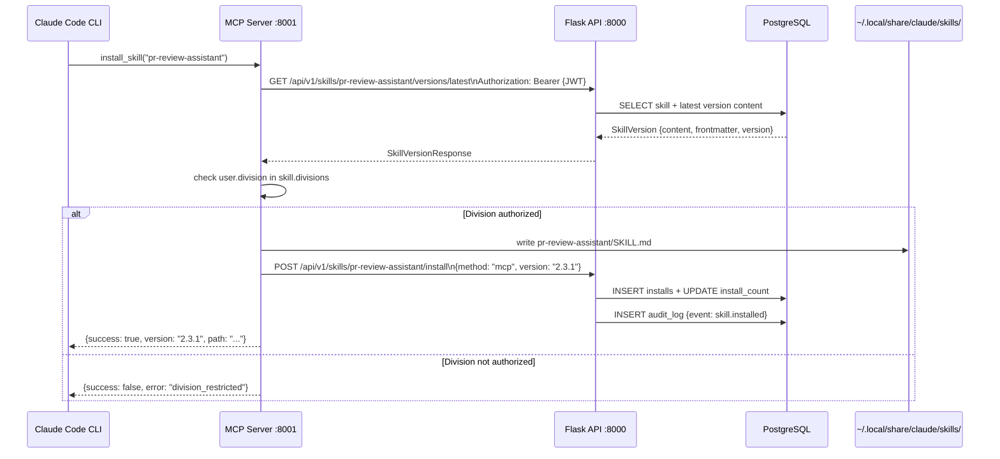

---

## 4. Submission State Machine

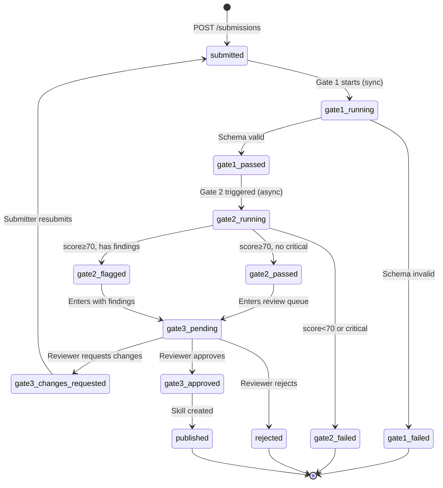

---

## 5. LLM Judge Flow

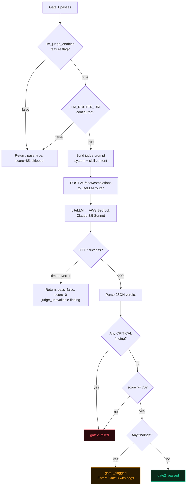

---

## 6. CI/CD Pipeline

```mermaid
flowchart LR
    subgraph trigger[Trigger]
        push[git push]
        mr[Merge Request]
    end

    subgraph lint[Stage: lint]
        l1[lint:python\nruff check + format]
        l2[lint:typescript\neslint + prettier]
    end

    subgraph test[Stage: test]
        t1[test:api\npytest ≥80% cov]
        t2[test:web\nVitest ≥80% cov]
        t3[test:mcp\npytest]
        t4[test:migrations\nalembic check]
        t5[typecheck:api\nmypy --strict]
        t6[typecheck:web\ntsc --noEmit]
    end

    subgraph build[Stage: build]
        b1[build:web\nnpx nx build web]
        b2[build:docker\ndocker compose build]
    end

    subgraph security[Stage: security]
        s1[SAST\nGitLab template]
        s2[openapi:freshness\nspec matches routes]
    end

    subgraph deploy[Stage: deploy]
        d1[deploy:staging\nauto on main]
        d2[deploy:production\nmanual trigger]
    end

    push --> lint
    mr --> lint
    lint --> test
    test --> build
    build --> security
    security --> deploy

    style lint fill:#07111f,stroke:#1e3248
    style test fill:#07111f,stroke:#1e3248
    style build fill:#07111f,stroke:#1e3248
    style security fill:#07111f,stroke:#1e3248
    style deploy fill:#07111f,stroke:#1e3248
```

---

## Quick Reference: All Diagrams

| Section | Diagram | Type | Used By Prompt |
|---------|---------|------|----------------|
| 1.1 | System Context | C4 Context | 0.1.1 |
| 1.2 | Container Diagram | C4 Container | 0.1.2 |
| 1.3 | NX Project Graph | Flowchart | 0.1.2 |
| 2.1 | Identity Domain ERD | ER Diagram | 1.1.1 |
| 2.2 | Skill Core ERD | ER Diagram | 1.1.2 |
| 2.3 | Social Domain ERD | ER Diagram | 1.1.3 |
| 2.4 | Submission Domain ERD | ER Diagram | 6.1.1 |
| 2.5 | Platform Domain ERD | ER Diagram | 9.1.1 |
| 3.1 | Stub Auth Flow | Sequence | 2.2.1 |
| 3.2 | Production OAuth Flow | Sequence | 4.1.1 |
| 3.3 | MCP Skill Install | Sequence | 7.1.1 |
| 4.0 | Submission State Machine | State | 6.1.1 |
| 5.0 | LLM Judge Flow | Flowchart | 6.1.2 |
| 6.0 | CI/CD Pipeline | Flowchart | 0.2.3 |
